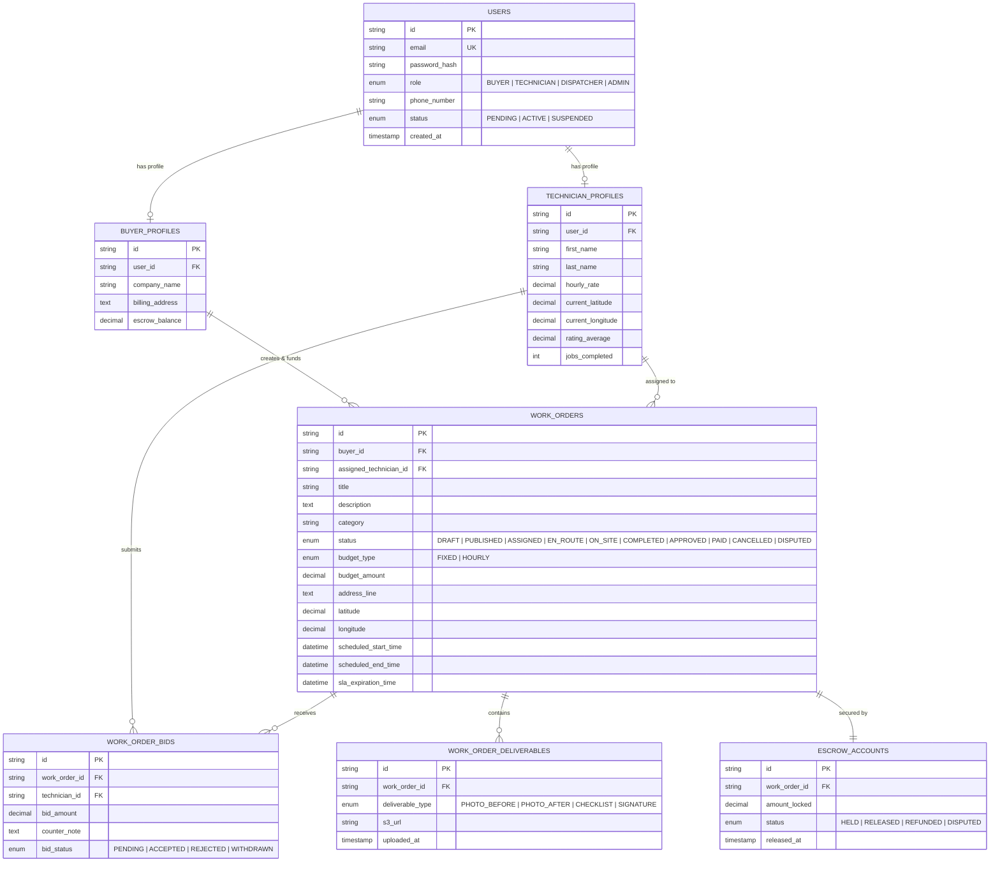
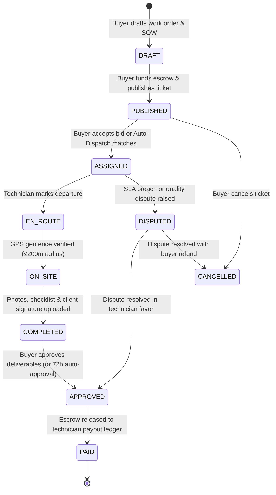

# 🏛️ Domain Entities & Relational Schema Specifications

> **Living Specification** • Conforms to Software Requirements Specification (SRS v1.0.0)

---

## 1. User Classes & Profile Models

---

## 2. Work Order Finite State Machine (FSM)

---

## 3. Deliverable & Proof-of-Work Contracts

| Deliverable Type | Storage Location                           | Validation & Cryptographic Integrity                   |
| :--------------- | :----------------------------------------- | :----------------------------------------------------- |
| `PHOTO_BEFORE`   | AWS S3 (`fieldforge-deliverables-storage`) | Pre-work timestamp watermark + Geo-tag inspection      |
| `PHOTO_AFTER`    | AWS S3 (`fieldforge-deliverables-storage`) | Post-repair photo with serial number verification      |
| `CHECKLIST`      | AWS S3 / JSON Metadata                     | Mandatory itemized tasks completed (100% check rate)   |
| `SIGNATURE`      | AWS S3 (`.svg`)                            | Client on-screen signature + SHA-256 audit digest hash |
