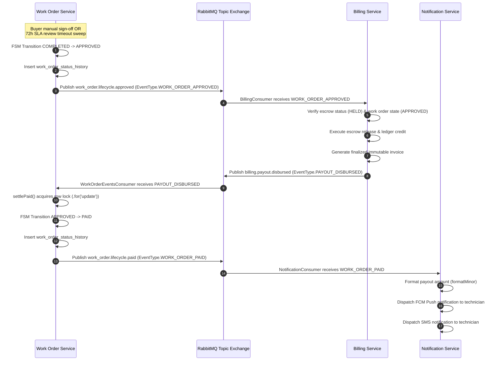

# 📝 ADR 009: Event-Driven Order Settlement Choreography and SLA Review Relocation

| Status       | Date           | Decision Maker         |
| :----------- | :------------- | :--------------------- |
| **ACCEPTED** | September 2026 | Satya Ranjan Debsharma |

---

## 1. Context

In the legacy implementation, the order settlement lifecycle leading to `PAID` work order status suffered from critical boundary violations, incomplete event choreography, and circumvention of state machine guarantees (`FF-ARCH-05`):

1. **Misplaced Cross-Service Mutation in `billing-service`**:
   - `apps/billing-service` hosted `SlaAutoApprovalService`, which periodically queried `workOrders` from `apps/billing-service` using Drizzle ORM.
   - It directly executed SQL updates against `work_orders` to transition them to `APPROVED`, inserted records into `work_order_status_history`, and if escrow release failed, rolled back `work_orders` to `COMPLETED`.
   - This directly violated database isolation (`RULE-ARCH-01`, `ADR 006`), aggregate boundaries (`ADR 005`), and bypassed the Work Order FSM (`WorkOrderFsmService`).
   - Critically, it never published the canonical `work_order.lifecycle.approved` event (`EventType.WORK_ORDER_APPROVED`), severing event-driven choreography when auto-approval executed.

2. **Unsound API Transition to `PAID`**:
   - `WorkOrdersService.transitionStatus()` permitted users with `role === 'ADMIN'` to transition work orders to `PAID` via the generic REST API endpoint (`POST /work-orders/:id/transition`).
   - Manually setting `PAID` via API completely bypassed financial settlement: no funds were released from escrow, no payout ledger transactions were posted, no immutable invoice was finalized, and no payout notifications were emitted.

3. **Incomplete Notification Choreography**:
   - `apps/notification-service` subscribed to `WORK_ORDER_PUBLISHED` and `WORK_ORDER_ASSIGNED`, but never subscribed to `WORK_ORDER_PAID`.
   - Technicians never received automated push or SMS confirmations when payouts were disbursed.

---

## 2. Decision

We establish an immutable, pure event-driven order settlement choreography across `work-order-service`, `billing-service`, and `notification-service`:

### Key Architectural Invariants

1. **Relocate `SlaAutoApprovalService` to `work-order-service`**:
   - The 72-hour buyer review timeout (SRS FR-WO-005, FR-BILL-002) is an SLA on the Work Order aggregate.
   - `SlaAutoApprovalService` now resides in `apps/work-order-service/src/modules/sla/sla-auto-approval.service.ts`.
   - When sweeping overdue `COMPLETED` orders, it executes `WorkOrdersService.transition()` with `role = 'SYSTEM'`, ensuring full FSM validation, audit logging, and canonical publication of `EventType.WORK_ORDER_APPROVED`.
   - The misplaced cron service in `billing-service` has been deleted along with its cross-service SQL mutations.

2. **Strictly Block Manual `PAID` Status via Generic API**:
   - In `WorkOrdersService.transition()`, any request to transition to `PAID` is rejected with `ForbiddenException('Work order cannot be manually transitioned to PAID via API; settlement to PAID is exclusively event-driven upon payout disbursement (billing.payout.disbursed)')`.
   - `settlePaid()` in `work-order-service` is the sole entry point to transition a work order to `PAID`, invoked strictly by `WorkOrderEventsConsumer` upon receiving `PAYOUT_DISBURSED`.

3. **Complete Settlement Notification Choreography**:
   - `NotificationConsumer` in `apps/notification-service` subscribes to `EventType.WORK_ORDER_PAID` (`work_order.lifecycle.paid`).
   - Upon consumption, it dispatches an FCM Push notification to the technician's device token and an SMS receipt via `SmsNotificationChannel`.

4. **Zero Schema Migrations**:
   - Adheres to `RULE-DB-02`. Uses existing schema definitions, contracts, and RabbitMQ topic exchanges.

---

## 3. Consequences

### Positive

- **Guaranteed Financial Integrity**: Work orders can never enter `PAID` status without proven escrow release, ledger credit, and finalized invoicing.
- **True Bounded Context Isolation**: `billing-service` no longer mutates or rolls back work order aggregate tables.
- **Resilient Choreography**: If billing escrow release fails or encounters conflicts, the work order remains in `APPROVED` or retries gracefully without corrupting database state across service boundaries.
- **Complete End-to-End Auditability**: Every status transition generates an immutable `work_order_status_history` audit entry and correlated RabbitMQ event trace.

### Trade-offs

- The settlement lifecycle is asynchronous; the buyer or admin UI observes `APPROVED` status immediately after sign-off, with `PAID` status arriving asynchronously via event consumption. Real-time updates rely on polling or WebSocket push.
