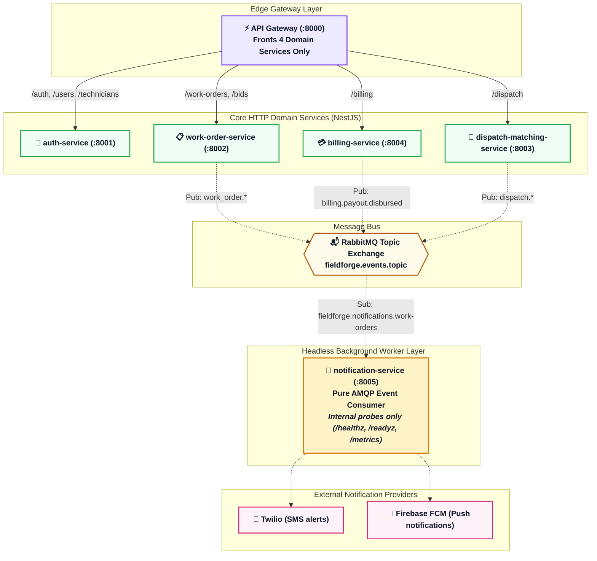

# 📝 ADR 010: Headless Notification Worker Boundary & Gateway Route Decoupling

| Status       | Date           | Decision Maker         |
| :----------- | :------------- | :--------------------- |
| **ACCEPTED** | September 2026 | Satya Ranjan Debsharma |

---

## 1. Context

In the legacy architecture, `apps/notification-service` was modeled and registered in `apps/api-gateway` as an externally routed HTTP microservice (`FF-ARCH-06 / Finding 6`):

1. **Dead Route Proxying in API Gateway**:
   - `apps/api-gateway/src/config/gateway.config.ts` configured `notifications: process.env.NOTIFICATION_SERVICE_URL || 'http://localhost:8005'`.
   - `apps/api-gateway/src/controllers/proxy.controller.ts` registered route forwarders for `/notifications` and `/notifications/{*path}` forwarding to port `8005`.
   - However, `apps/notification-service` is an asynchronous event consumer that subscribes to RabbitMQ topics (`fieldforge.notifications.work-orders`) and invokes external channels (Twilio SMS, Firebase FCM Push). It exposes **zero** business REST endpoints.
   - Any external request hitting `/api/v1/notifications/*` opened an unnecessary HTTP proxy connection to port `8005`, only to receive an unhandled 404 from NestJS/Express.

2. **Architectural Confusion & Ingress Risk**:
   - Treating `notification-service` as an HTTP-routable API service introduced unnecessary gateway configuration overhead.
   - Exposing internal daemon ports to the public edge reverse proxy confused developers and clients regarding available API capabilities.
   - It also increased the risk of inadvertently routing external traffic to internal container probes (`/healthz`, `/readyz`).

---

## 2. Decision

We establish that `notification-service` is strictly a **headless background consumer worker daemon**, completely decoupled from the edge API Gateway:

### Key Architectural Enforcements:

1. **Remove Notifications Proxy from API Gateway**:
   - `gatewayConfig.services` only contains the 4 HTTP domain services: `auth`, `workOrder`, `dispatch`, `billing`.
   - `ProxyController` removes `notifications` proxy creation and route decorator entries.
   - Any inbound request targeting `/api/v1/notifications/*` is immediately rejected at the edge with `404 Not Found` (`No downstream service registered for path: ...`) without opening upstream network sockets.

2. **Retain Internal Infrastructure Probes in `notification-service`**:
   - `apps/notification-service` continues to run on port `8005` with `HealthController` for Kubernetes pod liveness/readiness probes (`/healthz`, `/readyz`) and Prometheus observability scraping (`/metrics`).
   - It remains an independent container/process in Docker Compose and Kubernetes without ingress exposure.

3. **Zero Impact on Domain Clients**:
   - Neither `apps/web-buyer-portal` nor `apps/mobile-tech-app` issues HTTP calls to `notification-service`.
   - Notifications to mobile technicians and enterprise buyers remain 100% event-driven via RabbitMQ and push/SMS channels.

---

## 3. Consequences

### Positive

- **Reduced Gateway Overhead**: Eliminates dead proxy routing and avoids unnecessary socket connections to a non-HTTP business service.
- **Clear Architectural Boundaries**: Clarifies in documentation and code that `notification-service` is an asynchronous event consumer, not a public HTTP API.
- **Fail-Fast Security**: Prevents edge exposure of worker internals or unintended probing.

### Neutral / Negative

- None. `notification-service` never exposed business HTTP endpoints; no client contracts or features are affected.
