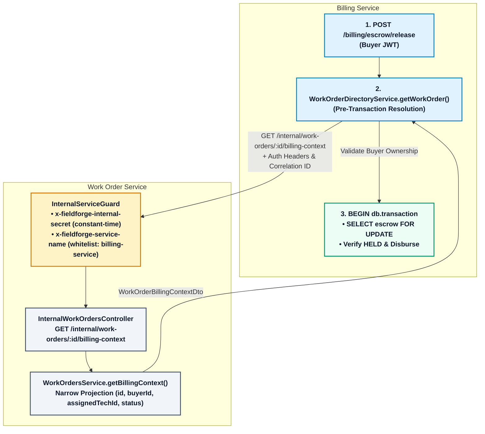

# 📝 ADR 012: Internal Service Authentication and Narrow Directory Lookup

| Status       | Date           | Decision Maker         |
| :----------- | :------------- | :--------------------- |
| **ACCEPTED** | September 2026 | Satya Ranjan Debsharma |

---

## 1. Context

FieldForge microservices operate in bounded contexts with decoupled domain models (`RULE-ARCH-01`). In specific operational paths—such as manual escrow fund release by an enterprise buyer—`billing-service` requires contextual attributes from `work-order-service` (specifically, verifying the owning `buyerId`, confirming the `assignedTechnicianId`, and ensuring `status === 'APPROVED'`).

Previously, this inter-service query suffered from three critical flaws (`ISSUE-002`):

1. **Authentication Failure (401 Unauthorized):**
   `billing-service` called `GET /work-orders/:id` directly using unauthenticated `fetch`. Because `GET /work-orders/:id` is an external endpoint protected by `verifyGatewayUser` (requiring an end-user JWT and gateway-asserted headers), requests from `billing-service` were rejected with `401 Unauthorized`.
2. **False 404 Masking:**
   `WorkOrderDirectoryService.getWorkOrder()` caught the 401 error and returned `null`. `EscrowService.releaseFunds()` then threw `NotFoundException('Work order ... not found')`, completely breaking manual buyer escrow release.
3. **Cascading Row Lock Contention:**
   The synchronous inter-service HTTP query was invoked **inside** an active `db.transaction()` block after acquiring an InnoDB row lock (`SELECT ... FOR UPDATE` on `escrowAccounts`). Any network latency, jitter, or HTTP timeout held database locks open, exhausting MySQL connection pool threads.

---

## 2. Decision

We establish a formalized **Internal Service Authentication Pattern** for synchronous service-to-service REST lookups, accompanied by **Narrow Context DTOs** and **Lock-Decoupled Directory Resolution**:

### Key Architectural Invariants

1. **Dedicated Internal Endpoints (`/internal/*`):**
   Internal service-to-service endpoints are grouped under `/internal/*` and mounted on dedicated internal controllers (e.g. `InternalWorkOrdersController`). They are never mixed with public user-facing endpoints.
2. **Edge Gateway Isolation & Anti-Spoofing (`RULE-AUTH-03`):**
   `api-gateway` strips any client-supplied `x-fieldforge-service-name` and `x-fieldforge-internal-secret` headers before proxying requests downstream. Furthermore, `api-gateway` explicitly drops and rejects `/internal/*` routes (HTTP 404).
3. **Constant-Time Timing-Safe Secret Verification:**
   The `InternalServiceGuard` validates `x-fieldforge-internal-secret` using `safeCompareSecrets()` powered by `crypto.timingSafeEqual`. To prevent `RangeError: Input buffers must have the same byte length`, buffer lengths are validated in constant time prior to execution.
4. **Service Whitelisting:**
   The internal endpoint mandates `x-fieldforge-service-name` and verifies it against an allowed caller whitelist (`['billing-service']`). Missing/invalid secrets return 401; unauthorized service names return 403.
5. **Fail-Closed in Production (Request-Time):**
   If `NODE_ENV=production` and `INTERNAL_SERVICE_SECRET` is unset or blank, the guard and client fail closed at request time and reject internal authentication requests (HTTP 401). In non-production environments, a fallback development secret is permitted.
6. **Narrow Data Contracts (`RULE-ARCH-01`):**
   Inter-service payloads are restricted to minimal DTOs (`WorkOrderBillingContextDto`). Sensitive domain data (customer site address, job description, budget amounts, coordinates) are strictly excluded from cross-service responses.
7. **Strict Lock Decoupling:**
   Synchronous HTTP directory lookups must **never** execute inside an open database transaction or while holding a database row lock (`SELECT ... FOR UPDATE`). Directory resolution occurs prior to `db.transaction()`; authoritative financial state transitions and ledger updates remain strictly protected under InnoDB row locks.
8. **Asynchronous SYSTEM Flow Preservation:**
   Automated payouts triggered by RabbitMQ events (`work_order.lifecycle.approved`) supply `buyerId` and `technicianId` directly in the message payload. When `callerRole === 'SYSTEM'` and profile IDs are known, directory HTTP lookups are bypassed completely.
9. **Zero Remote Response Caching for Financial Operations:**
   `WorkOrderDirectoryService` does not cache remote responses in memory. Every runtime lookup executes a fresh HTTP request to ensure work-order state (`status`, `assignedTechnicianId`) is strictly up to date during financial authorization and payout decisions.

---

## 3. Consequences

### Positive

- Resolves `ISSUE-002`: Manual buyer escrow release functions seamlessly and securely.
- Bounded context isolation is preserved without leaking private domain schemas or PII across service boundaries.
- Synchronous network I/O no longer occurs while the billing database transaction or escrow row lock is held.
- Gateway anti-spoofing guarantees external actors cannot impersonate internal services.
- Financial state and technician assignment freshness is strictly preserved on every lookup.

### Limitations & Follow-Ups

- **Shared Secret Pattern:** This architecture uses symmetric shared secret verification across internal services. It does not provide cryptographic workload identity or mutual TLS (mTLS). In high-security multi-tenant clusters, future operations may transition to SPIFFE/SPIRE workload identities or Istio mTLS.
- **Development-Stage Configuration:** Production Kubernetes Secret injection, NetworkPolicies, and automated secret rotation remain follow-up operations work before production deployment.
