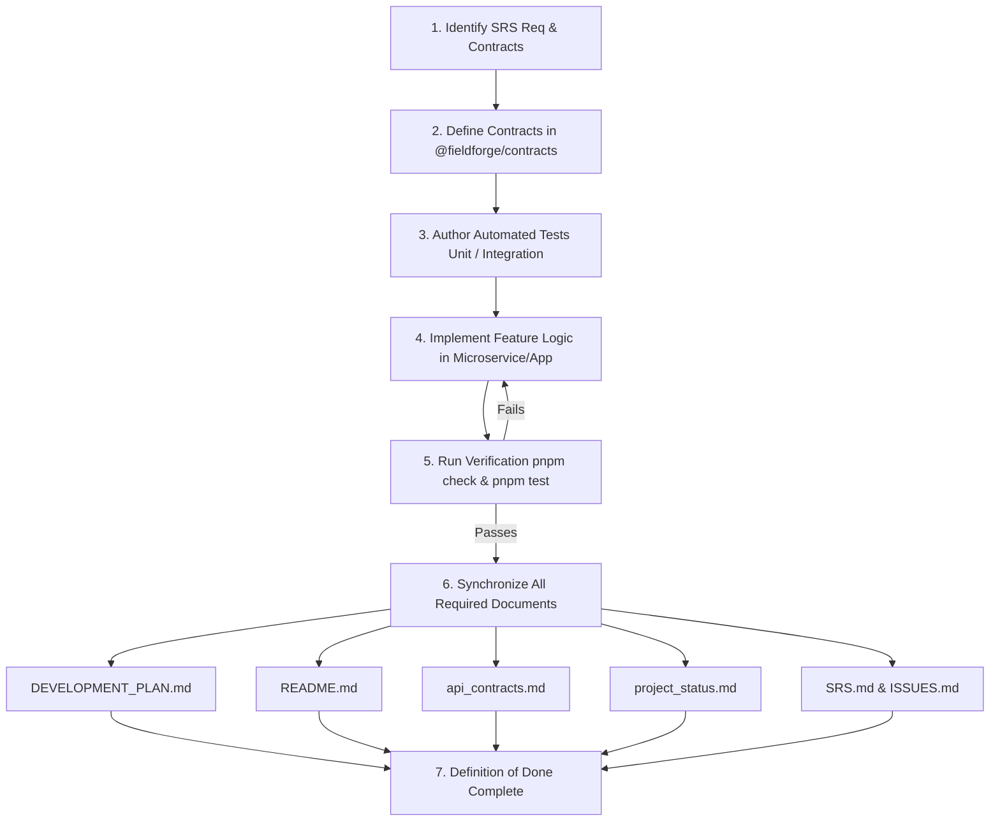

# 🚀 Feature Implementation, Documentation & Testing Directives

> **Rule ID:** `RULE-FEAT-09` • **Priority:** `CRITICAL`

---

### 1. Zero Untested Code Policy (Mandatory Automated Tests)

Whenever any feature, endpoint, domain service, state transition, or event pipeline is added or modified:

- **Mandatory Test Coverage:**
  - **Unit Tests:** Every new controller, service method, domain entity logic, utility, and validator must have unit tests covering:
    - Happy path workflows with expected return values and side effects.
    - Negative paths, error handling, invalid inputs, and boundary conditions.
    - Security boundaries (unauthenticated requests return `401`, insufficient role permissions return `403`, token tampering is rejected).
  - **Integration Tests:** Database repositories, transactional mutations, multi-table queries, and event producer/consumer integrations must be tested against realistic state.
  - **Contract / Schema Tests:** Zod schemas and DTOs in `@fieldforge/contracts` must be validated to accept valid payloads and reject malformed schemas with descriptive errors.
  - **E2E / Frontend Tests:** For UI features (e.g. Next.js buyer portal, Expo technician app), include component interaction tests or Playwright E2E scenarios.
- **Strict Prohibition Against Pseudo-Testing:**
  - `--passWithNoTests` is strictly prohibited across all workspaces.
  - Empty test suites, skipped tests without an open issue reference, and unassertive tests (e.g. `expect(true).toBe(true)` or calling a method without asserting output/state) are treated as build failures.
- **Verification Requirement:**
  - Workspace tests must pass via `pnpm test` or `pnpm --filter <workspace> test`.
  - Monorepo-wide checks must pass via `pnpm check`.

---

### 2. Mandatory Documentation Updates on Every Feature Addition

No feature is complete until all relevant living documents and specifications are updated in lockstep with the code. Agents and engineers must inspect and update:

#### A. Development Plan (`docs/DEVELOPMENT_PLAN.md`)

- Update roadmap phase, milestone progress, and active sequencing.
- Mark completed work packages and deliverables.
- Record any sequence shifts, newly unblocked steps, or upcoming technical priorities.

#### B. Root Documentation (`README.md`)

- Update feature catalogues, quickstart guides, and CLI workflow commands.
- Update architecture diagrams, microservice port tables, and routing tables if routes/ports change.
- Update the Environment Variables table whenever new variables or config options are introduced.

#### C. API Contracts & Living Catalogue (`@fieldforge/contracts` & `.agent/context/api_contracts.md`)

- **Code Contract:** All request/response DTOs, Zod validators, enums, and event envelopes must be created or updated in `packages/contracts/src/`.
- **Specification Catalogue:** Update `.agent/context/api_contracts.md` (and OpenAPI/Swagger decorators) with:
  - HTTP method, route, and microservice owner.
  - Authentication and RBAC guards (Public vs Bearer JWT with required role).
  - Input payload schemas, query parameters, and return structures.
  - Header propagation rules (e.g. `x-correlation-id`, `x-ff-user-id`).

#### D. Implementation Status (`.agent/context/project_status.md`)

- Move completed capabilities from _"What is not yet implemented"_ to _"What exists"_.
- Update the "Last reviewed" date and active phase description.
- Update the verified unit/integration test count.
- Detail operational and security assumptions established by the feature.

#### E. System Requirements Specification (`docs/SRS.md`)

- Ensure every feature maps directly to one or more SRS requirement IDs (e.g., `SRS-FR-AUTH-*`, `SRS-FR-WO-*`, `SRS-FR-DISP-*`, `SRS-FR-PAY-*`).
- Update requirement status, acceptance criteria notes, or implementation references to maintain 100% requirements traceability.

#### F. Issues & Defect Registry (`docs/ISSUES.md`)

- Close resolved defects, security vulnerabilities, or specification gaps (e.g., marking corresponding issue IDs as resolved with reference to the implementing code).
- Record any newly identified edge cases, technical debt, or temporary trade-offs introduced during implementation.

#### G. Additional Documents as Needed

- **`docs/ARCHITECTURE.md`:** Update if domain boundaries, event topologies, or inter-service protocols change.
- **`.agent/memory/ADRs/`:** Add a new Architecture Decision Record (ADR) if a material architectural pattern or technology choice is made.
- **`DESIGN.md`:** Update if new UI tokens, design components, or accessibility patterns are introduced.
- **`.env.example`:** Update immediately if any new environment variable or configuration property is added.

---

### 3. Feature Lifecycle Verification Workflow

Follow this mandatory execution sequence for any feature implementation:

---

### 4. Definition of Done (DoD) Checklist

A feature cannot be merged or marked done until all items below are checked:

- [ ] **Functional Implementation:** Cleanly adheres to bounded context and architectural rules.
- [ ] **Shared Contracts:** DTOs, Zod validators, and event envelopes exported from `@fieldforge/contracts`.
- [ ] **Tests Implemented & Passing:** Comprehensive unit and integration tests written with real assertions; zero `--passWithNoTests`.
- [ ] **Development Plan:** `docs/DEVELOPMENT_PLAN.md` updated with progress and sequencing.
- [ ] **README Updated:** `README.md` reflects any changes to ports, features, or environment variables.
- [ ] **API Contracts Documented:** `.agent/context/api_contracts.md` updated with endpoint, payload, and auth specifications.
- [ ] **Project Status Updated:** `.agent/context/project_status.md` reflects new state, test counts, and dates.
- [ ] **SRS Traceability:** `docs/SRS.md` requirement IDs referenced and verified.
- [ ] **Issues Tracked:** `docs/ISSUES.md` updated (resolved items closed, new edge cases recorded).
- [ ] **Monorepo Health:** `pnpm check`, `pnpm typecheck`, `pnpm test`, and `pnpm build` pass cleanly.
