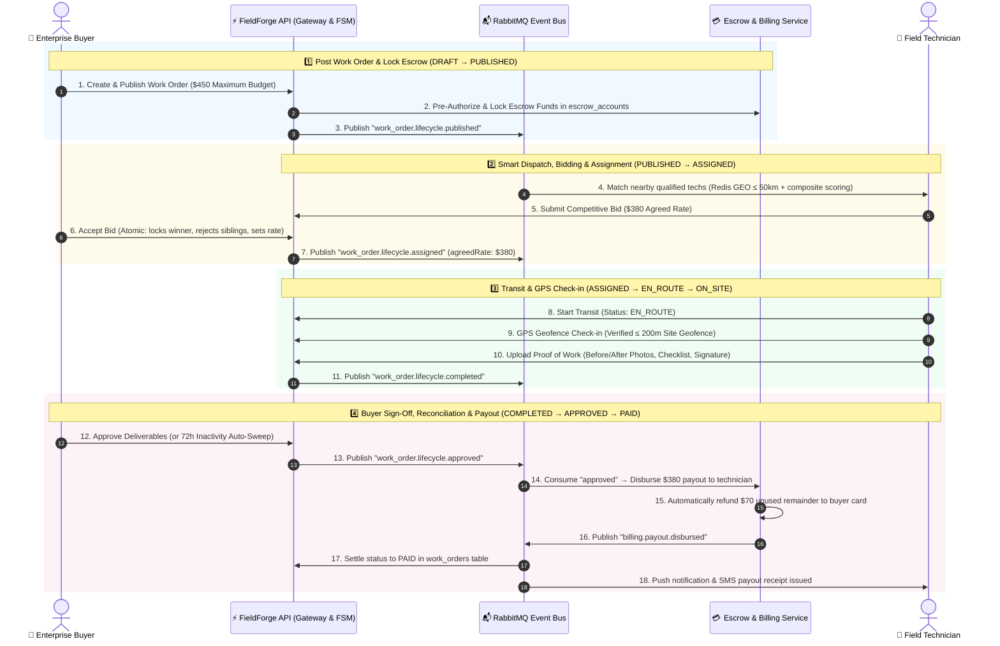
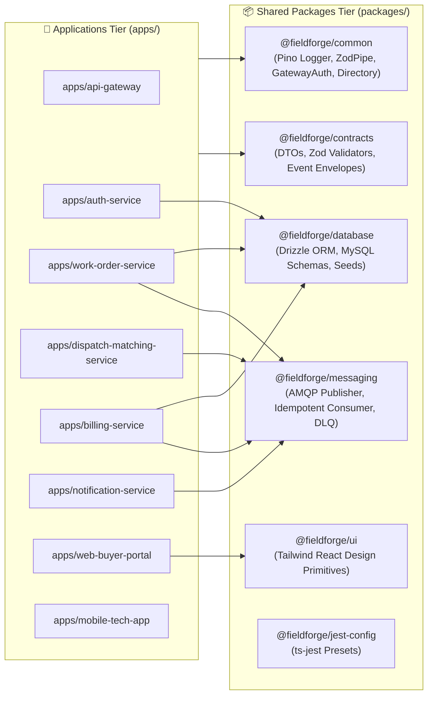
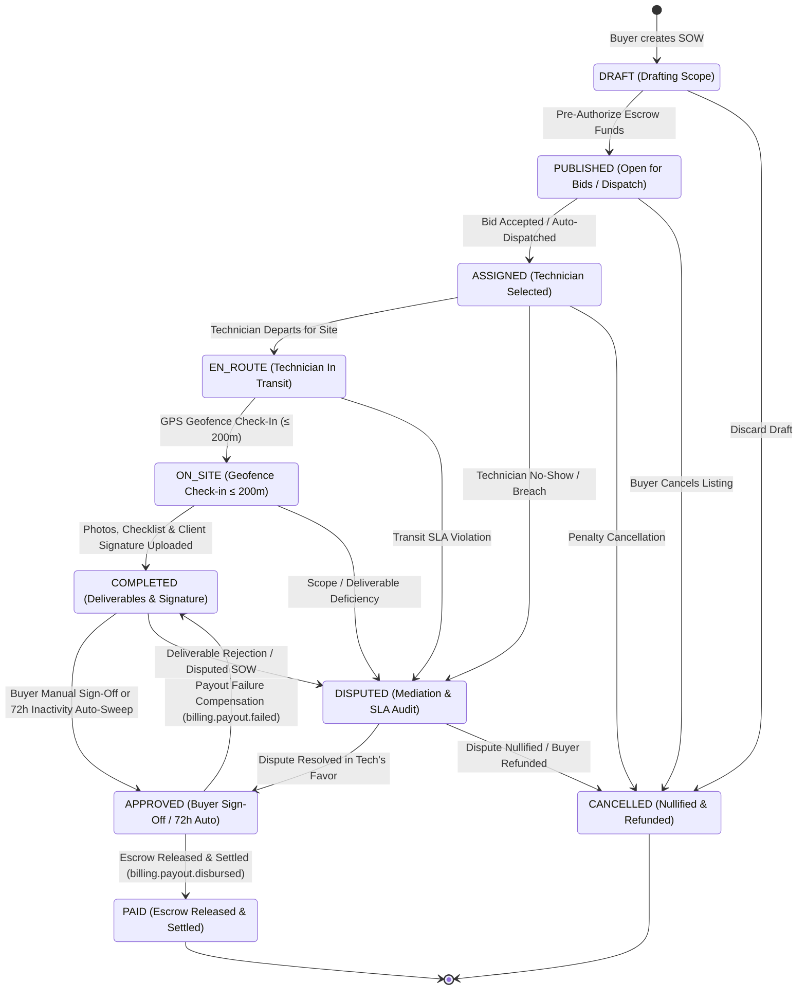

<div align="center">

# ⚡ FieldForge

### Real-Time Enterprise Field Service Marketplace & Microservices Platform

[](https://nodejs.org/)
[](https://nestjs.com/)
[](https://react.dev/)
[](https://nextjs.org/)
[](https://reactnative.dev/)
[](https://www.mysql.com/)
[](https://redis.io/)
[](https://www.rabbitmq.com/)
[](https://turbo.build/)
[](./docs/DEVELOPMENT_PLAN.md)
[](./LICENSE)

<p align="center">
  <b>High-throughput, event-driven SaaS marketplace connecting enterprise buyers with certified field service technicians for mission-critical hardware, telecom, and networking maintenance.</b>
</p>

[Architecture](#-system-architecture) • [Microservices](#-microservices-ecosystem) • [Database Schema](#-database--relational-modeling) • [FSM Lifecycle](#-work-order-finite-state-machine-fsm) • [Messaging](#-event-backbone--messaging-architecture-fieldforgemessaging) • [Quickstart](#-quickstart--local-development) • [Testing & Verification](#-automated-testing--verification-gates) • [ADRs](#-accepted-architecture-decision-records-adrs)

</div>

---

## 📖 Overview & Core Capabilities

FieldForge is an enterprise field service marketplace and autonomous dispatch platform connecting businesses with certified technicians. Engineered as a modular, event-driven distributed system on NestJS, Next.js, React Native Expo, MySQL 8.4 LTS, Redis 8.0, and RabbitMQ 4.1:

- **⚡ Low-Latency Dispatch Matching:** Redis `GEOSEARCH` proximity matching on spatial sets (`tech:locations`) paired with multi-parameter contractor scoring (40% distance, 30% rating, 15% completed jobs, 15% verified certifications).
- **📋 Deterministic Finite State Machine (FSM):** Strict, ACID-backed work order state progression with zero race conditions, modular transition guards, execution strategies, and compensating rollback on payout failure (`APPROVED → COMPLETED`).
- **📍 GPS Geofence Check-In & Proof of Work:** Server-verified device GPS location requiring $\le 200\text{m}$ site proximity (SRS FR-MOB-001), before/after photo deliverables, milestone checklists, and SHA-256 client signature approvals.
- **🛡️ Technician Compliance & Vetting Badges:** Database-backed credentials (Cisco CCNA, OSHA 10, CompTIA A+, Fiber Optic, Background Checks), administrative verification workflows, and visual badge discovery across portal and mobile app.
- **📱 Phone OTP Verification:** Cryptographically randomized, rate-limited 6-digit OTP verification for secure contractor onboarding (FR-AUTH-001).
- **💳 Guaranteed Escrow Settlement & Payout Reconciliation:** Automated pre-authorization, fund locking on publication, agreed bid rate reconciliation with automatic buyer remainder refund, double-entry payout ledger, and 72-hour review SLA auto-approval sweep.
- **📄 Hexagonal PDF Invoicing:** Decoupled PDF generation using Ports & Adapters (`InvoicePdfRendererPort` + `PdfKitInvoicePdfRenderer`), isolating imperative layout math and SHA-256 content hashes from domain services.
- **🔔 Autonomous Headless Worker:** Event-driven notification daemon consuming AMQP topics to dispatch push (FCM) and SMS alerts (Twilio/SES) with zero public HTTP exposure (ADR 010).
- **📊 99.9% SLI/SLO Reliability:** Production Prometheus metrics (`/metrics`), live Grafana dashboard (`http://localhost:3009`), Pino structured logging with PII redaction, distributed `x-correlation-id` propagation, and k6 load validation.
- **🧪 631 Verified Tests:** 603 automated unit/integration tests across 15 packages/apps and 28 Playwright E2E tests (100% real assertions, zero `--passWithNoTests`).

---

## 🏗️ System Architecture

### High-Level System Topology

```mermaid
flowchart TD
    %% Global Styling Classes
    classDef clientStyle fill:#e0f2fe,stroke:#0284c7,stroke-width:2px,color:#0f172a,font-weight:600;
    classDef gatewayStyle fill:#ede9fe,stroke:#7c3aed,stroke-width:2px,color:#0f172a,font-weight:600;
    classDef serviceStyle fill:#f0fdf4,stroke:#16a34a,stroke-width:2px,color:#0f172a,font-weight:600;
    classDef workerStyle fill:#fef3c7,stroke:#d97706,stroke-width:2px,color:#0f172a,font-weight:600;
    classDef brokerStyle fill:#fffbeb,stroke:#d97706,stroke-width:2px,color:#0f172a,font-weight:600;
    classDef dbStyle fill:#f1f5f9,stroke:#475569,stroke-width:2px,color:#0f172a,font-weight:600;
    classDef extStyle fill:#fdf2f8,stroke:#db2777,stroke-width:2px,color:#0f172a,font-weight:600;
    classDef apmStyle fill:#fef2f2,stroke:#dc2626,stroke-width:2px,color:#0f172a,font-weight:600;

    subgraph Clients[" 🌐 Client Applications Tier "]
        Buyer["🏢 Enterprise Buyer Portal<br/><b>Next.js 16 App Router · React 19 + Redux Toolkit</b><br/><i>5 Route Segments (:5173)</i>"]:::clientStyle
        Tech["📱 Field Tech Mobile App<br/><b>React Native + Expo</b><br/><i>Offline Sync Queue & GPS Geofence</i>"]:::clientStyle
    end

    subgraph Edge[" 🛡️ Edge Security & Gateway Tier "]
        APIGW["⚡ API Gateway Microservice (:8000)<br/><b>Reverse Proxy · JWT Verification · Rate Limiting · RBAC</b><br/><i>x-correlation-id & asserted x-ff-* identity headers</i>"]:::gatewayStyle
    end

    subgraph Services[" 🚀 Core Domain Microservices Cluster (NestJS) "]
        direction TB
        AuthSvc["🔐 Auth & Identity (:8001)<br/><i>IamModule · ProfilesModule · ContractorVettingModule</i>"]:::serviceStyle
        WOSvc["📋 Work Order Service (:8002)<br/><i>FSM Engine · Commercial Bidding · 72h SLA Sweep</i>"]:::serviceStyle
        DispSvc["📍 Dispatch & Matching (:8003)<br/><i>Redis GEOSEARCH · 2-Tier Cache · Candidate Scoring</i>"]:::serviceStyle
        BillSvc["💳 Billing & Escrow (:8004)<br/><i>Escrow Vault · Payout Ledger · Hexagonal PDF Invoicing</i>"]:::serviceStyle
    end

    subgraph Workers[" ⚙️ Headless Background Workers (ADR 010) "]
        NotifSvc["🔔 Notification Service (:8005)<br/><i>Autonomous Consumer · FCM Push · Twilio SMS</i><br/><i>Internal /healthz & /metrics only (no gateway ingress)</i>"]:::workerStyle
    end

    subgraph Messaging[" 📬 Event-Driven Message Broker "]
        RabbitMQ{{"📬 RabbitMQ Topic & Delay Exchange<br/><b>fieldforge.events.topic · fieldforge.events.dlx</b><br/><i>Broker-native delayed retry queues (*.retry)</i>"}}:::brokerStyle
    end

    subgraph Storage[" 💾 Persistence & In-Memory Geospatial Tier "]
        MySQL[("🗄️ MySQL 8.4 LTS (InnoDB)<br/><b>Drizzle ORM · 11 Tables · ACID Transactions</b><br/><i>Users, Work Orders, Bids, Escrow, Invoices, Ledger</i>")]:::dbStyle
        Redis[("⚡ Redis 8.0 Cache & Lock Store<br/><b>GEOSEARCH · 7-Day Idempotency · Rate Limits</b><br/><i>tech:locations · ff:idemp:* · throttler</i>")]:::dbStyle
    end

    subgraph External[" ☁️ Third-Party Integrations & Cloud Services "]
        S3["🪣 AWS S3<br/><i>Presigned Uploads & Deliverables</i>"]:::extStyle
        Stripe["💳 Stripe API<br/><i>Escrow Pre-Auth & Payment Intents</i>"]:::extStyle
        Twilio["📱 Twilio / AWS SES<br/><i>SMS Alerts & Invoicing Email</i>"]:::extStyle
        FCM["🔔 Firebase FCM<br/><i>Mobile Push Notifications</i>"]:::extStyle
    end

    subgraph Observability[" 📊 APM, Metrics & Distributed Tracing "]
        OTEL["📡 Pino Structured JSON Logs & Traces"]:::apmStyle
        Prometheus["📈 Prometheus (:9090) & Grafana (:3009)"]:::apmStyle
        Jaeger["🔍 Jaeger Distributed Tracing (:16686)"]:::apmStyle
    end

    %% Client Ingress
    Buyer -->|HTTPS / REST| APIGW
    Tech -->|HTTPS / REST| APIGW

    %% Gateway Ingress Routing (4 Core Services Only)
    APIGW -->|Route /auth, /users, /technicians| AuthSvc
    APIGW -->|Route /work-orders, /dispatch/bids| WOSvc
    APIGW -->|Route /dispatch| DispSvc
    APIGW -->|Route /billing| BillSvc

    %% Database Connections (Drizzle ORM)
    AuthSvc -->|TCP / Drizzle| MySQL
    WOSvc -->|TCP / Drizzle| MySQL
    BillSvc -->|TCP / Drizzle| MySQL
    DispSvc -->|RESP / GEOSEARCH| Redis

    %% Inter-Service Directory Resolution (Decoupled Schemas)
    DispSvc -.->|POST /technicians/batch (cached)| AuthSvc
    WOSvc -.->|GET /users/:id/profile| AuthSvc
    BillSvc -.->|GET /work-orders/:id| WOSvc

    %% Async Event Publish & Consume
    WOSvc -.->|Pub: work_order.lifecycle.*| RabbitMQ
    DispSvc -.->|Pub: dispatch.*| RabbitMQ
    BillSvc -.->|Pub: billing.payout.*| RabbitMQ

    RabbitMQ -.->|Sub: work_order.lifecycle.approved| BillSvc
    RabbitMQ -.->|Sub: billing.payout.*| WOSvc
    RabbitMQ -.->|Sub: work_order.lifecycle.*| NotifSvc

    %% External Cloud Services
    WOSvc -.->|Presigned URLs| S3
    BillSvc -.->|Payment Gateway| Stripe
    NotifSvc -.->|SMS Delivery| Twilio
    NotifSvc -.->|Push Notifications| FCM

    %% APM Telemetry
    Services -.->|Structured JSON Logs & Spans| OTEL
    Workers -.->|Structured JSON Logs & Spans| OTEL
    OTEL --> Prometheus
    OTEL --> Jaeger
```

---

### 🔄 End-to-End Work Order Lifecycle & Event Flow



---

### 📬 Event Backbone & Messaging Architecture (`@fieldforge/messaging`)

FieldForge operates an asynchronous event-driven messaging architecture built on RabbitMQ topic exchanges, broker-native delayed retry queues, confirmed delivery channels, and atomic Redis idempotency locks (`RULE-EVENT-03`):

- **Central Topic Exchange (`fieldforge.events.topic`)**: Durable topic exchange routing all domain events with persistent delivery mode (`deliveryMode = 2`).
- **Broker-Native Delayed Retry Queues (`<queue>.retry`)**: Transient processing failures schedule retries through dedicated broker-native delay queues with per-message TTL (`expiration`) and dead-letter routing to the default exchange (`''`). This eliminates process-crash message loss during in-memory backoff: messages remain durably inside RabbitMQ storage across worker pod restarts (FF-ARCH-12).
- **Dead-Letter Exchange (`fieldforge.events.dlx`) & DLQ (`fieldforge.events.dlq`)**: Traps poisoned or exhausted messages (`retryCount >= 3`) with `x-death-reason` and original routing headers for root-cause diagnostics.
- **Atomic 7-Day Redis Idempotency Store**: Every message consumer performs atomic key acquisition (`ff:idemp:<eventId>`) with a 7-day TTL (`604800s`). The Lua-based `tryAcquire(eventId, retryCount)` allows legitimate broker retries while blocking fresh duplicate deliveries and completed events.
- **Zero Premature ACKs**: Consumer acknowledges (`channel.ack(msg)`) the original queue only after confirmed receipt in the broker retry queue or DLQ.
- **Distributed Trace Propagation**: Restores `x-correlation-id` from AMQP headers into Pino child loggers for unbroken trace continuity across HTTP and AMQP boundaries.

---

### 🗄️ Database & Relational Modeling

All 11 relational database tables are managed via **Drizzle ORM** targeting **MySQL 8.4 LTS InnoDB** with strict foreign keys, cascade rules, and parameterization:

```mermaid
erDiagram
    USERS ||--o| BUYER_PROFILES : "1:1 profile"
    USERS ||--o| TECHNICIAN_PROFILES : "1:1 profile"
    USERS ||--o{ REFRESH_TOKENS : "owns (1:N)"
    TECHNICIAN_PROFILES ||--o{ TECHNICIAN_CERTIFICATIONS : "holds (1:N)"
    BUYER_PROFILES ||--o{ WORK_ORDERS : "creates (1:N)"
    TECHNICIAN_PROFILES ||--o{ WORK_ORDERS : "assigned_to (0..1:N)"
    TECHNICIAN_PROFILES ||--o{ WORK_ORDER_BIDS : "submits (1:N)"
    WORK_ORDERS ||--o{ WORK_ORDER_BIDS : "receives (1:N)"
    WORK_ORDERS ||--o{ WORK_ORDER_DELIVERABLES : "contains (1:N)"
    WORK_ORDERS ||--o{ WORK_ORDER_STATUS_HISTORY : "audit_trail (1:N)"
    WORK_ORDERS ||--|| ESCROW_ACCOUNTS : "secured_by (1:1 strict)"
    WORK_ORDERS ||--|| INVOICES : "billed_by (1:1 strict)"
    TECHNICIAN_PROFILES ||--o{ PAYOUT_LEDGER : "credits (1:N)"

    USERS {
        varchar_36 id PK "UUID"
        varchar_255 email UK "Unique login"
        varchar_255 password_hash "Bcrypt hash"
        enum role "BUYER | TECHNICIAN | DISPATCHER | ADMIN"
        varchar_30 phone_number "E.164 phone"
        enum status "PENDING | ACTIVE | SUSPENDED"
        timestamp created_at "Auto-now"
        timestamp updated_at "On-update"
    }

    BUYER_PROFILES {
        varchar_36 id PK "UUID"
        varchar_36 user_id FK,UK "1:1 Cascade delete"
        varchar_255 company_name "Legal enterprise name"
        text billing_address "Billing & tax address"
        decimal_12_2 escrow_balance "Available balance"
    }

    TECHNICIAN_PROFILES {
        varchar_36 id PK "UUID"
        varchar_36 user_id FK,UK "1:1 Cascade delete"
        varchar_100 first_name "First name"
        varchar_100 last_name "Last name"
        decimal_8_2 hourly_rate "Base rate / hr"
        decimal_10_8 current_latitude "Spatial GPS Lat"
        decimal_11_8 current_longitude "Spatial GPS Lng"
        decimal_3_2 rating_average "Score (default 5.00)"
        int jobs_completed "Completed jobs count"
    }

    REFRESH_TOKENS {
        varchar_36 id PK "UUID"
        varchar_36 user_id FK "References users (cascade)"
        varchar_255 token_hash "Bcrypt/SHA token hash"
        timestamp expires_at "Token expiration"
        timestamp revoked_at "Revocation timestamp"
        timestamp created_at "Auto-now"
    }

    TECHNICIAN_CERTIFICATIONS {
        varchar_36 id PK "UUID"
        varchar_36 technician_id FK "References technician_profiles (cascade)"
        varchar_100 name "CCNA, OSHA 10, CompTIA A+"
        timestamp issued_date "Issue date"
        timestamp expiry_date "Expiration date"
        boolean is_verified "Admin verified flag"
        timestamp created_at "Auto-now"
    }

    WORK_ORDERS {
        varchar_36 id PK "UUID"
        varchar_36 buyer_id FK "References buyer_profiles"
        varchar_36 assigned_technician_id FK "References technician_profiles (nullable)"
        varchar_255 title "Job summary"
        text description "Scope of work specifications"
        varchar_100 category "Hardware, Cabling, Telecom"
        enum status "DRAFT|PUBLISHED|ASSIGNED|EN_ROUTE|ON_SITE|COMPLETED|APPROVED|PAID|CANCELLED|DISPUTED"
        enum budget_type "FIXED | HOURLY"
        decimal_10_2 budget_amount "Max budget allocation"
        text address_line "Physical site address"
        decimal_10_8 latitude "Geofence target lat"
        decimal_11_8 longitude "Geofence target lng"
        datetime scheduled_start_time "SLA window start"
        datetime scheduled_end_time "SLA window end"
        datetime sla_expiration_time "Auto-escalation deadline"
        timestamp created_at "Auto-now"
        timestamp updated_at "On-update"
    }

    WORK_ORDER_STATUS_HISTORY {
        varchar_36 id PK "UUID"
        varchar_36 work_order_id FK "References work_orders (cascade)"
        enum from_status "Previous status"
        enum to_status "Target status"
        varchar_36 changed_by "User UUID or SYSTEM"
        text reason "Transition rationale"
        timestamp created_at "Auto-now"
    }

    WORK_ORDER_BIDS {
        varchar_36 id PK "UUID"
        varchar_36 work_order_id FK "References work_orders (cascade)"
        varchar_36 technician_id FK "References technician_profiles"
        decimal_10_2 bid_amount "Contractor proposed rate"
        text counter_note "Scope or timeline notes"
        enum bid_status "PENDING | ACCEPTED | REJECTED | WITHDRAWN"
        timestamp created_at "Auto-now"
    }

    WORK_ORDER_DELIVERABLES {
        varchar_36 id PK "UUID"
        varchar_36 work_order_id FK "References work_orders (cascade)"
        enum deliverable_type "PHOTO_BEFORE | PHOTO_AFTER | CHECKLIST | SIGNATURE"
        varchar_512 s3_url "Secure AWS S3 Object URI"
        varchar_64 signature_hash "SHA-256 digital signature"
        varchar_255 client_name "Sign-off client representative"
        timestamp signed_at "Sign timestamp"
        timestamp uploaded_at "Proof upload timestamp"
    }

    ESCROW_ACCOUNTS {
        varchar_36 id PK "UUID"
        varchar_36 work_order_id FK,UK "1:1 Unique constraint (uq_escrow_work_order)"
        decimal_10_2 amount_locked "Pre-authorized escrow funds"
        enum status "HELD | RELEASED | REFUNDED | DISPUTED"
        timestamp created_at "Escrow locked timestamp"
        timestamp released_at "Payout disbursement timestamp"
    }

    INVOICES {
        varchar_36 id PK "UUID"
        varchar_36 work_order_id FK,UK "1:1 Unique constraint (uq_invoice_work_order)"
        varchar_36 buyer_id FK "References buyer_profiles"
        varchar_64 invoice_number UK "INV-YYYY-XXXXX"
        decimal_10_2 amount "Final invoice amount"
        varchar_64 content_hash "SHA-256 tamper-evident hash"
        timestamp issued_at "Issue timestamp"
        timestamp created_at "Auto-now"
    }

    PAYOUT_LEDGER {
        varchar_36 id PK "UUID"
        varchar_36 technician_id FK "References technician_profiles"
        varchar_36 work_order_id FK "References work_orders (cascade)"
        decimal_10_2 amount "Transaction amount"
        enum type "CREDIT | DEBIT"
        varchar_255 description "Audit ledger description"
        timestamp created_at "Auto-now"
    }

    IDEMPOTENCY_KEYS {
        varchar_255 key PK "Client idempotency key"
        varchar_64 scope "API operation scope"
        varchar_36 resource_id "Associated entity UUID"
        enum status "IN_PROGRESS | COMPLETED | FAILED"
        json response_payload "Cached HTTP response"
        timestamp created_at "Auto-now"
        timestamp expires_at "TTL expiration"
    }
```



#### Relational Constraints & Indexing Invariants

- **Escrow 1:1 Invariant (`uq_escrow_work_order`)**: Strict database-level unique constraint prevents double-funding or duplicate payout disbursement on a single work order.
- **Invoice 1:1 Invariant (`uq_invoice_work_order`)**: Enforces one invoice per completed work order, preventing duplicate billing.
- **Dispatch Composite Index (`idx_wo_status_sched`)**: Composite index on `work_orders(status, scheduled_start_time)` allows high-throughput querying of open work orders without MySQL filesorting.
- **Audit Trail Index (`idx_wosh_wo_created`)**: Indexed on `work_order_status_history(work_order_id, created_at)` for instant chronological transition log retrieval.
- **Geospatial Precision**: Site coordinates and technician locations use `DECIMAL(10, 8)` and `DECIMAL(11, 8)` for centimeter-level geofence accuracy ($\le 200\text{m}$).

---

## 🚀 Microservices Ecosystem

FieldForge separates domain responsibilities into 6 focused microservices, strictly decoupled into independent bounded contexts (`RULE-ARCH-01`):

| Microservice                    |  Port  | Architecture & Domain Responsibilities                                                                                                                                                                                                                     | Primary Data Store                                                  |
| :------------------------------ | :----: | :--------------------------------------------------------------------------------------------------------------------------------------------------------------------------------------------------------------------------------------------------------- | :------------------------------------------------------------------ |
| **`api-gateway`**               | `8000` | **Edge Security & Reverse Proxy:** Fronts 4 domain services (`auth`, `work-orders`, `dispatch`, `billing`). Enforces `JwtAuthGuard`, `RolesGuard`, `ThrottlerGuard` rate limiting, CORS allowlists, correlation ID injection, and PII redaction.           | In-Memory / Redis 8.0                                               |
| **`auth-service`**              | `8001` | **Identity, Profiles & Compliance:** Decoupled into `IamModule` (credentials, JWT rotation, phone OTP), `ProfilesModule` (buyer/tech profiles), and `ContractorVettingModule` (compliance badges, directory resolution `POST /technicians/batch`).         | MySQL 8.4 (`users`, `profiles`, `refresh_tokens`, `certifications`) |
| **`work-order-service`**        | `8002` | **Work Order Aggregate Root:** Canonical FSM lifecycle engine, modular transition guards/strategies, commercial bidding negotiation (`work_order_bids`), unified assignment logic, and automated 72h review SLA auto-approval sweep worker.                | MySQL 8.4 (`work_orders`, `status_history`, `bids`, `deliverables`) |
| **`dispatch-matching-service`** | `8003` | **Pure Geospatial Matching Engine:** Redis `GEOSEARCH` proximity lookup on `tech:locations`, multi-parameter candidate scoring algorithm, and 2-tier caching (`TechnicianDirectoryService`: Redis 300s TTL + in-memory LRU) for directory resolution.      | Redis 8.0 & RabbitMQ 4.1                                            |
| **`billing-service`**           | `8004` | **Escrow Vault & Hexagonal Invoicing:** Escrow pre-authorization, transactional fund release (`FOR UPDATE`), agreed bid reconciliation with buyer remainder refund, double-entry payout ledger, and hexagonal PDF generation via `InvoicePdfRendererPort`. | MySQL 8.4 (`escrow_accounts`, `invoices`, `payout_ledger`)          |
| **`notification-service`**      | `8005` | **Autonomous Headless Consumer Daemon (ADR 010):** Background event subscriber (`published`, `assigned`, `paid`). Dispatches FCM mobile push alerts and Twilio/SES SMS receipts. Internal `/healthz`, `/readyz`, and `/metrics` (zero edge ingress).       | RabbitMQ Topic Consumer                                             |

---

## 📦 Monorepo Package Architecture

FieldForge leverages **Turborepo** and **pnpm** workspaces for optimized caching, strict dependency isolation, and rapid parallel builds:



```
packages/
├── contracts/       # Shared DTOs, Zod schemas, Enums, money helpers & RabbitMQ EventEnvelope definitions
├── messaging/       # AMQP topic publisher, broker-native delayed retry queues (*.retry), Redis 7-day idempotency
├── database/        # MySQL 8.4 Drizzle ORM schema definitions, seeds & migration snapshots
├── common/          # ZodValidationPipe, GatewayAuthGuard, ProfileDirectoryService, Pino logger, Prometheus metrics
├── ui/              # Tailwind CSS React design system (Buttons, Modals, StatusBadges, Cards)
├── jest-config/     # Unified ts-jest configurations for NestJS microservices and Node packages
├── tsconfig/        # Standardized TypeScript compiler configurations (Base, NestJS, React, React Native)
└── eslint-config/   # Unified ESLint 10 & Prettier code quality standards
```

---

## 🔄 Work Order Finite State Machine (FSM)



### 📋 State Transition Matrix & Lifecycle Invariants

| From State      | Allowed Next State(s)               | Authorized Actor         | Transition Guard / Pre-condition                                  | Emitted Event (`fieldforge.events.topic`) |
| :-------------- | :---------------------------------- | :----------------------- | :---------------------------------------------------------------- | :---------------------------------------- |
| **`DRAFT`**     | `PUBLISHED`, `CANCELLED`            | Buyer                    | Stripe escrow pre-authorization locked                            | `work_order.lifecycle.published`          |
| **`PUBLISHED`** | `ASSIGNED`, `CANCELLED`             | Buyer / Dispatch Engine  | Contractor bid accepted or auto-assigned                          | `work_order.lifecycle.assigned`           |
| **`ASSIGNED`**  | `EN_ROUTE`, `DISPUTED`, `CANCELLED` | Technician / Buyer       | Technician confirms assignment and initiates transit              | `work_order.lifecycle.en_route`           |
| **`EN_ROUTE`**  | `ON_SITE`, `DISPUTED`               | Technician               | Device GPS Haversine verification ($\le 200\text{m}$ of site)     | `work_order.lifecycle.on_site`            |
| **`ON_SITE`**   | `COMPLETED`, `DISPUTED`             | Technician               | Before/after photos + milestone checklist + SHA-256 sign-off      | `work_order.lifecycle.completed`          |
| **`COMPLETED`** | `APPROVED`, `DISPUTED`              | Buyer / SLA Sweep Worker | Buyer manual approval OR 72h SLA review inactivity timeout        | `work_order.lifecycle.approved`           |
| **`APPROVED`**  | `PAID`, `COMPLETED`                 | `work-order-service`     | `PAID` via `payout.disbursed`; rollback to `COMPLETED` on failure | `work_order.lifecycle.paid` / comp. log   |
| **`DISPUTED`**  | `APPROVED`, `CANCELLED`             | Admin / Arbiter          | Mediation resolved in tech favor or cancelled with buyer refund   | `work_order.dispute.resolved`             |
| **`PAID`**      | _Terminal (`[*]`)_                  | —                        | Final settled state: Escrow disbursed, invoice issued             | —                                         |
| **`CANCELLED`** | _Terminal (`[*]`)_                  | Buyer / Admin            | Final cancelled state: Escrow refunded to buyer payment method    | `work_order.lifecycle.cancelled`          |

---

## 💻 Client Applications

### 🏢 Enterprise Buyer Portal (`apps/web-buyer-portal`)

- **Next.js 16 App Router & React 19:** High-performance responsive dashboard served on port `5173`.
- **RTK Query API Slice:** Centralized API client with automatic token refresh (`baseQueryWithReauth`) and concurrency mutex for zero-interruption session persistence.
- **5 Dedicated Route Segments:**
  - `/operations`: Live dispatch Kanban board, active SLA countdown monitors, and interactive FSM transitions.
  - `/create-wo`: Scope of Work builder wizard with budget estimation and escrow pre-authorization.
  - `/technicians`: Real-time proximity radar with composite matching scores and compliance badge discovery.
  - `/billing`: Escrow vault manager, double-entry payout ledger view, and PDF invoice downloads.
  - `/audit`: Tamper-evident deliverable inspection with SHA-256 signature verification and transition logs.

### 📱 Field Tech Mobile App (`apps/mobile-tech-app`)

- **React Native & Expo:** Native cross-platform application with offline-first synchronization.
- **Durable Offline Sync Queue:** Atomic `OfflineSyncService` backed by persistent storage; mutations executed offline replay via FIFO queue with `x-idempotency-key` and exponential backoff upon reconnect.
- **Geofenced On-Site Check-In:** Device GPS checks against work order coordinates enforcing the strict $\le 200\text{m}$ radius threshold.
- **Proof of Work Deliverables:** Milestone checklist verification, hardware serial number scanner, camera integration with presigned uploads, and client finger-signature capture.

---

## 📊 Service Level Objectives (SLOs) & APM Matrix

| Service Level Metric        | Target Objective (SLO) | Indicator Definition (SLI)                            | Validation & Evidence Source               |
| :-------------------------- | :--------------------: | :---------------------------------------------------- | :----------------------------------------- |
| **Platform Availability**   |   **at least 99.9%**   | Successful non-5xx requests / total HTTP requests     | Prometheus `rate(http_requests_total)`     |
| **Read Latency (p95)**      |      **< 100ms**       | Duration of REST read endpoints (`method="GET"`)      | Measured via `scripts/k6/dispatch-load.js` |
| **Write Latency (p95)**     |      **< 200ms**       | Duration of relational transaction endpoints (`POST`) | Measured via `scripts/k6/dispatch-load.js` |
| **Dispatch Queue Latency**  |       **≤ 1.5s**       | Time from work order publication to push notification | Metric `dispatch_fanout_latency_seconds`   |
| **Financial Ledger Safety** |     **0 failures**     | Unreconciled escrow transactions or ledger breaches   | Metric `billing_reconciliation_failures`   |

> **SLO Load Testing:** Run `./scripts/run-load-test.sh` to drive 1,000 concurrent iterations against the live stack and assert SLO thresholds. View live telemetry in Grafana at `http://localhost:3009`.

---

## 🛠️ Quickstart & Local Development

### 1. Prerequisites

- **Node.js** `24.x LTS` (managed via `.nvmrc` — run `nvm use`)
- **pnpm** `11.x` (`npm install -g pnpm@latest`)
- **Docker Desktop** with Docker Compose enabled

### 2. Environment Setup & Bootstrap

```bash
# 1. Clone the repository
git clone https://github.com/your-org/fieldforge.git
cd fieldforge

# 2. Select the required Node 24 runtime
nvm use

# 3. Create a local environment file and run the reproducible bootstrap
cp .env.example .env
pnpm setup

# 4. Apply database migrations and seed realistic mock data
pnpm db:migrate
pnpm db:seed

# 5. Launch all microservices, workers, and portals concurrently
pnpm dev
```

> **`JWT_SECRET` Security Requirement:** `api-gateway` and `auth-service` share one HS256 key resolved through `requireJwtSecret()` ([`packages/common/src/config/jwt-secret.ts`](./packages/common/src/config/jwt-secret.ts)). There is deliberately no default fallback: a service with a missing, too-short (< 32 characters, per RFC 7518 §3.2), or previously published key exits immediately at startup. `pnpm setup` generates a cryptographically secure key for local development.

### 3. Core Service Endpoints

| Service / Tool                | URL / Port                      | Description                                         |
| :---------------------------- | :------------------------------ | :-------------------------------------------------- |
| **Enterprise Buyer Portal**   | `http://localhost:5173`         | Next.js 16 App Router Buyer Operations Console      |
| **API Gateway (Public REST)** | `http://localhost:8000/api/v1`  | Edge gateway reverse proxy for mobile and web       |
| **Auth & Identity Service**   | `http://localhost:8001`         | IAM, Profiles & Contractor Vetting                  |
| **Work Order FSM Service**    | `http://localhost:8002`         | Work Order Lifecycle, Bids & SLA Sweeper            |
| **Dispatch Matching Service** | `http://localhost:8003`         | Geospatial Redis Matching & Candidate Scoring       |
| **Billing & Escrow Service**  | `http://localhost:8004`         | Escrow Vault, Payout Ledger & Invoicing             |
| **Notification Worker**       | `http://localhost:8005/healthz` | Headless AMQP Consumer (Internal health & metrics)  |
| **RabbitMQ Management UI**    | `http://localhost:15672`        | Topic exchange, queues, DLQ & message diagnostics   |
| **Grafana APM Dashboard**     | `http://localhost:3009`         | Live SLI/SLO dashboards and request latency metrics |
| **Prometheus Server**         | `http://localhost:9090`         | Metrics scraping engine & recording rules           |
| **Jaeger Tracing Console**    | `http://localhost:16686`        | Distributed trace waterfall exploration             |

---

## 🧪 Automated Testing & Verification Gates

The repository enforces strict test quality and continuous validation. Placeholder test suites (`--passWithNoTests`) and superficial assertions are prohibited.

### Monorepo Test Inventory (656 Total Verified Tests)

| Component / Workspace            | Type                  | Test Suites |  Tests  |    Status     |
| :------------------------------- | :-------------------- | :---------: | :-----: | :-----------: |
| `apps/work-order-service`        | Unit / Integration    |     13      |   234   |     PASS      |
| `@fieldforge/contracts`          | Unit / Schema         |      3      |   81    |     PASS      |
| `apps/auth-service`              | Unit / Integration    |      7      |   73    |     PASS      |
| `apps/dispatch-matching-service` | Unit / Integration    |      5      |   58    |     PASS      |
| `@fieldforge/common`             | Unit / Infrastructure |      6      |   49    |     PASS      |
| `apps/api-gateway`               | Unit / Integration    |      6      |   44    |     PASS      |
| `apps/billing-service`           | Unit / Integration    |      5      |   33    |     PASS      |
| `@fieldforge/messaging`          | Unit / Integration    |      5      |   21    |     PASS      |
| `apps/mobile-tech-app`           | Unit / Component      |      3      |   21    |     PASS      |
| `apps/notification-service`      | Unit / Integration    |      1      |   14    |     PASS      |
| **Playwright E2E Test Suite**    | End-to-End            |      1      |   28    |     PASS      |
| **Monorepo Total**               |                       |   **50**    | **656** | **100% PASS** |

### Standard Verification Commands

```bash
# Run unit & integration test suites
pnpm test

# Run Playwright end-to-end buyer lifecycle test suite
pnpm test:e2e

# Run format, lint, typecheck, and test checks
pnpm check

# Validate Turborepo task graph cleanly
pnpm validate:clean-typecheck
```

### 🛡️ Pre-Push Verification Gate (`pnpm verify:pre-push`)

Per `AGENTS.md`, developers and autonomous agents **MUST NEVER** execute `git push` without first passing the mandatory 9-step pre-push verification gate in sequence:

```bash
pnpm verify:pre-push
```

This script executes:

1. `pnpm format` (Automatic code formatting)
2. `pnpm format:check` (Asserts zero formatting deviations)
3. `pnpm lint` (ESLint 10 zero-warning enforcement)
4. `pnpm typecheck` (Turborepo strict TypeScript validation)
5. `pnpm test` (628 unit/integration tests with real assertions)
6. `pnpm test:e2e` (28 Playwright E2E lifecycle tests)
7. `pnpm validate:clean-typecheck` (Hermetic build artifact validation)
8. `pnpm build` (Production compilation of all apps & packages)
9. `pnpm check` (Full-stack workspace integrity check)

---

## 🏛️ Accepted Architecture Decision Records (ADRs)

Key architectural boundaries are codified in `.agent/memory/ADRs/`:

| ADR                                                                                     | Title                                   | Key Architectural Decision                                                                                             |
| :-------------------------------------------------------------------------------------- | :-------------------------------------- | :--------------------------------------------------------------------------------------------------------------------- |
| [**ADR 001**](./.agent/memory/ADRs/001_mysql_and_drizzle.md)                            | MySQL 8.0 & Drizzle ORM                 | Parameterized queries, typed relational schemas, and transactional money mutations. _(Superseded by ADR 004)_          |
| [**ADR 002**](./.agent/memory/ADRs/002_rabbitmq_topic_exchanges.md)                     | RabbitMQ Topic Exchanges                | Asynchronous cross-service event choreography via `fieldforge.events.topic`. _(Superseded by ADR 004)_                 |
| [**ADR 003**](./.agent/memory/ADRs/003_redis_geosearch_matching.md)                     | Redis GEOSEARCH Matching                | In-memory spatial indexing on `tech:locations` for low-latency contractor proximity queries. _(Superseded by ADR 004)_ |
| [**ADR 004**](./.agent/memory/ADRs/004_upgrade_infrastructure_versions.md)              | Upgrade Infrastructure Versions         | Unified runtime versions: MySQL 8.4 LTS InnoDB, Redis 8.0, and RabbitMQ 4.1 across docker and manifests.               |
| [**ADR 005**](./.agent/memory/ADRs/005_work_order_aggregate_boundary_reconciliation.md) | Work Order Boundary Reconciliation      | Isolated billing escrow mutations from work order status updates; event-driven settlement trigger.                     |
| [**ADR 006**](./.agent/memory/ADRs/006_bounded_context_data_isolation.md)               | Bounded Context Data Isolation          | Purged foreign database schema joins across services; introduced directory lookups (`POST /technicians/batch`).        |
| [**ADR 007**](./.agent/memory/ADRs/007_marketplace_bidding_work_order_cohesion.md)      | Bidding & Work Order Aggregate Cohesion | Relocated commercial bidding into `work-order-service` as an aggregate entity; gateway proxies `/dispatch/bids`.       |
| [**ADR 008**](./.agent/memory/ADRs/008_iam_profile_vetting_domain_separation.md)        | IAM, Profiles & Vetting Separation      | Decomposed `auth-service` into encapsulated `IamModule`, `ProfilesModule`, and `ContractorVettingModule`.              |
| [**ADR 009**](./.agent/memory/ADRs/009_event_driven_settlement_choreography.md)         | Order Settlement Choreography           | Relocated 72h SLA review sweep into `work-order-service`; API settlement to `PAID` blocked; escrow-driven settlement.  |
| [**ADR 010**](./.agent/memory/ADRs/010_headless_notification_worker_boundary.md)        | Headless Notification Worker Boundary   | Demoted `notification-service` to an autonomous background consumer; removed edge gateway ingress routes.              |

---

## 🤖 Agentic Context Engineering

All coding agents start with [`AGENTS.md`](./AGENTS.md). Supporting guardrails and context live under `.agent/`:

- **`.agent/rules/`**: Modular rules enforcing microservice boundaries, Drizzle ORM transactions, RabbitMQ topic routing, and pre-push verification gates.
- **`.agent/context/`**: Living specifications for domain entities, OpenAPI catalogues, and project status logs.
- **`.agent/memory/ADRs/`**: Architecture Decision Records capturing the rationale for design choices.
- **`.agent/skills/`**: Standardized skill playbooks for Turborepo, Next.js, and Stitch Design workflows.

---

## 📄 License

This project is licensed under the MIT License - see the [LICENSE](./LICENSE) file for details.
