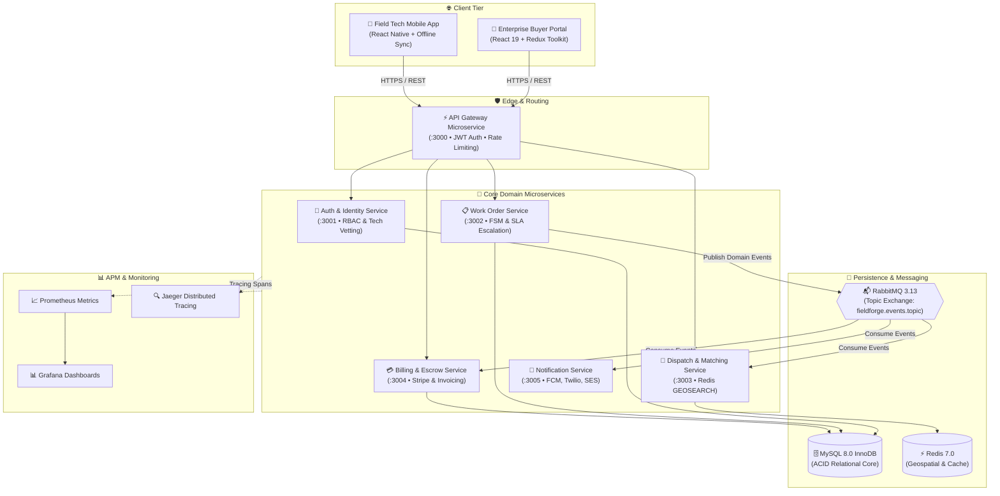
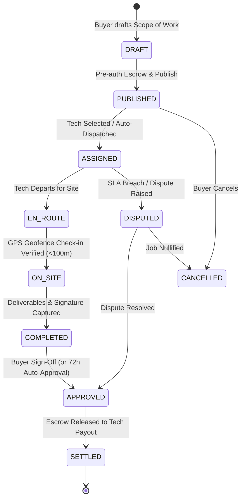

<div align="center">

# ⚡ FieldForge
### Real-Time Enterprise Field Service Marketplace & Microservices Platform

[](https://nodejs.org/)
[](https://nestjs.com/)
[](https://react.dev/)
[](https://reactnative.dev/)
[](https://www.mysql.com/)
[](https://redis.io/)
[](https://www.rabbitmq.com/)
[](https://turbo.build/)
[](https://kubernetes.io/)
[](./LICENSE)

<p align="center">
  <b>High-throughput, event-driven SaaS marketplace connecting enterprise buyers with certified field service technicians for mission-critical hardware, telecom, and networking maintenance.</b>
</p>

[Architecture](#-system-architecture) • [Microservices](#-microservices-ecosystem) • [Database Schema](#-database--relational-modeling) • [Quickstart](#-quickstart) • [Agent Directives](#-agentic-context-engineering)

</div>

---

## 📖 Overview & Core Capabilities

FieldForge is an enterprise field service management and autonomous dispatch platform engineered for high-concurrency gig-economy operations. It provides end-to-end management of the field workforce lifecycle:

- **⚡ Sub-Millisecond Dispatch Matching:** Redis 7 `GEOSEARCH` proximity engine paired with multi-parameter contractor scoring (certifications, ratings, hourly rate, distance).
- **📋 Deterministic Finite State Machine (FSM):** Strict, ACID-backed work order state progression with zero race conditions.
- **📍 GPS Geofence Check-In & Proof of Work:** Native mobile verification requiring $\le 100	ext{m}$ site proximity, photo deliverables, checklist milestone verification, and SHA-256 signed client approvals.
- **💳 Guaranteed Escrow Settlement:** Automated pre-authorization, fund locking on assignment, and 72-hour auto-disbursement with PDF invoice generation.
- **📊 99.9% SLI/SLO Reliability:** Built-in OpenTelemetry APM interceptors, Prometheus metrics collectors, and Pino structured logging with distributed `x-correlation-id` tracing.

---

## 🏗️ System Architecture



---

## 🚀 Microservices Ecosystem

| Microservice | Port | Domain Responsibilities | Primary Data Store |
| :--- | :---: | :--- | :--- |
| **`api-gateway`** | `3000` | Edge reverse proxy, JWT validation, rate limiting, correlation ID injection | In-Memory / Redis |
| **`auth-service`** | `3001` | User onboarding, RBAC tokens, compliance vetting (OSHA 10, Cisco CCNA, Background Checks) | MySQL (`users`, `profiles`) |
| **`work-order-service`** | `3002` | Work order lifecycle FSM, SOW templates, S3 deliverable uploads, SLA timeout watchers | MySQL (`work_orders`, `deliverables`) |
| **`dispatch-matching-service`** | `3003` | Geospatial contractor matching (`GEOSEARCH`), bidding negotiation, auto-routing rules | Redis 7 & RabbitMQ |
| **`billing-service`** | `3004` | Escrow pre-authorizations, fund capture, technician payouts, automated PDF invoicing | MySQL (`escrow_accounts`) |
| **`notification-service`** | `3005` | Push notifications (FCM/APNS), SMS dispatch alerts (Twilio), Email receipts (SES) | RabbitMQ Topic Consumer |

---

## 📦 Shared Monorepo Packages

```
packages/
├── contracts/       # Shared DTOs, Zod runtime validators, Enums & RabbitMQ event interfaces
├── database/        # MySQL 8.0 Drizzle ORM typed schema definitions, seeds & migrations
├── common/          # Structured Pino logger, OpenTelemetry APM interceptors, /healthz probes
├── ui/              # Shared Tailwind CSS React design system (Buttons, Modals, StatusBadges)
├── tsconfig/        # Standardized TypeScript compiler configurations (Base, NestJS, React, React Native)
└── eslint-config/   # Unified ESLint & Prettier code quality standards
```

---

## 🔄 Work Order Finite State Machine (FSM)



---

## 📊 Service Level Objectives (SLOs) & Reliability Matrix

| Service Level Metric | Target Objective (SLO) | Indicator Definition (SLI) | Max Error Budget |
| :--- | :---: | :--- | :--- |
| **Platform Availability** | **$\ge 99.95\%$** | $\frac{\text{Successful HTTP Requests (non-5xx)}}{\text{Total HTTP Requests}}$ | $21.6\text{ minutes / month}$ |
| **Read Latency (p95)** | **$< 100	ext{ms}$** | Duration of REST read endpoints | $95\%$ requests under $100\text{ms}$ |
| **Write Latency (p95)** | **$< 200	ext{ms}$** | Duration of relational transaction endpoints | $95\%$ writes under $200\text{ms}$ |
| **Dispatch Queue Latency** | **$\le 1.5	ext{s}$** | Time from work order publication to push notification | $99\%$ notifications in $\le 1.5\text{s}$ |
| **Redis GEOSEARCH Latency** | **$< 120	ext{ms}$** | Proximity lookup across 50,000+ cached technician nodes | $p95 < 120\text{ms}$ |

---

## 🛠️ Quickstart & Local Development

### 1. Prerequisites
- **Node.js** $\ge 24.0.0$
- **pnpm** $\ge 11.0.0$ (`npm install -g pnpm@latest`)
- **Docker Desktop** with Docker Compose enabled

### 2. Environment Setup
```bash
# 1. Clone the repository
git clone https://github.com/your-org/fieldforge.git
cd fieldforge

# 2. Install monorepo dependencies
pnpm install

# 3. Spin up local backing services (MySQL, Redis, RabbitMQ, Jaeger, Prometheus, Grafana)
pnpm docker:up

# 4. Run database migrations and seed mock data
pnpm db:migrate
pnpm db:seed

# 5. Launch all microservices and frontend portals concurrently
pnpm dev
```

### 3. Service Endpoints
- **Enterprise Buyer Portal:** `http://localhost:5173`
- **API Gateway (Public REST API):** `http://localhost:3000/api/v1`
- **RabbitMQ Management UI:** `http://localhost:15672` (guest / guest)
- **Jaeger Tracing Console:** `http://localhost:16686`
- **Grafana APM Dashboards:** `http://localhost:3001` (admin / admin)

---

## 🤖 Agentic Context Engineering

This repository is optimized for autonomous AI coding agents (Cursor, Antigravity, GitHub Copilot). Operational guardrails are codified under `.agent/` and `.cursorrules`:

- **`.agent/rules/`**: Modular rules enforcing microservices isolation, Drizzle ORM transactions, RabbitMQ topic routing, and React 19 / React Native best practices.
- **`.agent/context/`**: Living specifications for domain entities, OpenAPI catalogues, and SLI/SLO definitions.
- **`.agent/memory/ADRs/`**: Architecture Decision Records capturing technical rationale for key design choices.
- **`.agent/workflows/`**: Automation shell scripts for microservice generation, automated test loops, and SLI latency verification.

---

## 📄 License
This project is licensed under the MIT License - see the [LICENSE](./LICENSE) file for details.
