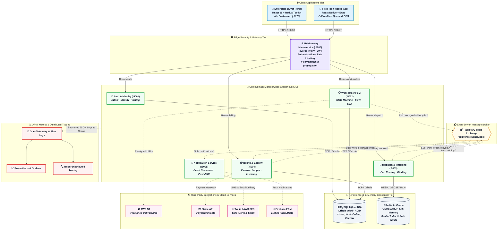
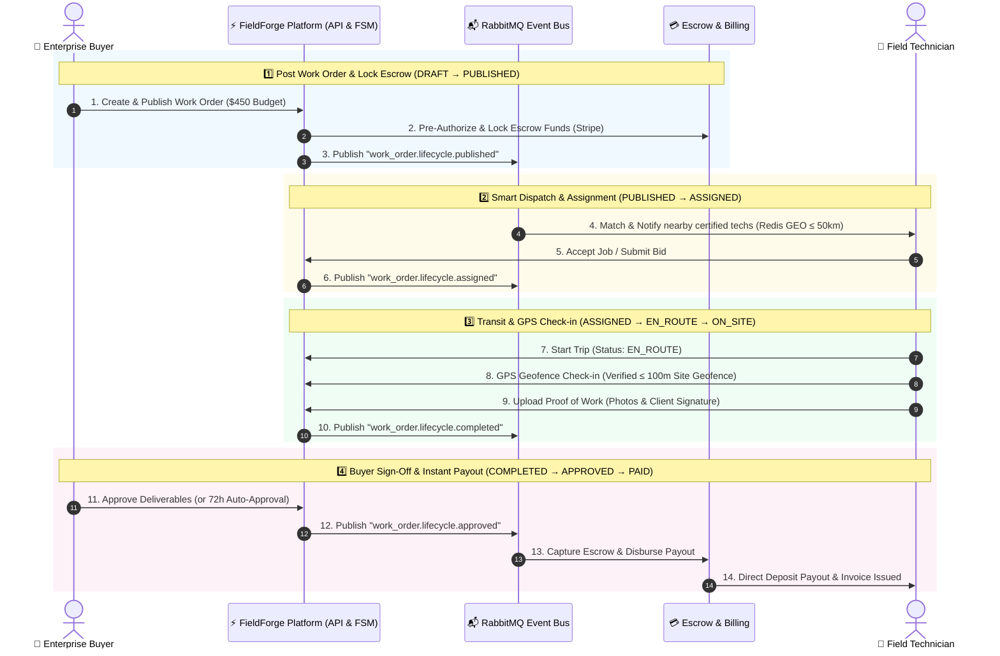
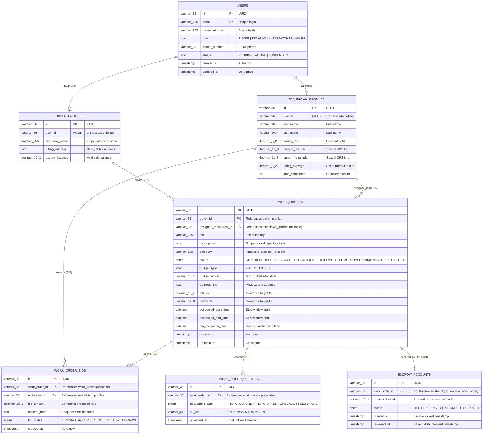
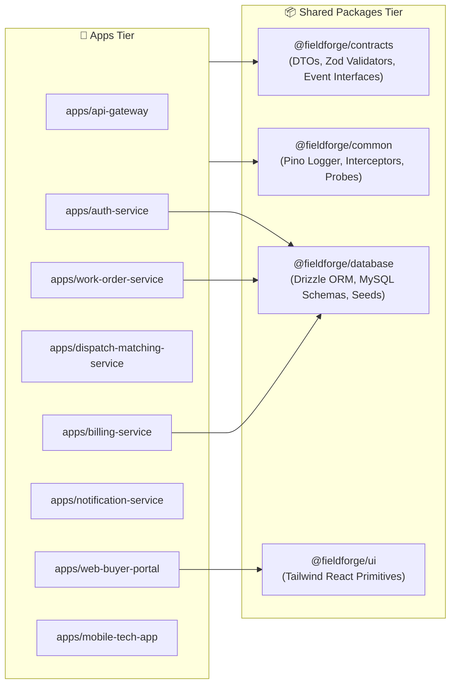
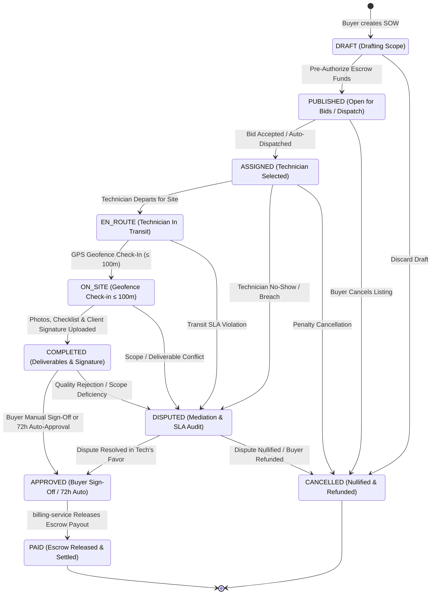

<div align="center">

# ⚡ FieldForge

### Real-Time Enterprise Field Service Marketplace & Microservices Platform

[](https://nodejs.org/)
[](https://nestjs.com/)
[](https://react.dev/)
[](https://reactnative.dev/)
[](https://www.mysql.com/)
[](https://redis.io/)
[](https://www.rabbitmq.com/)
[](https://turbo.build/)
[](https://kubernetes.io/)
[](./LICENSE)

<p align="center">
  <b>High-throughput, event-driven SaaS marketplace connecting enterprise buyers with certified field service technicians for mission-critical hardware, telecom, and networking maintenance.</b>
</p>

[Architecture](#-system-architecture) • [Microservices](#-microservices-ecosystem) • [Database Schema](#-database--relational-modeling) • [Quickstart](#-quickstart) • [Agent Directives](#-agentic-context-engineering)

</div>

---

## 📖 Overview & Target Capabilities

FieldForge is an enterprise field service marketplace and autonomous dispatch platform connecting businesses with certified technicians.

- **⚡ Low-Latency Dispatch Matching:** Redis `GEOSEARCH` proximity matching paired with multi-parameter contractor scoring (certifications, ratings, hourly rate, distance).
- **📋 Deterministic Finite State Machine (FSM):** Strict, ACID-backed work order state progression with zero race conditions.
- **📍 GPS Geofence Check-In & Proof of Work:** Native mobile verification requiring $\le 100\text{m}$ of site proximity, photo deliverables, checklist milestone verification, and SHA-256 signed client approvals.
- **💳 Guaranteed Escrow Settlement:** Automated pre-authorization, fund locking on assignment, and 72-hour auto-disbursement with PDF invoice generation.
- **📊 99.9% SLI/SLO Reliability Target:** Planned OpenTelemetry tracing, Prometheus metrics, Pino structured logging, and distributed `x-correlation-id` propagation.

---

## 🏗️ System Architecture

### High-Level System Topology



---

### 🔄 End-to-End Work Order Lifecycle & Event Flow



---

### 🗄️ Database Entity-Relationship (ER) Model



#### Relational Constraints & Indexing Invariants

- **Escrow 1:1 Invariant (`uq_escrow_work_order`)**: `escrow_accounts.work_order_id` is enforced by a `UNIQUE` constraint at the database layer to prevent double-funding or duplicate payout releases.
- **Dispatch Composite Index (`idx_wo_status_sched`)**: Composite index on `work_orders(status, scheduled_start_time)` allows high-throughput querying of open work orders without filesorting.
- **Geospatial Precision**: Site locations and technician coordinates use `DECIMAL(10, 8)` and `DECIMAL(11, 8)` for centimeter-level geofence accuracy ($\le 100\text{m}$).

---

## 🚀 Microservices Ecosystem

| Microservice                    |  Port  | Domain Responsibilities                                                                   | Primary Data Store                    |
| :------------------------------ | :----: | :---------------------------------------------------------------------------------------- | :------------------------------------ |
| **`api-gateway`**               | `5000` | Edge reverse proxy, JWT validation, rate limiting, correlation ID injection               | In-Memory / Redis                     |
| **`auth-service`**              | `5001` | User onboarding, RBAC tokens, compliance vetting (OSHA 10, Cisco CCNA, Background Checks) | MySQL (`users`, `profiles`)           |
| **`work-order-service`**        | `5002` | Work order lifecycle FSM, SOW templates, S3 deliverable uploads, SLA timeout watchers     | MySQL (`work_orders`, `deliverables`) |
| **`dispatch-matching-service`** | `5003` | Geospatial contractor matching (`GEOSEARCH`), bidding negotiation, auto-routing rules     | Redis 7 & RabbitMQ                    |
| **`billing-service`**           | `5004` | Escrow pre-authorizations, fund capture, technician payouts, automated PDF invoicing      | MySQL (`escrow_accounts`)             |
| **`notification-service`**      | `5005` | Push notifications (FCM/APNS), SMS dispatch alerts (Twilio), Email receipts (SES)         | RabbitMQ Topic Consumer               |

---

## 📦 Monorepo Package Architecture



```
packages/
├── contracts/       # Shared DTOs, Zod runtime validators, Enums & RabbitMQ event interfaces
├── database/        # MySQL 8.0 Drizzle ORM typed schema definitions, seeds & migrations
├── common/          # Structured Pino logger, OpenTelemetry APM interceptors, /healthz probes
├── ui/              # Shared Tailwind CSS React design system (Buttons, Modals, StatusBadges)
├── tsconfig/        # Standardized TypeScript compiler configurations (Base, NestJS, React, React Native)
└── eslint-config/   # Unified ESLint & Prettier code quality standards
```

---

## 🔄 Work Order Finite State Machine (FSM)



### 📋 State Transition Matrix & Lifecycle Invariants

| From State      | Allowed Next State(s)               | Authorized Actor        | Transition Guard / Pre-condition                      | Emitted Event (`fieldforge.events.topic`) |
| :-------------- | :---------------------------------- | :---------------------- | :---------------------------------------------------- | :---------------------------------------- |
| **`DRAFT`**     | `PUBLISHED`, `CANCELLED`            | Buyer                   | Stripe escrow pre-authorization locked                | `work_order.lifecycle.published`          |
| **`PUBLISHED`** | `ASSIGNED`, `CANCELLED`             | Buyer / Dispatch Engine | Contractor bid accepted or auto-assigned              | `work_order.lifecycle.assigned`           |
| **`ASSIGNED`**  | `EN_ROUTE`, `DISPUTED`, `CANCELLED` | Technician / Buyer      | Technician accepts and initiates transit              | `work_order.lifecycle.en_route`           |
| **`EN_ROUTE`**  | `ON_SITE`, `DISPUTED`               | Technician              | Device GPS Haversine verification ($\le 100\text{m}$) | `work_order.lifecycle.on_site`            |
| **`ON_SITE`**   | `COMPLETED`, `DISPUTED`             | Technician              | Before/after photos + SHA-256 client sign-off         | `work_order.lifecycle.completed`          |
| **`COMPLETED`** | `APPROVED`, `DISPUTED`              | Buyer / SLA Worker      | Buyer approves deliverables OR 72h inactivity timeout | `work_order.lifecycle.approved`           |
| **`APPROVED`**  | `PAID`                              | `billing-service`       | Escrow capture succeeded & payout ledger credited     | `billing.payout.disbursed`                |
| **`DISPUTED`**  | `APPROVED`, `CANCELLED`             | Admin / Arbiter         | Arbitration resolved or job nullified with refund     | `work_order.dispute.resolved`             |
| **`PAID`**      | _Terminal (`[*]`)_                  | —                       | Final state: Payout settled & PDF invoice issued      | —                                         |
| **`CANCELLED`** | _Terminal (`[*]`)_                  | Buyer / Admin           | Final state: Escrow refunded to buyer card            | `work_order.lifecycle.cancelled`          |

---

## 📊 Service Level Objectives (SLOs) & Reliability Matrix

| Service Level Metric        | Target Objective (SLO) | Indicator Definition (SLI)                              | Max Error Budget                          |
| :-------------------------- | :--------------------: | :------------------------------------------------------ | :---------------------------------------- |
| **Platform Availability**   |   **at least 99.9%**   | Successful non-5xx requests / total requests            | 43.2 minutes / month                      |
| **Read Latency (p95)**      |   **$< 100	ext{ms}$**   | Duration of REST read endpoints                         | $95\%$ requests under $100\text{ms}$      |
| **Write Latency (p95)**     |   **$< 200	ext{ms}$**   | Duration of relational transaction endpoints            | $95\%$ writes under $200\text{ms}$        |
| **Dispatch Queue Latency**  |  **$\le 1.5	ext{s}$**   | Time from work order publication to push notification   | $99\%$ notifications in $\le 1.5\text{s}$ |
| **Redis GEOSEARCH Latency** |   **$< 120	ext{ms}$**   | Proximity lookup across 50,000+ cached technician nodes | $p95 < 120\text{ms}$                      |

---

## 🛠️ Quickstart & Local Development

### 1. Prerequisites

- **Node.js** $\ge 24.0.0$
- **pnpm** $\ge 11.0.0$ (`npm install -g pnpm@latest`)
- **Docker Desktop** with Docker Compose enabled

### 2. Environment Setup

```bash
# 1. Clone the repository
git clone https://github.com/your-org/fieldforge.git
cd fieldforge

# 2. Create a local environment file and run the reproducible bootstrap
cp .env.example .env
pnpm setup

# 3. Run database migrations and seed mock data
pnpm db:migrate
pnpm db:seed

# 4. Launch all microservices and frontend portals concurrently
pnpm dev
```

### 3. Service Endpoints

- **Enterprise Buyer Portal:** `http://localhost:5173`
- **API Gateway (Public REST API):** `http://localhost:5000/api/v1`
- **RabbitMQ Management UI:** `http://localhost:15672` (credentials from `.env`)
- **Jaeger Tracing Console:** `http://localhost:16686`
- **Grafana:** `http://localhost:3009` (credentials from `.env`)

---

## 🤖 Agentic Context Engineering

All coding agents start with [`AGENTS.md`](./AGENTS.md). Supporting guardrails are codified under `.agent/` and `.cursorrules`:

- **`.agent/rules/`**: Modular rules enforcing microservices isolation, Drizzle ORM transactions, RabbitMQ topic routing, and React 19 / React Native best practices.
- **`.agent/context/`**: Living specifications for domain entities, OpenAPI catalogues, and SLI/SLO definitions.
- **`.agent/memory/ADRs/`**: Architecture Decision Records capturing technical rationale for key design choices.
- **`.agent/workflows/`**: Guarded helper scripts for scaffolding, quality checks, and explicitly labelled SLO simulation.

---

## 📄 License

This project is licensed under the MIT License - see the [LICENSE](./LICENSE) file for details.
