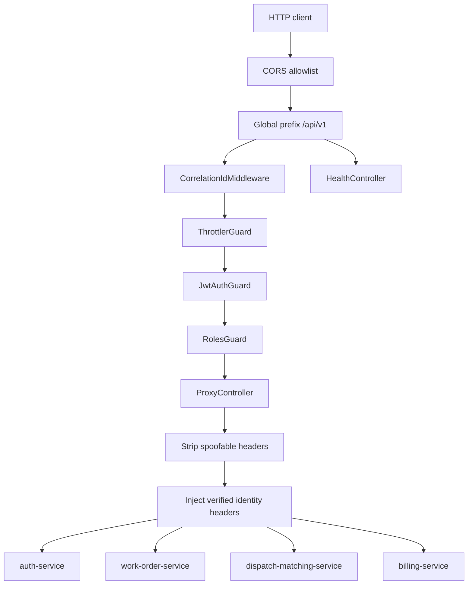
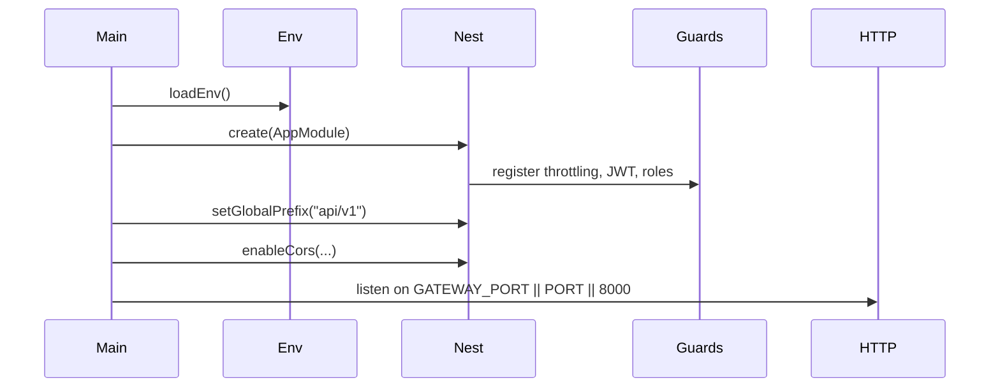

# API Gateway

## 1. Service Overview

`api-gateway` is the public HTTP edge for FieldForge. It exists to centralize request admission before traffic reaches domain services.

The gateway owns:

- Global `/api/v1` routing.
- JWT verification at the edge.
- RBAC enforcement through shared role metadata.
- Request throttling.
- CORS allowlisting.
- `x-correlation-id` creation and propagation.
- Downstream identity assertion headers (`x-ff-user-id`, `x-ff-user-role`, `x-ff-profile-id`).
- Anti-spoofing for FieldForge identity and internal-service headers.

It does not own business data, domain state transitions, escrow logic, matching, identity persistence, or notifications. Those responsibilities stay in the domain services.

Main consumers are the Next.js buyer portal, the Expo technician app, curl/API clients, and internal developers. The service is user-facing.

## 2. Service Responsibilities

### Primary Responsibilities

- Expose the public `/api/v1` REST boundary.
- Validate bearer JWTs except for confirmed public paths.
- Apply global request throttling.
- Proxy accepted requests to `auth-service`, `work-order-service`, `dispatch-matching-service`, and `billing-service`.
- Strip spoofable identity/internal headers from inbound traffic before forwarding.
- Inject verified identity headers into downstream requests when a token is valid.
- Generate or preserve `x-correlation-id`.
- Block public access to `/internal/*` paths.

### Secondary Responsibilities

- Expose shared liveness, readiness, and Prometheus metrics endpoints.
- Maintain backward-compatible bid route rewrites from `/dispatch/bids` and `/bids` to work-order bid routes.
- Enforce a strict browser CORS allowlist.

## 3. High-Level Architecture

Implementation evidence:

- Entry point: `apps/api-gateway/src/main.ts`
- Module: `apps/api-gateway/src/app.module.ts`
- Proxy controller: `apps/api-gateway/src/controllers/proxy.controller.ts`
- JWT guard: `apps/api-gateway/src/guards/jwt-auth.guard.ts`
- Correlation middleware: `apps/api-gateway/src/middleware/correlation-id.middleware.ts`
- Target service config: `apps/api-gateway/src/config/gateway.config.ts`



The gateway is intentionally stateless. It does not connect to MySQL, Redis, or RabbitMQ directly in the current implementation.

## 4. Folder Structure

```text
src/
|--- app.module.ts
|--- main.ts
|--- config/
|   `--- gateway.config.ts
|--- controllers/
|   `--- proxy.controller.ts
|--- guards/
|   `--- jwt-auth.guard.ts
|--- middleware/
|   `--- correlation-id.middleware.ts
`--- types/
    `--- express-http-proxy.d.ts
```

- `main.ts`: creates the Nest app, sets global prefix, configures CORS, and starts HTTP on `GATEWAY_PORT || PORT || 8000`.
- `app.module.ts`: registers JWT, throttling, global guards, global exception filter, metrics interceptor, shared health controller, and proxy controller.
- `config/`: resolves downstream service URLs from environment variables.
- `controllers/`: contains the catch-all route proxy and route rewrite logic.
- `guards/`: contains edge JWT verification and public path allowlist.
- `middleware/`: creates/preserves request correlation IDs.
- `types/`: local typing support for `express-http-proxy`.

## 5. Service Entry Point

Startup sequence:

1. `loadEnv()` reads local environment variables.
2. `NestFactory.create(AppModule)` builds the Nest app.
3. `app.setGlobalPrefix('api/v1')` mounts all controller routes under `/api/v1`.
4. CORS is enabled for `http://localhost:${WEB_PORT}`, `http://127.0.0.1:${WEB_PORT}`, and optional `CLIENT_URL`.
5. Global guards/interceptors/filters are registered by `AppModule`.
6. HTTP listens on `GATEWAY_PORT || PORT || 8000`.



Graceful shutdown hooks are not configured in `main.ts`.

## 6. API / Endpoint Documentation

All business routes are proxy routes. The gateway does not parse business payloads; it authenticates/adjudicates edge concerns, rewrites paths where needed, and forwards the request body to the selected downstream service.

### `ALL /api/v1/auth/*`

**Purpose:** Route authentication requests to `auth-service`.

**Access:** `POST /auth/register`, `POST /auth/login`, `POST /auth/refresh`, and `/auth/phone/*` are public by path allowlist. Other `/auth/*` paths require bearer JWT unless marked public by controller metadata.

**Authentication:** Optional only for public prefixes. If a token is present and valid, identity headers are injected downstream.

**Authorization:** `RolesGuard` can enforce role metadata where present.

**Request Parameters:** Any method, path, query, headers, and body supported by `auth-service`.

**Processing Flow:**

1. Apply correlation ID middleware.
2. Apply throttling.
3. Verify JWT when required or when a token is present.
4. Strip `x-ff-*` and `x-fieldforge-*` spoofable headers.
5. Re-add verified identity headers when authenticated.
6. Proxy to `AUTH_SERVICE_URL || http://localhost:8001`.

**Response:** Downstream response from `auth-service`.

**Possible Errors:** `401` missing/invalid token, `429` throttled, downstream errors, `404` if route is blocked as internal.

**Database Changes:** None in gateway.

**Side Effects:** Downstream service may mutate data.

**Implementation Location:** `proxy.controller.ts`, `jwt-auth.guard.ts`, `gateway.config.ts`.

### `ALL /api/v1/users/*`

Routes profile/directory requests to `auth-service` with the same edge processing as `/auth/*`.

Access is authenticated except for paths explicitly allowed by downstream code. Confirmed public user routes are not present in the gateway allowlist.

### `ALL /api/v1/technicians/*`

Routes technician vetting and internal-looking public paths to `auth-service`.

Important behavior:

- Client-supplied `x-fieldforge-service-name` and `x-fieldforge-internal-secret` are stripped.
- `/api/v1/technicians/batch` is not public at the gateway. It requires normal user authentication if attempted externally, while the real internal batch endpoint is called service-to-service without the gateway.

### `ALL /api/v1/work-orders/*`

Routes work-order lifecycle, deliverables, and canonical bid paths to `work-order-service`.

Authentication is required. The gateway passes `Authorization`, `x-correlation-id`, and verified `x-ff-*` identity headers to the downstream service.

### `ALL /api/v1/bids/*`

Backward-compatible gateway route. The proxy rewrites `/bids...` to `/work-orders/bids...` before sending to `work-order-service`.

### `ALL /api/v1/dispatch/*`

Routes matching and dispatch requests to `dispatch-matching-service`.

Special case: paths beginning `/api/v1/dispatch/bids` are routed to `work-order-service` and rewritten to `/work-orders/bids`.

### `ALL /api/v1/billing/*`

Routes escrow, invoice, and payout-ledger requests to `billing-service`.

### `ALL /api/v1/internal/*`

**Purpose:** Explicitly blocked.

**Access:** No public access.

**Processing Flow:** `ProxyController.forward()` detects `rawPath.startsWith('internal')` or `rawPath.includes('/internal/')`.

**Response:** `404` with an internal-route denial message.

**Side Effects:** None.

### `GET /api/v1/healthz`

Shared liveness endpoint from `@fieldforge/common`.

**Access:** Public.

**Response:** `{ status: "UP", timestamp: string }`.

### `GET /api/v1/readyz`

Shared readiness endpoint. Because the gateway has no DB/Redis/RabbitMQ providers, readiness returns a system-only check.

**Access:** Public.

### `GET /api/v1/metrics`

Prometheus text exposition from `metricsRegistry`.

**Access:** Public by gateway allowlist.

## 7. Endpoint Summary Table

| Method | Endpoint                | Purpose                         | Access                                                           |
| ------ | ----------------------- | ------------------------------- | ---------------------------------------------------------------- |
| ALL    | `/api/v1/auth/*`        | Proxy auth routes               | Public for register/login/refresh/phone, otherwise authenticated |
| ALL    | `/api/v1/users/*`       | Proxy user profile routes       | Authenticated                                                    |
| ALL    | `/api/v1/technicians/*` | Proxy technician vetting routes | Authenticated, except downstream-specific rules                  |
| ALL    | `/api/v1/work-orders/*` | Proxy work-order routes         | Authenticated                                                    |
| ALL    | `/api/v1/bids/*`        | Legacy bid proxy alias          | Authenticated                                                    |
| ALL    | `/api/v1/dispatch/*`    | Proxy dispatch routes           | Authenticated                                                    |
| ALL    | `/api/v1/billing/*`     | Proxy billing routes            | Authenticated                                                    |
| ALL    | `/api/v1/internal/*`    | Block internal routes           | Not accessible                                                   |
| GET    | `/api/v1/healthz`       | Liveness                        | Public                                                           |
| GET    | `/api/v1/readyz`        | Readiness                       | Public                                                           |
| GET    | `/api/v1/metrics`       | Prometheus metrics              | Public                                                           |

## 8. Request Lifecycle

```text
Client
-> API Gateway /api/v1
-> CORS check
-> CorrelationIdMiddleware
-> ThrottlerGuard
-> JwtAuthGuard
-> RolesGuard
-> ProxyController route selection
-> spoofable header stripping
-> verified identity header injection
-> downstream service
-> downstream response
```

## 9. Data Ownership and Storage

The gateway owns no database tables and performs no durable writes. It does not initialize `DrizzleModule`, Redis, or `MessagingModule`.

## 10. Service Communication

Outbound HTTP proxy targets:

- `AUTH_SERVICE_URL || http://localhost:8001`
- `WORK_ORDER_SERVICE_URL || http://localhost:8002`
- `DISPATCH_SERVICE_URL || http://localhost:8003`
- `BILLING_SERVICE_URL || http://localhost:8004`

RabbitMQ usage is not confirmed from the current codebase for this service.

## 11. Events, Queues, Jobs, and Workers

The gateway publishes no events, consumes no queues, and runs no background workers in the current codebase.

## 12. External Integrations

- `express-http-proxy` for downstream HTTP proxying.
- Browser CORS origins from `WEB_PORT` and `CLIENT_URL`.

No payment, SMS, push, database, or message-broker integration is present in this service.

## 13. Authentication and Authorization

- JWT secret is loaded through `requireJwtSecret()` from `@fieldforge/common`.
- Tokens are verified by `JwtService.verifyAsync<AuthJwtPayload>()`.
- Public prefixes are hardcoded in `jwt-auth.guard.ts`.
- Valid tokens populate `request.user`.
- Downstream identity headers are gateway-asserted only after inbound spoofed copies are deleted.
- `RolesGuard` from `@fieldforge/common` is registered globally.

## 14. Error Handling

- `GlobalHttpExceptionFilter` is registered globally.
- Missing tokens on protected paths return `401`.
- Invalid tokens on protected paths return `401`.
- Unknown service segments return `404`.
- Internal route attempts return `404`.
- CORS failures call the CORS callback with `Blocked by CORS allowlist`.
- Downstream errors are proxied by `express-http-proxy`.

## 15. Background Processing

No schedulers, cron jobs, queue consumers, or workers are registered.

## 16. Configuration

Confirmed environment variables:

| Variable                 | Purpose                                       | Default                           |
| ------------------------ | --------------------------------------------- | --------------------------------- |
| `GATEWAY_PORT`           | Gateway listen port                           | falls back to `PORT`, then `8000` |
| `PORT`                   | Alternate listen port and gateway config port | `8000`                            |
| `WEB_PORT`               | Local buyer portal port for CORS              | `5173`                            |
| `CLIENT_URL`             | Additional allowed CORS origin                | none                              |
| `JWT_SECRET`             | HS256 verification secret                     | required by `requireJwtSecret()`  |
| `AUTH_SERVICE_URL`       | Auth service target                           | `http://localhost:8001`           |
| `WORK_ORDER_SERVICE_URL` | Work-order target                             | `http://localhost:8002`           |
| `DISPATCH_SERVICE_URL`   | Dispatch target                               | `http://localhost:8003`           |
| `BILLING_SERVICE_URL`    | Billing target                                | `http://localhost:8004`           |
| `LOG_LEVEL`              | Pino log level through shared logger          | `info`                            |

## 17. Deployment and Runtime

- Dockerfile: `apps/api-gateway/Dockerfile`
- Container port: `8000`
- Kubernetes deployment: `infra/k8s/services/api-gateway.yaml`
- Kubernetes replicas: `2`
- Kubernetes service: `api-gateway-service:8000`
- Ingress: `infra/k8s/base/ingress.yaml` routes `api.fieldforge.io` to `api-gateway-service`.
- Probes use `/api/v1/healthz` and `/api/v1/readyz`.

## 18. Run and Test

```bash
pnpm --filter @fieldforge/api-gateway dev
pnpm --filter @fieldforge/api-gateway test
pnpm --filter @fieldforge/api-gateway typecheck
pnpm --filter @fieldforge/api-gateway build
```

Service tests live in `apps/api-gateway/test/` and cover gateway config, JWT secret handling, JWT guard behavior, proxy routing, and roles guard behavior.

## 19. Important Architectural Decisions

- ADR 006: bounded context data isolation; the gateway forwards identity, but domain services still verify bearer tokens.
- ADR 010: notification-service is not routed through the gateway.
- `.agent/rules/01_architecture_rules.md`: synchronous reads are HTTP/API boundary based; services must not query each other's private data.

## 20. Confirmed Gaps and Non-Responsibilities

- API Gateway does not proxy `notification-service`.
- API Gateway does not expose `/internal/*`.
- API Gateway does not manage persistence or event publishing.
- OpenAPI generation is not confirmed from the current codebase.
