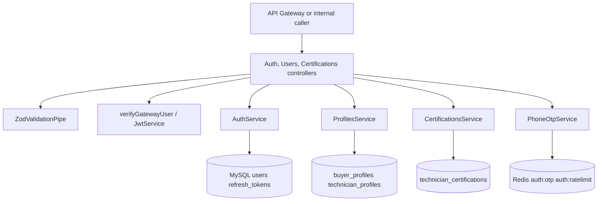
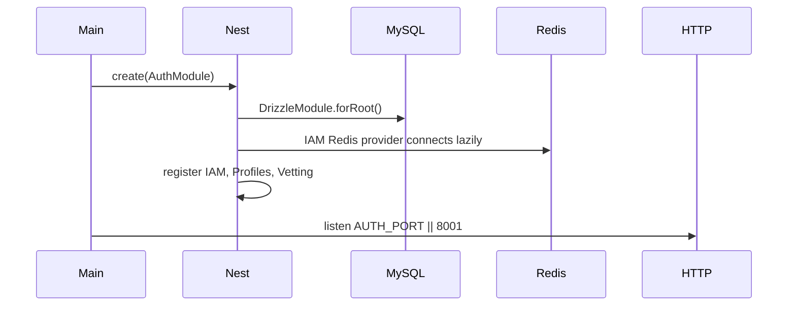

# Auth Service

## 1. Service Overview

`auth-service` owns identity, authentication tokens, user profiles, phone OTP verification, and technician vetting data for FieldForge.

It solves the business problem of establishing who a caller is, which role they have, and which domain profile ID represents them in the marketplace. Other services use the resulting JWT payload and profile IDs rather than querying auth-owned tables directly.

The service owns:

- IAM records in `users`.
- Refresh token rotation in `refresh_tokens`.
- Buyer and technician profile provisioning.
- Technician certifications and verified badge summaries.
- Phone OTP request/verification state in Redis.
- Internal technician directory lookup for dispatch.

It should not own work-order lifecycle, dispatch matching, escrow settlement, billing ledger, or notifications.

Main consumers are the API Gateway, buyer portal, mobile technician app, `dispatch-matching-service` for internal technician batch lookup, and other services through profile directory lookups. It is user-facing for IAM/vetting APIs and internal for selected directory APIs.

## 2. Service Responsibilities

### Primary Responsibilities

- Register users with role-specific profile provisioning.
- Authenticate users and issue access/refresh tokens.
- Rotate refresh tokens.
- Provide authenticated self-profile lookup.
- Provide user profile directory lookup.
- Store and verify technician certifications.
- Return technician badges and batch technician summaries.

### Secondary Responsibilities

- Send and verify phone OTP codes using Redis.
- Rate-limit OTP issuance with an atomic Redis Lua sliding window.
- Expose liveness, readiness, and metrics endpoints.

## 3. High-Level Architecture

Implementation evidence:

- Entry point: `apps/auth-service/src/main.ts`
- Root module: `apps/auth-service/src/auth.module.ts`
- IAM module: `apps/auth-service/src/modules/iam/*`
- Profiles module: `apps/auth-service/src/modules/profiles/*`
- Vetting module: `apps/auth-service/src/modules/vetting/*`



## 4. Folder Structure

```text
src/
|--- auth.module.ts
|--- main.ts
`--- modules/
    |--- iam/
    |   |--- auth.controller.ts
    |   |--- auth.service.ts
    |   |--- iam.module.ts
    |   `--- phone-otp.service.ts
    |--- profiles/
    |   |--- profiles.module.ts
    |   |--- profiles.service.ts
    |   `--- users.controller.ts
    `--- vetting/
        |--- certifications.controller.ts
        |--- certifications.service.ts
        `--- vetting.module.ts
```

- `iam/`: low-level identity, password, JWT, refresh token, and OTP logic.
- `profiles/`: role-specific profile provisioning and profile lookup.
- `vetting/`: technician certifications, badge state, pending review, and internal batch summaries.

## 5. Service Entry Point

Startup sequence:

1. `NestFactory.create(AuthModule)`.
2. `AuthModule` imports `DrizzleModule.forRoot()`, `IamModule`, `ProfilesModule`, and `ContractorVettingModule`.
3. `IamModule` configures `JwtModule` with `requireJwtSecret()` and creates an `ioredis` client for OTPs.
4. `HealthController` and `GlobalHttpExceptionFilter` are registered.
5. HTTP listens on `AUTH_PORT || 8001`.



Graceful Redis disconnect exists in `PhoneOtpService.onApplicationShutdown()`. No app-level shutdown hook is configured in `main.ts`.

## 6. API / Endpoint Documentation

### `POST /auth/register`

**Purpose:** Create a user account and role-specific profile.

**Access:** Public through the API Gateway.

**Authentication:** None.

**Authorization:** Role is supplied in the validated body.

**Request Parameters:** Body validated by `registerUserSchema`.

**Request Example:**

```json
{
  "email": "buyer@example.com",
  "password": "not-shown-here",
  "role": "BUYER",
  "phoneNumber": "+14155550100",
  "companyName": "Example Buyer",
  "billingAddress": "1 Market St"
}
```

**Validation Rules:** Confirmed in `packages/contracts/src/validators/auth.schema.ts`.

**Processing Flow:**

1. Validate request body.
2. Reject duplicate email.
3. Hash password with bcrypt.
4. Insert `users` row inside a transaction.
5. Provision `buyer_profiles` or `technician_profiles` through `ProfilesService`.
6. Generate JWT access token and random refresh token.
7. Store refresh token hash in `refresh_tokens`.

**Response:** `AuthTokensDto` with `accessToken`, `refreshToken`, `expiresIn`, and user summary.

**Possible Errors:** `409` duplicate email, validation errors, database errors.

**Database Changes:** Inserts `users`, profile table row, and `refresh_tokens`.

**Side Effects:** None outside MySQL.

**Implementation Location:** `auth.controller.ts`, `auth.service.ts`, `profiles.service.ts`.

### `POST /auth/login`

**Purpose:** Authenticate email/password and issue tokens.

**Access:** Public.

**Authentication:** None.

**Authorization:** User status must be `ACTIVE`.

**Request Parameters:** Body validated by `loginSchema`.

**Request Example:**

```json
{
  "email": "buyer@example.com",
  "password": "not-shown-here"
}
```

**Processing Flow:** Find user by email, compare bcrypt password, reject inactive account, resolve profile ID, issue tokens.

**Response:** `AuthTokensDto`.

**Possible Errors:** `401` invalid credentials or inactive account.

**Database Changes:** Inserts new `refresh_tokens` row.

### `POST /auth/refresh`

**Purpose:** Exchange a valid refresh token for new tokens.

**Access:** Public.

**Request Parameters:** Body validated by `refreshTokenSchema`.

**Request Example:**

```json
{
  "refreshToken": "raw-refresh-token"
}
```

**Processing Flow:** Hash token, find unrevoked unexpired token, revoke current token, load active user, resolve profile ID, issue new access and refresh tokens.

**Response:** `AuthTokensDto`.

**Possible Errors:** `401` invalid/expired token or inactive user.

**Database Changes:** Updates previous refresh token `revokedAt`; inserts new refresh token.

### `POST /auth/phone/send-otp`

**Purpose:** Generate a 6-digit phone OTP.

**Access:** Public.

**Request Parameters:** Body validated by `sendPhoneOtpSchema`.

**Request Example:**

```json
{
  "phoneNumber": "+14155550100"
}
```

**Validation Rules:** Contract schema plus Redis rate limit of 3 requests per 10 minutes.

**Processing Flow:** Trim phone, run Lua rate-limit script, generate random code, store JSON at `auth:otp:<phone>` with 300-second TTL.

**Response:** `PhoneOtpResponseDto`.

**Possible Errors:** `400` too many requests, `503` Redis unavailable.

**Database Changes:** None.

**Side Effects:** Redis writes. Actual SMS dispatch is not confirmed from the current codebase.

### `POST /auth/phone/verify-otp`

**Purpose:** Verify and consume a phone OTP.

**Access:** Public.

**Request Parameters:** Body validated by `verifyPhoneOtpSchema`.

**Request Example:**

```json
{
  "phoneNumber": "+14155550100",
  "code": "123456"
}
```

**Processing Flow:** Run Lua script to atomically compare code, increment failed attempts, delete consumed or exhausted OTP.

**Response:** `PhoneOtpResponseDto`.

**Possible Errors:** `400` no code, invalid code, too many failed attempts; `503` Redis unavailable.

### `GET /users/me`

**Purpose:** Return the authenticated caller's profile.

**Access:** Authenticated user.

**Authentication:** Bearer JWT is verified inside the service via `verifyGatewayUser()`.

**Authorization:** User can only resolve themselves from token `sub`; mismatched `x-ff-user-id` is rejected.

**Request Parameters:** `Authorization` header; optional gateway `x-ff-user-id`.

**Processing Flow:** Verify token, compare gateway header if present, load user, attach buyer or technician profile if applicable.

**Response:** User fields plus `buyerProfile` or `technicianProfile` for role-specific users.

**Possible Errors:** `401`, `404`.

**Database Changes:** None.

### `GET /users/:id/profile`

**Purpose:** Fetch an aggregate profile by user ID.

**Access:** Bearer JWT if `Authorization` is provided. The controller allows calls without an auth header in code; public exposure should be controlled at the gateway or network boundary. Treat unauthenticated direct access as a code-level behavior to review.

**Authentication:** Verifies bearer token when supplied.

**Request Parameters:** Path `id`.

**Processing Flow:** Optionally verify token, call `ProfilesService.getUserProfile(id)`.

**Response:** User with role-specific profile.

**Possible Errors:** `401`, `404`.

### `GET /technicians/:id/badges`

**Purpose:** Return technician certification badges.

**Access:** Authenticated user.

**Authentication:** Bearer JWT through `verifyGatewayUser()`.

**Request Parameters:** Path `id` may be technician profile ID or user ID.

**Processing Flow:** Verify caller, read certifications by technician ID, fallback through profile/user resolution if necessary.

**Response:** Array of `TechnicianBadgeDto`.

### `POST /technicians/certifications`

**Purpose:** Submit a new technician certification for review.

**Access:** `TECHNICIAN` or `ADMIN`.

**Request Parameters:** Body validated by `createCertificationSchema`.

**Request Example:**

```json
{
  "name": "Fiber Optic Technician",
  "issuedDate": "2026-01-01",
  "expiryDate": "2028-01-01"
}
```

**Processing Flow:** Verify caller, enforce role, resolve technician profile ID, insert unverified certification.

**Database Changes:** Inserts `technician_certifications`.

### `PATCH /technicians/certifications/:id/verify`

**Purpose:** Mark a certification verified or unverified.

**Access:** `ADMIN` or `DISPATCHER`.

**Request Example:**

```json
{
  "isVerified": true
}
```

**Processing Flow:** Verify caller role, load certification, update `is_verified`.

**Possible Errors:** `403`, `404`.

### `GET /technicians/certifications/pending`

**Purpose:** List certifications awaiting review.

**Access:** `ADMIN` or `DISPATCHER`.

**Processing Flow:** Verify caller role, select rows where `isVerified = false`.

### `POST /technicians/batch`

**Purpose:** Internal directory lookup for dispatch matching.

**Access:** Internal service only, allowed caller `dispatch-matching-service`.

**Authentication:** `InternalServiceGuard` requires `x-fieldforge-service-name` and `x-fieldforge-internal-secret`.

**Request Example:**

```json
{
  "ids": ["technician-profile-id"]
}
```

**Validation Rules:** `batchTechniciansSchema`, 1 to 100 non-empty IDs.

**Processing Flow:** Verify internal secret and service name, fetch technician profiles joined to users, fetch certifications, return summary records.

**Response:** Array of `TechnicianSummaryDto`.

**Possible Errors:** `401`, `403`, validation errors.

### `GET /healthz`, `GET /readyz`, `GET /metrics`

Shared health and metrics endpoints from `@fieldforge/common`.

Readiness checks MySQL because `DrizzleModule` is injected. Redis OTP readiness is not wired into `HealthController` through `REDIS_HEALTH_INDICATOR` in the current module.

## 7. Endpoint Summary Table

| Method | Endpoint                                 | Purpose                    | Access                               |
| ------ | ---------------------------------------- | -------------------------- | ------------------------------------ |
| POST   | `/auth/register`                         | Register user and profile  | Public                               |
| POST   | `/auth/login`                            | Login                      | Public                               |
| POST   | `/auth/refresh`                          | Refresh tokens             | Public                               |
| POST   | `/auth/phone/send-otp`                   | Send phone OTP             | Public                               |
| POST   | `/auth/phone/verify-otp`                 | Verify phone OTP           | Public                               |
| GET    | `/users/me`                              | Self profile               | Authenticated                        |
| GET    | `/users/:id/profile`                     | User profile lookup        | Token verified when supplied         |
| GET    | `/technicians/:id/badges`                | Technician badges          | Authenticated                        |
| POST   | `/technicians/certifications`            | Submit certification       | `TECHNICIAN`, `ADMIN`                |
| PATCH  | `/technicians/certifications/:id/verify` | Verify certification       | `ADMIN`, `DISPATCHER`                |
| GET    | `/technicians/certifications/pending`    | List pending certs         | `ADMIN`, `DISPATCHER`                |
| POST   | `/technicians/batch`                     | Batch technician directory | Internal `dispatch-matching-service` |
| GET    | `/healthz`                               | Liveness                   | Public                               |
| GET    | `/readyz`                                | Readiness                  | Public                               |
| GET    | `/metrics`                               | Metrics                    | Public                               |

## 8. Request Lifecycle

```text
API Gateway
-> Auth service controller
-> ZodValidationPipe where applicable
-> verifyGatewayUser for protected routes
-> role/internal guard checks
-> domain service
-> Drizzle / Redis
-> DTO response
```

## 9. Data Ownership and Storage

Owned MySQL tables:

- `users`
- `refresh_tokens`
- `buyer_profiles`
- `technician_profiles`
- `technician_certifications`

Redis keys:

- `auth:otp:<phone>` with 300-second TTL.
- `auth:ratelimit:<phone>` sorted set with 10-minute sliding window.

The service does not own work-order, billing, bid, deliverable, or dispatch live-location tables.

## 10. Service Communication

Inbound:

- API Gateway routes `/auth`, `/users`, and `/technicians`.
- `dispatch-matching-service` calls `POST /technicians/batch` directly with internal service headers.

Outbound:

- MySQL through `DrizzleModule`.
- Redis for OTP.

No RabbitMQ publisher or consumer is registered in `AuthModule`.

## 11. Events, Queues, Jobs, and Workers

No AMQP events are published or consumed by this service in the current codebase.

Background workers are not registered.

## 12. External Integrations

- MySQL via Drizzle.
- Redis via `ioredis`.
- bcrypt for password hashing.
- JWT through `@nestjs/jwt`.
- SMS provider dispatch for OTP is not confirmed from the current codebase.

## 13. Authentication and Authorization

- IAM routes for register/login/refresh/phone are public.
- Protected controllers manually verify the bearer token with `verifyGatewayUser()`.
- `x-ff-user-id` is treated only as a gateway assertion and compared against token `sub`.
- Certification submission requires `TECHNICIAN` or `ADMIN`.
- Certification verification and pending review require `ADMIN` or `DISPATCHER`.
- Batch technician lookup requires internal service authentication.

## 14. Error Handling

- `GlobalHttpExceptionFilter` is registered globally.
- Duplicate email returns `ConflictException`.
- Bad login/refresh returns `UnauthorizedException`.
- Missing or mismatched identity returns `UnauthorizedException`.
- Role failures return `ForbiddenException`.
- Missing rows return `NotFoundException`.
- OTP Redis failures return `ServiceUnavailableException`.

## 15. Background Processing

No Nest scheduler, cron job, or queue consumer is registered. OTP expiration is handled by Redis TTL.

## 16. Configuration

| Variable                                                  | Purpose                        | Default                         |
| --------------------------------------------------------- | ------------------------------ | ------------------------------- |
| `AUTH_PORT`                                               | HTTP listen port               | `8001`                          |
| `DATABASE_URL`                                            | Full MySQL URI                 | built from `DB_*` values        |
| `DB_HOST`, `DB_PORT`, `DB_NAME`, `DB_USER`, `DB_PASSWORD` | MySQL connection pieces        | local defaults except password  |
| `JWT_SECRET`                                              | JWT signing/verifying secret   | required                        |
| `REDIS_HOST`                                              | OTP Redis host                 | `127.0.0.1`                     |
| `REDIS_PORT`                                              | OTP Redis port                 | `6379`                          |
| `REDIS_PASSWORD`                                          | OTP Redis password             | none in code unless env set     |
| `INTERNAL_SERVICE_SECRET`                                 | Internal batch endpoint secret | dev fallback outside production |
| `LOG_LEVEL`                                               | Logger level                   | `info`                          |

## 17. Deployment and Runtime

- Dockerfile: `apps/auth-service/Dockerfile`
- Container port: `8001`
- Kubernetes deployment/service: `infra/k8s/services/auth-service.yaml`
- Kubernetes replicas: `2`
- K8s probes: `/healthz`, `/readyz`
- Auth deployment explicitly wires Redis host, port, and password from config/secret.

## 18. Run and Test

```bash
pnpm --filter @fieldforge/auth-service dev
pnpm --filter @fieldforge/auth-service test
pnpm --filter @fieldforge/auth-service typecheck
pnpm --filter @fieldforge/auth-service build
```

Tests live in `apps/auth-service/test/` and cover auth controller/service, users controller, certifications controller/service, profiles service, and phone OTP behavior.

## 19. Important Architectural Decisions

- ADR 006: bounded context data isolation.
- ADR 008: IAM, profiles, and contractor vetting are separate domain modules inside auth-service.
- Phase 45 / ISSUE-007: technician batch endpoint is internal-only.
- C5 invariant: identity comes from signed token, not from raw headers.

## 20. Confirmed Gaps and Non-Responsibilities

- OTP delivery through an external SMS provider is not confirmed from the current codebase.
- RabbitMQ eventing is not used by this service.
- `/users/:id/profile` only verifies a token when an Authorization header is supplied; external exposure depends on gateway/network controls.
