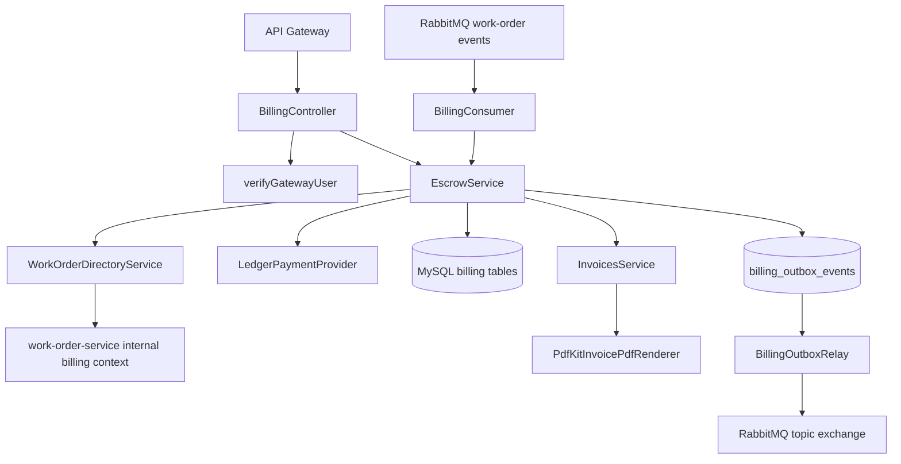
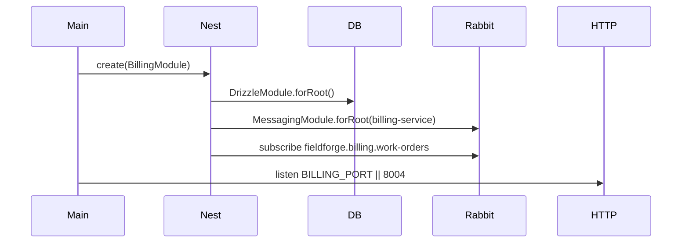

# Billing Service

## 1. Service Overview

`billing-service` owns escrow, payout, invoice, and technician earnings ledger behavior for FieldForge.

It solves the business problem of holding buyer funds, releasing approved funds to technicians, refunding cancelled work orders, producing immutable invoices, and publishing settlement events without directly mutating work-order state.

The service owns:

- `escrow_accounts`
- `invoices`
- `payout_ledger`
- `billing_outbox_events`
- financial operation usage of `idempotency_keys`

It should not own work-order lifecycle state, user credentials, technician vetting, dispatch location, or notification delivery.

Main consumers are the API Gateway, `work-order-service` events, and `work-order-service` internal billing-context endpoint. It is user-facing for escrow/invoice APIs and background-facing for payout/refund event handling.

## 2. Service Responsibilities

### Primary Responsibilities

- Pre-authorize and lock escrow funds.
- Release escrow after work-order approval.
- Refund held escrow when work orders are cancelled.
- Generate immutable content-hashed invoices.
- Generate invoice PDFs.
- Maintain technician payout ledger entries.
- Publish billing settlement events through the transactional outbox.
- Consume work-order approval and cancellation events.

### Secondary Responsibilities

- Enforce durable idempotency for capture, payout, and refund operations.
- Verify work-order billing context through an internal HTTP endpoint before release.
- Refund unused escrow remainder when payout amount is less than locked escrow.
- Expose health/readiness/metrics endpoints.

## 3. High-Level Architecture

Implementation evidence:

- Entry point: `apps/billing-service/src/main.ts`
- Module: `apps/billing-service/src/billing.module.ts`
- Controller: `src/controllers/billing.controller.ts`
- Escrow domain service: `src/modules/escrow/escrow.service.ts`
- Invoice service: `src/modules/invoices/invoices.service.ts`
- PDF renderer: `src/modules/invoices/pdfkit-invoice-pdf.renderer.ts`
- Payment provider port/adapter: `src/modules/payments/*`
- Work-order directory client: `src/modules/work-orders/work-order-directory.service.ts`
- Consumer: `src/consumers/billing.consumer.ts`
- Outbox: `src/events/*`



## 4. Folder Structure

```text
src/
|--- billing.module.ts
|--- main.ts
|--- consumers/
|   `--- billing.consumer.ts
|--- controllers/
|   `--- billing.controller.ts
|--- events/
|   |--- billing-outbox.relay.ts
|   `--- billing-outbox-retention.service.ts
`--- modules/
    |--- escrow/
    |--- invoices/
    |--- payments/
    `--- work-orders/
```

- `controllers/`: HTTP API surface.
- `modules/escrow/`: escrow state machine, idempotency, capture/release/refund.
- `modules/invoices/`: invoice persistence, hashing, PDF rendering.
- `modules/payments/`: payment provider port and current local ledger implementation.
- `modules/work-orders/`: internal HTTP client for narrow work-order billing context.
- `consumers/`: RabbitMQ work-order event handlers.
- `events/`: transactional outbox relay and retention.

## 5. Service Entry Point

Startup sequence:

1. `NestFactory.create(BillingModule)`.
2. `BillingModule` imports `DrizzleModule.forRoot()`, `MessagingModule.forRoot({ serviceName: 'billing-service' })`, and `JwtModule`.
3. `PAYMENT_PROVIDER` is bound to `LedgerPaymentProvider`.
4. `INVOICE_PDF_RENDERER` is bound to `PdfKitInvoicePdfRenderer`.
5. `BillingConsumer.onApplicationBootstrap()` subscribes to work-order approval/cancellation events when `IdempotentConsumer` is present.
6. HTTP listens on `BILLING_PORT || 8004`.



## 6. API / Endpoint Documentation

### `POST /billing/escrow/preauth`

**Purpose:** Capture/pre-authorize buyer funds and create a held escrow account for a work order.

**Access:** `BUYER` or `ADMIN`.

**Authentication:** Bearer JWT verified by `verifyGatewayUser()`.

**Authorization:** Caller role must be buyer/admin. Buyer profile ID is resolved through `ProfileDirectoryService`.

**Request Parameters:** Body validated by `preAuthEscrowSchema`; optional `idempotency-key`; optional `x-correlation-id`.

**Request Example:**

```json
{
  "workOrderId": "work-order-id",
  "amountMinor": 150000,
  "paymentMethodId": "pm_card_default"
}
```

**Processing Flow:**

1. Verify caller.
2. Resolve buyer profile ID.
3. Build capture idempotency fingerprint.
4. In a DB transaction, check or create idempotency row.
5. Reject if an escrow already exists for the work order.
6. Call `PaymentProviderPort.captureEscrow()`.
7. Insert `escrow_accounts` row with `HELD`.
8. Mark idempotency row complete.
9. Insert `billing.escrow.funded` outbox event.
10. Trigger outbox relay.

**Response:** Escrow ID, workOrderId, amountLockedMinor, and status.

**Possible Errors:** `401`, `403`, `409` idempotency conflict or duplicate escrow, validation errors.

**Database Changes:** Inserts `escrow_accounts`, `idempotency_keys` when a key is provided, and `billing_outbox_events`.

**Side Effects:** Calls payment provider port; eventually publishes `billing.escrow.funded`.

### `POST /billing/escrow/release`

**Purpose:** Release held escrow to a technician after approval.

**Access:** `BUYER` or `ADMIN`; event-driven callers use `EscrowService.releaseFunds()` with `SYSTEM`.

**Request Parameters:** Body validated by `releaseEscrowSchema`; optional `idempotency-key`; optional `x-correlation-id`.

**Request Example:**

```json
{
  "workOrderId": "work-order-id"
}
```

**Processing Flow:**

1. Verify caller role.
2. Fetch narrow work-order billing context from `work-order-service` outside DB transaction.
3. Require work order status `APPROVED`.
4. Verify buyer authority unless `ADMIN` or `SYSTEM`.
5. In a transaction, check durable idempotency.
6. Lock escrow row `FOR UPDATE`.
7. Require escrow status `HELD`.
8. Validate requested payout amount if supplied.
9. Mark escrow `RELEASED`.
10. Call `PaymentProviderPort.disbursePayout()`.
11. Refund unused remainder if locked escrow exceeds payout amount.
12. Insert `payout_ledger` credit.
13. Generate or fetch immutable invoice.
14. Mark idempotency complete.
15. Insert `billing.payout.disbursed` outbox event.
16. Trigger outbox relay.

**Response:** `EscrowReleaseResult` with workOrderId, technicianId, disbursedAmountMinor, status, and invoiceId.

**Possible Errors:** `404` missing work order/escrow, `409` wrong work-order or escrow state, `400` invalid payout amount, `403` caller not buyer/admin.

**Database Changes:** Updates `escrow_accounts`; inserts `payout_ledger`, `invoices`, `billing_outbox_events`, and idempotency state.

### `GET /billing/escrow/:workOrderId`

**Purpose:** Retrieve escrow details for a work order.

**Access:** Authenticated.

**Processing Flow:** Verify caller, load escrow by work order ID, map amount to minor units.

**Database Changes:** None.

### `GET /billing/invoices/:id`

**Purpose:** Retrieve immutable invoice metadata.

**Access:** Authenticated.

**Processing Flow:** Verify caller, load invoice by ID.

**Response:** `InvoiceDetailsDto`.

**Possible Errors:** `401`, `404`.

### `GET /billing/invoices/:id/pdf`

**Purpose:** Render and stream invoice PDF.

**Access:** Authenticated.

**Processing Flow:** Verify caller, load invoice, render PDF through `PdfKitInvoicePdfRenderer`, set PDF response headers, write buffer.

**Response:** `application/pdf`.

### `GET /billing/technicians/:id/payouts`

**Purpose:** Retrieve technician payout ledger and earnings summary.

**Access:** `TECHNICIAN` for self, or `ADMIN`. The controller explicitly restricts technician callers to their own profile; it does not explicitly forbid non-technician non-admin roles before calling the service.

**Authentication:** Bearer JWT.

**Processing Flow:** Verify caller, resolve technician profile for technician callers, enforce self-access, call `EscrowService.getTechnicianEarnings(id)`.

**Response:** `TechnicianEarningsDto`.

### `GET /healthz`, `GET /readyz`, `GET /metrics`

Shared endpoints from `@fieldforge/common`. Readiness checks MySQL because `DrizzleModule` is injected.

## 7. Endpoint Summary Table

| Method | Endpoint                           | Purpose                    | Access                           |
| ------ | ---------------------------------- | -------------------------- | -------------------------------- |
| POST   | `/billing/escrow/preauth`          | Hold escrow funds          | `BUYER`, `ADMIN`                 |
| POST   | `/billing/escrow/release`          | Release escrow funds       | `BUYER`, `ADMIN`                 |
| GET    | `/billing/escrow/:workOrderId`     | Get escrow details         | Authenticated                    |
| GET    | `/billing/invoices/:id`            | Get invoice metadata       | Authenticated                    |
| GET    | `/billing/invoices/:id/pdf`        | Stream invoice PDF         | Authenticated                    |
| GET    | `/billing/technicians/:id/payouts` | Technician earnings ledger | Technician self / admin intended |
| GET    | `/healthz`                         | Liveness                   | Public                           |
| GET    | `/readyz`                          | Readiness                  | Public                           |
| GET    | `/metrics`                         | Metrics                    | Public                           |

## 8. Request Lifecycle

```text
API Gateway
-> BillingController
-> verifyGatewayUser
-> ZodValidationPipe
-> role/profile authorization
-> EscrowService / InvoicesService
-> optional internal work-order-service lookup
-> MySQL transaction and row locks
-> payment provider port
-> invoice generation
-> outbox event insertion
-> outbox relay trigger
-> response
```

Event-driven release lifecycle:

```text
work_order.lifecycle.approved
-> BillingConsumer
-> EscrowService.releaseFunds(SYSTEM)
-> payout ledger + invoice + outbox
-> billing.payout.disbursed
-> work-order-service settles PAID
```

## 9. Data Ownership and Storage

Owned tables:

- `escrow_accounts`
- `invoices`
- `payout_ledger`
- `billing_outbox_events`

Shared infrastructure table used:

- `idempotency_keys`

The service does not write `work_orders`. It queries work-order status through an internal HTTP projection.

## 10. Service Communication

Inbound:

- API Gateway for `/billing/*`.
- RabbitMQ queue `fieldforge.billing.work-orders`.

Outbound:

- Internal HTTP to `work-order-service` at `GET /internal/work-orders/:id/billing-context`.
- RabbitMQ topic exchange through billing outbox relay.
- Payment provider port.
- MySQL.

Internal work-order lookup headers:

- `x-fieldforge-service-name: billing-service`
- `x-fieldforge-internal-secret: <secret>` when configured or dev fallback is available.
- Optional `x-correlation-id`.

## 11. Events, Queues, Jobs, and Workers

Consumed:

| Queue                            | Event Type                       | Handler                                      |
| -------------------------------- | -------------------------------- | -------------------------------------------- |
| `fieldforge.billing.work-orders` | `work_order.lifecycle.approved`  | `BillingConsumer.handleWorkOrderApproved()`  |
| `fieldforge.billing.work-orders` | `work_order.lifecycle.cancelled` | `BillingConsumer.handleWorkOrderCancelled()` |

Published through transactional outbox:

- `billing.escrow.funded`
- `billing.payout.disbursed`

Deprecated/not subscribed:

- `handleWorkOrderAssigned()` remains for backward compatibility but `BillingConsumer` does not subscribe to `work_order.lifecycle.assigned`.
- `billing.payout.failed` is deprecated and not produced by the current consumer path.

Background services:

- `BillingOutboxRelay`
- `BillingOutboxRetentionService`

## 12. External Integrations

- MySQL/Drizzle.
- RabbitMQ and Redis idempotency through `@fieldforge/messaging`.
- `work-order-service` internal REST endpoint.
- `pdfkit` for invoice PDFs.
- `LedgerPaymentProvider` is the active payment provider implementation.

Although the package depends on `stripe`, Stripe API usage is not confirmed from the current codebase.

## 13. Authentication and Authorization

- Controllers verify bearer tokens with `verifyGatewayUser()`.
- Gateway header mismatch is rejected.
- Escrow preauth/release requires `BUYER` or `ADMIN`.
- Buyer profile resolution is used for escrow preauth and release authorization.
- Technician payout endpoint enforces self-access for technician callers.
- Work-order internal lookup uses service-name and shared-secret authentication on the work-order-service side.

## 14. Error Handling

- `GlobalHttpExceptionFilter` is registered.
- Idempotency parameter mismatch returns `ConflictException`.
- Duplicate or already released escrow returns `ConflictException`.
- Work-order not approved returns `ConflictException`.
- Missing work order/escrow/invoice returns `NotFoundException`.
- Work-order internal lookup network failure returns `ServiceUnavailableException`.
- Internal auth failure to work-order-service returns `InternalServerErrorException`.
- Unexpected release failures increment billing reconciliation failure metrics.
- Consumer handler failures are rethrown to RabbitMQ retry/DLQ policy.

## 15. Background Processing

- `BillingConsumer` subscribes during application bootstrap.
- Outbox relay publishes committed billing events.
- Outbox retention worker purges only old `PUBLISHED` billing outbox rows according to retention config.

No `ScheduleModule` is imported in `BillingModule`, although `@nestjs/schedule` is listed as a dependency.

## 16. Configuration

| Variable                                | Purpose                           | Default                          |
| --------------------------------------- | --------------------------------- | -------------------------------- |
| `BILLING_PORT`                          | HTTP listen port                  | `8004`                           |
| `DATABASE_URL` / `DB_*`                 | MySQL connection                  | local defaults                   |
| `JWT_SECRET`                            | JWT verification secret           | required                         |
| `WORK_ORDER_SERVICE_URL`                | Internal work-order lookup        | `http://localhost:8002`          |
| `AUTH_SERVICE_URL`                      | Profile directory lookup          | `http://localhost:8001`          |
| `INTERNAL_SERVICE_SECRET`               | Internal work-order lookup secret | dev fallback outside production  |
| `OUTBOX_PUBLISHED_RETENTION_DAYS`       | Published outbox retention        | `30` in common parser            |
| `OUTBOX_CLEANUP_BATCH_SIZE`             | Cleanup batch size                | `1000` in common parser          |
| `OUTBOX_CLEANUP_INTERVAL_MS`            | Cleanup interval                  | parser default in common worker  |
| `RABBITMQ_*`, `RABBITMQ_URL`, `REDIS_*` | Messaging and idempotency         | local defaults                   |
| `STRIPE_SECRET_KEY`                     | Present in `.env.example`         | Not used by active provider code |

## 17. Deployment and Runtime

- Dockerfile: `apps/billing-service/Dockerfile`
- Container port: `8004`
- Kubernetes deployment/service: `infra/k8s/services/billing-service.yaml`
- Kubernetes replicas: `2`
- K8s probes: `/healthz`, `/readyz`

## 18. Run and Test

```bash
pnpm --filter @fieldforge/billing-service dev
pnpm --filter @fieldforge/billing-service test
pnpm --filter @fieldforge/billing-service typecheck
pnpm --filter @fieldforge/billing-service build
```

Tests live in `apps/billing-service/test/` and cover controller behavior, billing consumer, escrow service, invoice service, ledger payment provider, PDF renderer, work-order directory service, and billing outbox behavior.

## 19. Important Architectural Decisions

- ADR 005: work-order aggregate boundary reconciliation.
- ADR 009: event-driven settlement choreography.
- ADR 011: transactional outbox pattern.
- ADR 012: internal service authentication and directory lookup.
- Phase 35/36/41: refund path, provider idempotency, and payout failure consistency fixes.

## 20. Confirmed Gaps and Non-Responsibilities

- Stripe is not the active provider in current code.
- Billing does not mutate work-order rows directly.
- Technician payout route currently enforces self-access for technicians, but explicit denial for buyer/dispatcher roles is not visible in the controller.
- No public webhook endpoint is implemented.
