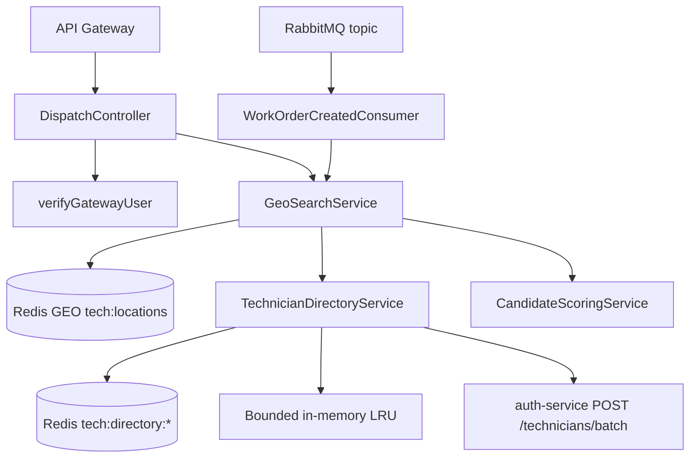
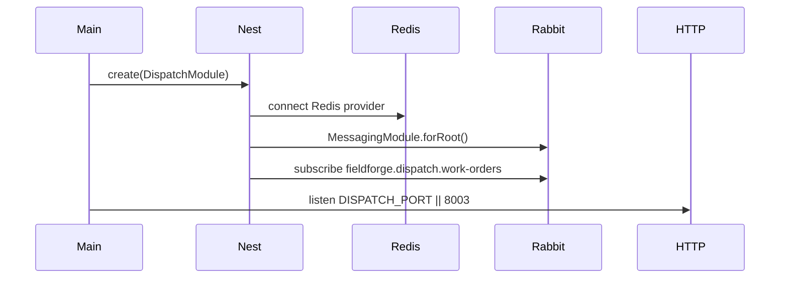

# Dispatch Matching Service

## 1. Service Overview

`dispatch-matching-service` owns live technician geospatial matching and routing recommendations.

It solves the business problem of finding nearby eligible technicians for a work order without coupling dispatch to auth-owned SQL tables. Live coordinates are stored in Redis, while technician metadata is hydrated through `auth-service`'s internal batch directory API.

The service owns:

- Redis geospatial index `tech:locations`.
- Redis and in-memory technician directory cache.
- Candidate scoring and ranking.
- Work-order-published event consumption for dispatch fanout logging.

It should not own user identities, technician profile persistence, work-order state transitions, bids, billing, or notification delivery.

Main consumers are the API Gateway, buyer portal, technician app location updates, and RabbitMQ work-order events. It is user-facing for dispatch APIs and background-facing for event consumption.

## 2. Service Responsibilities

### Primary Responsibilities

- Store live technician GPS coordinates in Redis GEO.
- Find nearby technicians by radius using Redis `GEOSEARCH`.
- Hydrate technician summaries from `auth-service` using internal service authentication.
- Rank candidates by composite score.
- Return auto-route recommendations.

### Secondary Responsibilities

- Maintain a 300-second Redis technician directory cache.
- Maintain a bounded 1,000-entry in-memory LRU fallback cache.
- Consume `work_order.lifecycle.published` events.
- Expose health/readiness/metrics endpoints.

## 3. High-Level Architecture

Implementation evidence:

- Entry point: `apps/dispatch-matching-service/src/main.ts`
- Module: `apps/dispatch-matching-service/src/dispatch.module.ts`
- Controller: `apps/dispatch-matching-service/src/modules/dispatch/dispatch.controller.ts`
- Geo search: `apps/dispatch-matching-service/src/modules/geo-search/geo-search.service.ts`
- Directory cache/client: `apps/dispatch-matching-service/src/modules/geo-search/technician-directory.service.ts`
- Scoring: `apps/dispatch-matching-service/src/modules/scoring/candidate-scoring.service.ts`
- Consumer: `apps/dispatch-matching-service/src/modules/consumers/work-order-created.consumer.ts`



## 4. Folder Structure

```text
src/
|--- dispatch.module.ts
|--- main.ts
`--- modules/
    |--- consumers/
    |   `--- work-order-created.consumer.ts
    |--- dispatch/
    |   `--- dispatch.controller.ts
    |--- geo-search/
    |   |--- geo-search.service.ts
    |   `--- technician-directory.service.ts
    `--- scoring/
        |--- candidate-scorer.interface.ts
        |--- candidate-scoring.service.ts
        `--- index.ts
```

- `dispatch/`: HTTP API layer.
- `geo-search/`: Redis GEO operations and technician directory hydration.
- `scoring/`: scoring port and default scoring implementation.
- `consumers/`: AMQP subscription to work-order publication events.

## 5. Service Entry Point

Startup sequence:

1. `NestFactory.create(DispatchModule)`.
2. `DispatchModule` configures a Redis provider with `REDIS_HOST`, `REDIS_PORT`, and `REDIS_PASSWORD`.
3. `MessagingModule.forRoot({ serviceName: 'dispatch-service' })` registers AMQP publisher/consumer utilities.
4. `JwtModule` is configured with `requireJwtSecret()`.
5. `WorkOrderCreatedConsumer.onApplicationBootstrap()` subscribes to RabbitMQ if `IdempotentConsumer` is injected.
6. HTTP listens on `DISPATCH_PORT || 8003`.



`GeoSearchService.onApplicationShutdown()` disconnects Redis.

## 6. API / Endpoint Documentation

### `POST /dispatch/technicians/location`

**Purpose:** Update the authenticated technician's live location.

**Access:** `TECHNICIAN` or `ADMIN`.

**Authentication:** Bearer JWT verified by `verifyGatewayUser()`.

**Authorization:** `TECHNICIAN` and `ADMIN` only. The request must have a resolved `profileId`; technicians cannot supply arbitrary technician IDs.

**Request Parameters:** Body validated by `updateTechnicianLocationSchema`.

**Request Example:**

```json
{
  "latitude": 37.7749,
  "longitude": -122.4194
}
```

**Validation Rules:** Latitude/longitude schema from `@fieldforge/contracts`; profile ID required.

**Processing Flow:**

1. Verify bearer token and gateway identity assertion.
2. Enforce role.
3. Require `user.profileId`.
4. Call `GeoSearchService.updateTechnicianLocation(profileId, latitude, longitude)`.
5. Store member in Redis GEO key `tech:locations` using `GEOADD`.

**Response:**

```json
{
  "statusCode": 200,
  "message": "Technician location updated successfully",
  "latitude": 37.7749,
  "longitude": -122.4194
}
```

**Possible Errors:** `401`, `403`, validation errors, Redis errors.

**Database Changes:** None.

**Side Effects:** Updates Redis geospatial index.

**Implementation Location:** `dispatch.controller.ts`, `geo-search.service.ts`.

### `GET /dispatch/technicians/nearby`

**Purpose:** Find and rank technicians near a coordinate.

**Access:** Authenticated user. The living API catalogue says buyer/dispatcher, but the controller currently authenticates any valid role and does not enforce a role-specific allowlist.

**Authentication:** Bearer JWT.

**Request Parameters:** Query validated by `nearbyTechniciansQuerySchema`.

**Request Example:**

```json
{
  "latitude": 37.7749,
  "longitude": -122.4194,
  "radiusMiles": 25
}
```

**Processing Flow:**

1. Verify caller.
2. Run Redis `GEOSEARCH tech:locations FROMLONLAT <lng> <lat> BYRADIUS <radius> mi WITHDIST WITHCOORD`.
3. Batch hydrate technician summaries through `TechnicianDirectoryService`.
4. Fetch missing summaries via internal `auth-service` call `POST /technicians/batch` in chunks of 100.
5. Cache returned summaries in Redis and local bounded LRU.
6. Mark unresolved technicians unavailable.
7. Rank candidates with `CandidateScoringService`.

**Response:** `{ count, technicians }` where technicians are `NearbyTechnicianDto`.

**Possible Errors:** `401`; Redis lookup failures return an empty candidate list in `GeoSearchService`.

**Database Changes:** None.

**Side Effects:** Redis/cache reads and writes for directory cache.

### `POST /dispatch/auto-route`

**Purpose:** Return the best eligible technician recommendation for a work order.

**Access:** Authenticated user. The catalogue says buyer/dispatcher; the controller currently authenticates any valid role.

**Request Parameters:** Body validated by `autoRouteSchema`.

**Request Example:**

```json
{
  "workOrderId": "work-order-id",
  "latitude": 37.7749,
  "longitude": -122.4194,
  "maxRadiusMiles": 5
}
```

**Processing Flow:**

1. Verify caller.
2. Use supplied latitude/longitude, or default to `37.7749, -122.4194` when omitted.
3. Use `maxRadiusMiles || 5`.
4. Find nearby technicians.
5. Select first candidate where `isAvailable` and `distanceMiles <= radiusMiles`.
6. Return match.

**Response:**

```json
{
  "workOrderId": "work-order-id",
  "technicianId": "technician-profile-id",
  "status": "MATCHED",
  "candidate": {}
}
```

**Possible Errors:** `401`, validation errors, `404` if no eligible contractor exists.

**Database Changes:** None.

### `GET /healthz`, `GET /readyz`, `GET /metrics`

Shared health and metrics endpoints. Redis/Rabbit health indicators are not wired into `HealthController` in `DispatchModule`; readiness checks system only unless optional providers are added.

## 7. Endpoint Summary Table

| Method | Endpoint                         | Purpose                         | Access                |
| ------ | -------------------------------- | ------------------------------- | --------------------- |
| POST   | `/dispatch/technicians/location` | Update live technician location | `TECHNICIAN`, `ADMIN` |
| GET    | `/dispatch/technicians/nearby`   | Find nearby technicians         | Authenticated         |
| POST   | `/dispatch/auto-route`           | Recommend best route candidate  | Authenticated         |
| GET    | `/healthz`                       | Liveness                        | Public                |
| GET    | `/readyz`                        | Readiness                       | Public                |
| GET    | `/metrics`                       | Metrics                         | Public                |

## 8. Request Lifecycle

```text
API Gateway
-> DispatchController
-> verifyGatewayUser
-> ZodValidationPipe
-> GeoSearchService
-> Redis GEOSEARCH / GEOADD
-> TechnicianDirectoryService cache
-> auth-service internal batch lookup when cache misses
-> CandidateScoringService
-> response
```

## 9. Data Ownership and Storage

Owned operational Redis data:

- `tech:locations`: Redis GEO index of technician profile IDs.
- `tech:directory:<id>`: cached technician directory summaries, 300-second TTL.
- In-memory bounded LRU cache: 1,000 entries, 300-second TTL.

The service intentionally does not import `@fieldforge/database` or Drizzle.

## 10. Service Communication

Inbound:

- API Gateway for `/dispatch/*`.
- RabbitMQ queue `fieldforge.dispatch.work-orders`.

Outbound:

- Redis for live locations and cache.
- `auth-service` direct internal HTTP call to `POST /technicians/batch`.
- RabbitMQ through `IdempotentConsumer`.

Internal auth headers sent to auth-service:

- `x-fieldforge-service-name: dispatch-matching-service`
- `x-fieldforge-internal-secret: <secret>` when configured or dev fallback is available.
- Optional `x-correlation-id`.

## 11. Events, Queues, Jobs, and Workers

Consumed queue:

| Queue                             | Event Type                       | Handler                                               |
| --------------------------------- | -------------------------------- | ----------------------------------------------------- |
| `fieldforge.dispatch.work-orders` | `work_order.lifecycle.published` | `WorkOrderCreatedConsumer.handleWorkOrderPublished()` |

The consumer finds nearby technicians for the published order and logs the number of eligible technicians. It does not mutate work-order state.

Published events are not confirmed from the current codebase for this service.

## 12. External Integrations

- Redis via `ioredis`.
- RabbitMQ/Redis idempotency through `@fieldforge/messaging`.
- `auth-service` internal REST directory lookup.

No external map provider, geocoder, SMS, or payment provider is integrated in this service.

## 13. Authentication and Authorization

- All dispatch endpoints call `verifyGatewayUser()`.
- Location updates require `TECHNICIAN` or `ADMIN`.
- Location updates require a token/gateway profile ID and never accept a technician ID from the body.
- Nearby and auto-route endpoints currently require authentication only; stricter role checks are not implemented in the controller.
- Auth-service batch lookup uses `InternalServiceGuard` on the auth side.

## 14. Error Handling

- `GlobalHttpExceptionFilter` is registered globally.
- Redis connection failures at startup are warned, not fatal.
- `findNearbyTechnicians()` catches Redis `GEOSEARCH` errors and returns an empty list.
- Directory lookup failures log warnings and return cached records only.
- Auto-route returns `NotFoundException` if no available candidate is found.

## 15. Background Processing

- `WorkOrderCreatedConsumer` subscribes during `onApplicationBootstrap()`.
- Message idempotency, retries, and DLQ handling are provided by `IdempotentConsumer` from `@fieldforge/messaging`.

No cron jobs or schedulers are registered.

## 16. Configuration

| Variable                                                                               | Purpose                   | Default                         |
| -------------------------------------------------------------------------------------- | ------------------------- | ------------------------------- |
| `DISPATCH_PORT`                                                                        | HTTP listen port          | `8003`                          |
| `JWT_SECRET`                                                                           | JWT verification secret   | required                        |
| `REDIS_HOST`                                                                           | Redis host                | `127.0.0.1`                     |
| `REDIS_PORT`                                                                           | Redis port                | `6379`                          |
| `REDIS_PASSWORD`                                                                       | Redis password            | none unless set                 |
| `AUTH_SERVICE_URL`                                                                     | Internal auth-service URL | `http://localhost:8001`         |
| `INTERNAL_SERVICE_SECRET`                                                              | Internal API secret       | dev fallback outside production |
| `RABBITMQ_USER`, `RABBITMQ_PASSWORD`, `RABBITMQ_HOST`, `RABBITMQ_PORT`, `RABBITMQ_URL` | Messaging connection      | local defaults                  |
| `LOG_LEVEL`                                                                            | Logger level              | `info`                          |

## 17. Deployment and Runtime

- Dockerfile: `apps/dispatch-matching-service/Dockerfile`
- Container port: `8003`
- Kubernetes deployment/service: `infra/k8s/services/dispatch-service.yaml`
- Kubernetes replicas: `3`
- K8s probes: `/healthz`, `/readyz`

## 18. Run and Test

```bash
pnpm --filter @fieldforge/dispatch-matching-service dev
pnpm --filter @fieldforge/dispatch-matching-service test
pnpm --filter @fieldforge/dispatch-matching-service typecheck
pnpm --filter @fieldforge/dispatch-matching-service build
```

Tests live in `apps/dispatch-matching-service/test/` and cover architecture boundaries, candidate scoring, controller behavior, geo search, technician directory caching, and event consumer behavior.

## 19. Important Architectural Decisions

- ADR 003: Redis geosearch matching.
- ADR 006: bounded context data isolation.
- Phase 44 / ISSUE-004A and ISSUE-004B: dispatch uses Redis as sole live geospatial source and does not query auth-owned tables.
- Phase 45 / ISSUE-007: technician batch lookup is internal-only and bounded.

## 20. Confirmed Gaps and Non-Responsibilities

- Nearby and auto-route endpoints do not currently enforce buyer/dispatcher-only roles in the controller.
- Consumer currently logs fanout counts; actual notification dispatch is handled by `notification-service`.
- Persistent SQL storage is intentionally absent.
