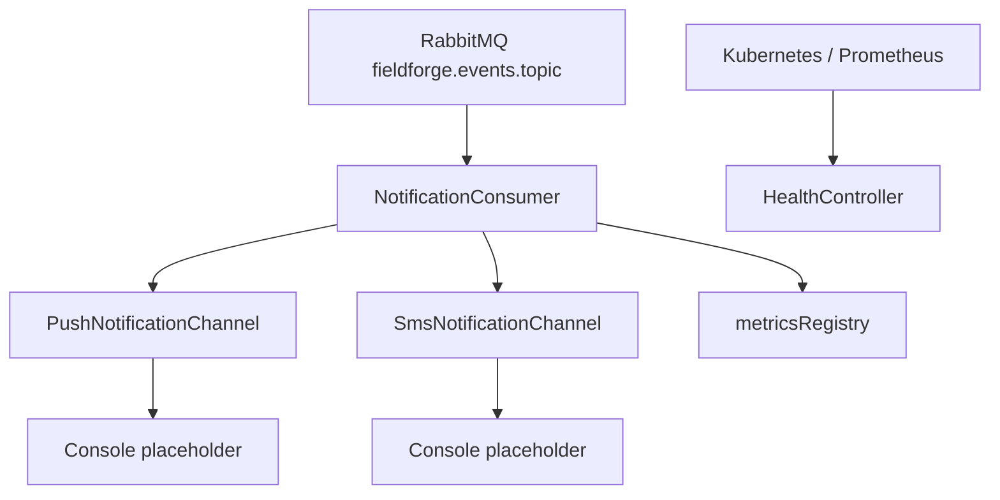
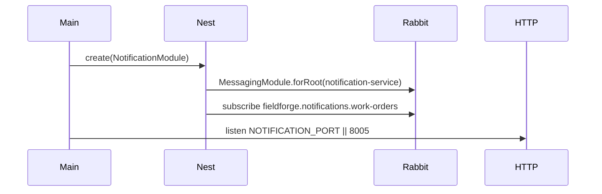

# Notification Service

## 1. Service Overview

`notification-service` is a headless event-driven worker for FieldForge notifications.

It exists to react to marketplace lifecycle events and send technician-facing notifications through channel adapters. It is intentionally not a public business API and is not proxied by the API Gateway.

The service owns:

- Notification event subscriptions.
- Push notification channel adapter.
- SMS channel adapter.
- Notification latency metric recording.

It should not own work-order state, dispatch matching, identity, escrow, invoicing, or public REST routes.

Main consumers are RabbitMQ events produced by other services. Operators and Kubernetes use its health and metrics endpoints.

## 2. Service Responsibilities

### Primary Responsibilities

- Consume work-order publication, assignment, and paid events.
- Send push notifications through `PushNotificationChannel`.
- Send SMS notifications through `SmsNotificationChannel`.
- Record fanout latency metrics for selected events.

### Secondary Responsibilities

- Expose health/readiness/metrics endpoints.
- Keep notification delivery decoupled from API Gateway routing.

## 3. High-Level Architecture

Implementation evidence:

- Entry point: `apps/notification-service/src/main.ts`
- Module: `apps/notification-service/src/notification.module.ts`
- Consumer: `apps/notification-service/src/consumers/notification.consumer.ts`
- Push channel: `apps/notification-service/src/channels/push.channel.ts`
- SMS channel: `apps/notification-service/src/channels/sms.channel.ts`



## 4. Folder Structure

```text
src/
|--- main.ts
|--- notification.module.ts
|--- channels/
|   |--- push.channel.ts
|   `--- sms.channel.ts
`--- consumers/
    `--- notification.consumer.ts
```

- `channels/`: provider adapter classes for outbound notifications.
- `consumers/`: RabbitMQ subscription and event-specific handlers.
- `notification.module.ts`: registers messaging, health, channels, and consumer.

## 5. Service Entry Point

Startup sequence:

1. `NestFactory.create(NotificationModule)`.
2. `NotificationModule` imports `MessagingModule.forRoot({ serviceName: 'notification-service' })`.
3. `NotificationConsumer.onApplicationBootstrap()` subscribes to `fieldforge.notifications.work-orders` when `IdempotentConsumer` is injected.
4. HTTP listens on `NOTIFICATION_PORT || 8005`.



The module comment explicitly states this is a headless background daemon. HTTP controllers are limited to shared health/metrics.

## 6. API / Endpoint Documentation

There are no business REST endpoints.

### `GET /healthz`

**Purpose:** Liveness probe.

**Access:** Public/internal platform access.

**Response:** `{ status: "UP", timestamp: string }`.

**Implementation Location:** `@fieldforge/common` `HealthController`.

### `GET /readyz`

**Purpose:** Readiness probe.

**Access:** Public/internal platform access.

**Response:** Readiness status, checks, uptime, memory, timestamp.

**Notes:** The notification module does not inject optional Redis/Rabbit health indicators into `HealthController`; readiness reports system-level status unless such providers are added.

### `GET /metrics`

**Purpose:** Prometheus metrics exposition.

**Access:** Prometheus/platform scraping.

**Response:** `text/plain; version=0.0.4; charset=utf-8`.

## 7. Endpoint Summary Table

| Method | Endpoint   | Purpose            | Access          |
| ------ | ---------- | ------------------ | --------------- |
| GET    | `/healthz` | Liveness           | Platform/public |
| GET    | `/readyz`  | Readiness          | Platform/public |
| GET    | `/metrics` | Prometheus metrics | Platform/public |

## 8. Event Lifecycle

```text
RabbitMQ delivery
-> IdempotentConsumer
-> Redis event-id idempotency gate
-> NotificationConsumer event switch
-> PushNotificationChannel and/or SmsNotificationChannel
-> metricsRegistry latency recording
-> ACK or retry/DLQ through messaging package
```

## 9. Data Ownership and Storage

The service owns no MySQL tables.

It relies on `@fieldforge/messaging` for Redis idempotency keys used by consumers. Channel adapters themselves have no durable storage.

## 10. Service Communication

Inbound:

- RabbitMQ queue `fieldforge.notifications.work-orders`.
- Kubernetes/Prometheus HTTP probes.

Outbound:

- `PushNotificationChannel.sendPush()`.
- `SmsNotificationChannel.sendSms()`.

Current channel implementations log to console. Real FCM/APNS/Twilio network calls are not implemented in the current codebase.

## 11. Events, Queues, Jobs, and Workers

Consumed queue:

| Queue                                  | Event Type                       | Handler                  | Side Effects                                                          |
| -------------------------------------- | -------------------------------- | ------------------------ | --------------------------------------------------------------------- |
| `fieldforge.notifications.work-orders` | `work_order.lifecycle.published` | `handlePublishedEvent()` | SMS notification to placeholder phone, dispatch fanout latency metric |
| `fieldforge.notifications.work-orders` | `work_order.lifecycle.assigned`  | `handleAssignedEvent()`  | Push notification to placeholder FCM token                            |
| `fieldforge.notifications.work-orders` | `work_order.lifecycle.paid`      | `handlePaidEvent()`      | Push and SMS payout notification, latency metric                      |

Published events are not confirmed from the current codebase.

## 12. External Integrations

Package dependencies include `firebase-admin` and `twilio`, but current channel implementations only call `console.log()`.

Therefore:

- Real FCM/APNS delivery is not confirmed from the current codebase.
- Real Twilio SMS delivery is not confirmed from the current codebase.

## 13. Authentication and Authorization

No business HTTP routes exist, so no user JWT/RBAC flow is implemented in this service.

Event trust and idempotency are provided by RabbitMQ delivery plus `IdempotentConsumer`. Broker-level authentication is configured by the messaging package connection settings.

## 14. Error Handling

- `IdempotentConsumer` parses events, rejects malformed JSON to DLQ, and applies retry/DLQ behavior on handler failures.
- Channel adapters currently log and do not throw on provider failure because no real provider call exists.
- No global HTTP exception filter is registered in `NotificationModule`.

## 15. Background Processing

`NotificationConsumer` is the background worker. It subscribes during `onApplicationBootstrap()`.

Retry and idempotency behavior:

- 7-day Redis idempotency gate by event ID.
- Max 3 retries.
- Broker-native retry queue with per-message expiration.
- DLQ through `fieldforge.events.dlx`.

## 16. Configuration

| Variable                                                                               | Purpose                     | Default                          |
| -------------------------------------------------------------------------------------- | --------------------------- | -------------------------------- |
| `NOTIFICATION_PORT`                                                                    | HTTP probe/metrics port     | `8005`                           |
| `RABBITMQ_USER`, `RABBITMQ_PASSWORD`, `RABBITMQ_HOST`, `RABBITMQ_PORT`, `RABBITMQ_URL` | Messaging connection        | local defaults                   |
| `REDIS_HOST`, `REDIS_PORT`, `REDIS_PASSWORD`                                           | Messaging idempotency Redis | local defaults                   |
| `TWILIO_ACCOUNT_SID`, `TWILIO_AUTH_TOKEN`                                              | Present in `.env.example`   | Not used by current channel code |
| `LOG_LEVEL`                                                                            | Logger level                | `info`                           |

## 17. Deployment and Runtime

- Dockerfile: `apps/notification-service/Dockerfile`
- Container port: `8005`
- Kubernetes deployment/service: `infra/k8s/services/notification-service.yaml`
- Kubernetes replicas: `2`
- K8s probes: `/healthz`, `/readyz`
- API Gateway route: none confirmed; ADR 010 intentionally excludes notification business routes from public edge routing.

## 18. Run and Test

```bash
pnpm --filter @fieldforge/notification-service dev
pnpm --filter @fieldforge/notification-service test
pnpm --filter @fieldforge/notification-service typecheck
pnpm --filter @fieldforge/notification-service build
```

Tests live in `apps/notification-service/test/notification.consumer.spec.ts`.

## 19. Important Architectural Decisions

- ADR 010: notification-service is a headless worker boundary.
- `.agent/rules/03_event_rabbitmq_rules.md`: idempotent consumption, retry, and DLQ requirements.
- Phase 34: notification formatting uses shared money utilities.

## 20. Confirmed Gaps and Non-Responsibilities

- No public business API.
- No API Gateway proxy route.
- Real FCM/APNS and Twilio provider calls are placeholders.
- Notification recipient resolution currently uses placeholder phone/device token values in code.
