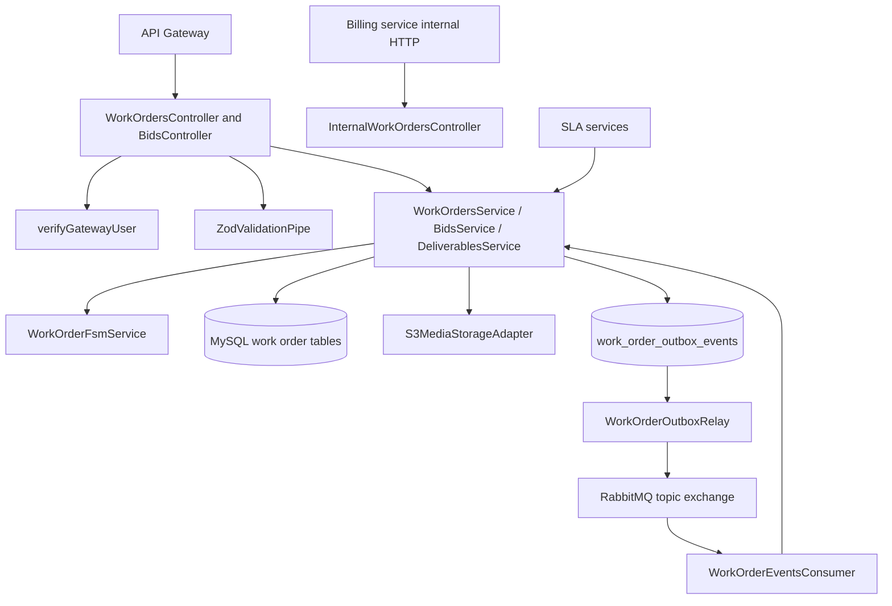
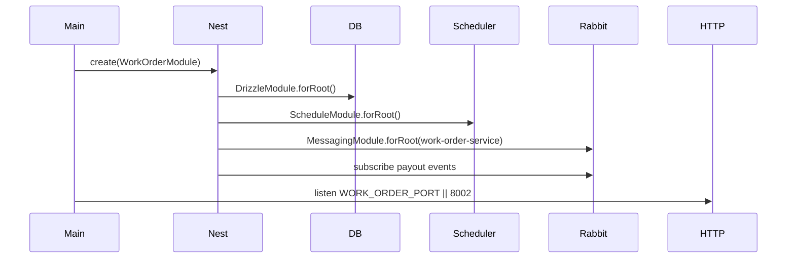

# Work Order Service

## 1. Service Overview

`work-order-service` owns the FieldForge work-order aggregate: draft creation, publication, lifecycle state transitions, bids, deliverables, digital signatures, SLA automation, and work-order domain events.

It solves the marketplace business problem of moving a buyer's field-service job from draft to publication, assignment, execution, approval, and paid settlement. It is the sole mutator of work-order lifecycle state and status history.

The service owns:

- `work_orders`
- `work_order_status_history`
- `work_order_bids`
- `work_order_deliverables`
- `work_order_outbox_events`

It should not own user credentials, technician vetting source data, live dispatch location storage, escrow funds, payout ledger, or notification delivery.

Main consumers are the API Gateway, buyer portal, technician app, `billing-service` internal lookup, RabbitMQ consumers, and RabbitMQ downstream subscribers. It is both user-facing and internal-service-facing.

## 2. Service Responsibilities

### Primary Responsibilities

- Create work-order drafts.
- List and fetch work orders.
- Publish work orders to the marketplace.
- Enforce the work-order finite state machine.
- Authorize lifecycle transitions by caller role and ownership/assignment.
- Record immutable status history.
- Accept and manage technician bids.
- Atomically assign a technician through bid acceptance.
- Generate and confirm deliverable upload records.
- Generate presigned download URLs for authorized deliverable access.
- Record client signature deliverables with stable SHA-256 hashes.
- Emit work-order lifecycle and bidding events through the transactional outbox.

### Secondary Responsibilities

- Expose a narrow internal billing-context endpoint for `billing-service`.
- Consume `billing.payout.disbursed` to settle a work order as `PAID`.
- Run SLA auto-approval and SLA escalation services.
- Retain and clean published outbox events.
- Expose health/readiness/metrics endpoints.

## 3. High-Level Architecture

Implementation evidence:

- Entry point: `apps/work-order-service/src/main.ts`
- Module: `apps/work-order-service/src/work-order.module.ts`
- Work-order controller/service: `src/modules/work-orders/*`
- Bids controller/service: `src/modules/bids/*`
- Deliverables service/adapters: `src/modules/deliverables/*`
- FSM: `src/modules/fsm/work-order-fsm.service.ts`
- SLA services: `src/modules/sla/*`
- Event publisher/outbox: `src/events/*`
- Billing events consumer: `src/consumers/work-order-events.consumer.ts`



## 4. Folder Structure

```text
src/
|--- main.ts
|--- work-order.module.ts
|--- consumers/
|   `--- work-order-events.consumer.ts
|--- events/
|   |--- work-order-event.publisher.ts
|   |--- work-order-outbox.relay.ts
|   `--- work-order-outbox-retention.service.ts
`--- modules/
    |--- bids/
    |--- deliverables/
    |--- fsm/
    |--- sla/
    `--- work-orders/
```

- `modules/work-orders/`: aggregate lifecycle, internal billing projection, assignment and transition strategies.
- `modules/bids/`: bid submission, listing, idempotency, acceptance, and assignment.
- `modules/deliverables/`: media storage port, S3 adapter, local test adapter, deliverable confirmation and signatures.
- `modules/fsm/`: canonical transition matrix.
- `modules/sla/`: scheduled auto-approval/escalation logic.
- `events/`: event publisher wrappers, outbox relay, and retention worker.
- `consumers/`: payout event consumer.

## 5. Service Entry Point

Startup sequence:

1. `NestFactory.create(WorkOrderModule)`.
2. `WorkOrderModule` imports `DrizzleModule.forRoot()`, `ScheduleModule.forRoot()`, `MessagingModule.forRoot({ serviceName: 'work-order-service' })`, and `JwtModule`.
3. The media storage port is bound to `S3MediaStorageAdapter`.
4. Controllers, services, outbox relay, retention worker, SLA services, and event consumer are registered.
5. `WorkOrderEventsConsumer.onApplicationBootstrap()` subscribes to payout events when `IdempotentConsumer` is present.
6. HTTP listens on `WORK_ORDER_PORT || 8002`.



## 6. API / Endpoint Documentation

### `POST /work-orders`

**Purpose:** Create a draft work order.

**Access:** `BUYER` or `ADMIN`.

**Authentication:** Bearer JWT verified by `verifyGatewayUser()`.

**Authorization:** Role must be `BUYER` or `ADMIN`. Buyer profile is resolved from token profile ID or `ProfileDirectoryService`.

**Request Parameters:** Body validated by `createWorkOrderSchema`.

**Request Example:**

```json
{
  "title": "Replace network switch",
  "description": "Replace failed access switch",
  "category": "networking",
  "budgetType": "FIXED",
  "budgetAmountMinor": 150000,
  "addressLine": "1 Market St, San Francisco, CA",
  "latitude": 37.7749,
  "longitude": -122.4194,
  "scheduledStartTime": "2026-10-01T10:00:00.000Z",
  "scheduledEndTime": "2026-10-01T14:00:00.000Z",
  "slaExpirationTime": "2026-10-04T14:00:00.000Z"
}
```

**Validation Rules:** End time must be after start time; SLA expiration must not be before start time.

**Processing Flow:** Verify caller, resolve buyer profile, validate times, insert `work_orders`, insert initial `work_order_status_history` row with `DRAFT`.

**Response:** `WorkOrderResponseDto`.

**Possible Errors:** `401`, `403`, validation errors, `400` invalid date ordering.

**Database Changes:** Inserts `work_orders` and status history.

**Side Effects:** No event is emitted for draft creation.

### `GET /work-orders`

**Purpose:** List work orders with filters.

**Access:** Authenticated.

**Request Parameters:** Query validated by `listWorkOrdersQuerySchema`; confirmed filters include status, buyerId, assignedTechnicianId, scheduledStartTimeFrom, scheduledStartTimeTo, limit, and offset.

**Processing Flow:** Verify caller, build Drizzle conditions, order by scheduled start time, return DTOs.

**Database Changes:** None.

### `GET /work-orders/:id`

**Purpose:** Fetch one work order.

**Access:** Authenticated.

**Processing Flow:** Verify caller, select work order by ID, map DB row to DTO.

**Possible Errors:** `401`, `404`.

### `GET /work-orders/:id/history`

**Purpose:** Fetch immutable state transition history.

**Access:** Authenticated.

**Processing Flow:** Verify caller, select `work_order_status_history` by work order ID ordered by creation time.

### `POST /work-orders/:id/publish`

**Purpose:** Transition `DRAFT -> PUBLISHED` and fan out a marketplace event.

**Access:** Owning `BUYER` or `ADMIN`.

**Processing Flow:**

1. Verify caller.
2. Lock work-order row `FOR UPDATE`.
3. Verify buyer ownership for buyer callers.
4. Validate FSM transition.
5. Update status to `PUBLISHED`.
6. Insert status history.
7. Insert `work_order.lifecycle.published` event into `work_order_outbox_events`.
8. Trigger `WorkOrderOutboxRelay`.

**Database Changes:** Updates `work_orders`; inserts status history and outbox row.

**Side Effects:** Eventually publishes `work_order.lifecycle.published`.

### `POST /work-orders/:id/transition`

**Purpose:** Execute a validated work-order FSM transition.

**Access:** Authenticated; status-specific guards decide roles.

**Request Example:**

```json
{
  "nextStatus": "ON_SITE",
  "latitude": 37.7749,
  "longitude": -122.4194,
  "reason": "Arrived at site"
}
```

**Validation Rules:** Body validated by `transitionStatusSchema`.

**Processing Flow:** Verify caller, lock row, validate FSM, run status-specific guard, run status-specific executor, insert outbox events for event-producing statuses, trigger outbox relay.

**Important Rules:**

- Manual `PAID` transitions are rejected; `PAID` is event-driven from billing payout.
- `ON_SITE` enforces server-side geofence checks in transition guards.
- `APPROVED` emits `work_order.lifecycle.approved`.
- `CANCELLED` emits `work_order.lifecycle.cancelled`.
- `ASSIGNED` emits `work_order.lifecycle.assigned`.

### `POST /work-orders/:id/transitions`

Implemented alias for `POST /work-orders/:id/transition`.

### `PATCH /work-orders/:id/status`

Implemented alias for the same transition path and payload.

### `POST /work-orders/:id/deliverables/presigned-url`

**Purpose:** Generate a presigned upload URL without creating a DB row.

**Access:** Assigned `TECHNICIAN` or `ADMIN`.

**Request Example:**

```json
{
  "deliverableType": "PHOTO_BEFORE",
  "filename": "before.jpg",
  "mimeType": "image/jpeg",
  "sizeBytes": 123456
}
```

**Processing Flow:** Verify caller, load work order, reject inactive states (`DRAFT`, `PUBLISHED`, `CANCELLED`, `PAID`), verify assigned technician/admin, delegate to `S3MediaStorageAdapter`.

**Response:** Upload URL, object key, expiration, and required headers.

**Database Changes:** None.

### `POST /work-orders/:id/deliverables`

**Purpose:** Confirm an uploaded deliverable after S3 verification and persist it.

**Access:** Assigned `TECHNICIAN` or `ADMIN`.

**Request Example:**

```json
{
  "deliverableType": "PHOTO_BEFORE",
  "objectKey": "work-orders/wo-id/deliverables/PHOTO_BEFORE/file.jpg",
  "mimeType": "image/jpeg",
  "sizeBytes": 123456
}
```

**Processing Flow:** Verify caller/state, ensure object key prefix belongs to the work order and type, call `headObject`, verify content type/length, idempotently insert `work_order_deliverables`.

**Database Changes:** Inserts deliverable row only after storage verification.

### `GET /work-orders/:id/deliverables/:deliverableId/download-url`

**Purpose:** Generate a 900-second presigned download URL.

**Access:** Owning `BUYER`, assigned `TECHNICIAN`, or `ADMIN`.

**Processing Flow:** Verify caller, authorize ownership/assignment, load deliverable, parse S3 URI or legacy URL, generate presigned GET URL.

### `POST /work-orders/:id/signature`

**Purpose:** Record client signature proof.

**Access:** Assigned `TECHNICIAN` or `ADMIN`.

**Request Example:**

```json
{
  "signatureSvg": "<svg></svg>",
  "clientName": "Jane Client"
}
```

**Rules:** Work order must be `ON_SITE` or `COMPLETED`. Hash is SHA-256 over `signatureSvg + clientName + workOrderId`.

**Database Changes:** Inserts `SIGNATURE` deliverable row.

### `POST /work-orders/:id/deliverables/signature`

Alias for signature recording.

### `GET /work-orders/:id/deliverables`

**Purpose:** List deliverables for an authorized work order participant.

**Access:** Owning `BUYER`, assigned `TECHNICIAN`, or `ADMIN`.

**Processing Flow:** Verify caller, authorize, select deliverables, return stored media URLs and parsed object keys. It does not generate presigned URLs for every row.

### `POST /work-orders/:id/bids`

**Purpose:** Submit a technician bid on a published work order.

**Access:** `TECHNICIAN` or `ADMIN`.

**Request Example:**

```json
{
  "bidAmountMinor": 120000,
  "counterNote": "Can start at 10:00"
}
```

**Processing Flow:** Verify caller role, merge route `workOrderId` into body, validate with `submitBidSchema`, resolve technician profile, lock work order, require `PUBLISHED`, prevent duplicate pending bid, insert bid, optionally store idempotency response, insert `tech.bidding.submitted` outbox event.

### `GET /work-orders/:id/bids`

**Purpose:** List bids for a work order.

**Access:** Authenticated. Buyers can view all bids on their own work order; technicians see their own bids.

### `POST /work-orders/:id/bids/:bidId/accept`

**Purpose:** Accept a bid and assign the work order atomically.

**Access:** Owning `BUYER` or `ADMIN`.

**Processing Flow:** Check idempotency, lock bid, validate target work order, lock work order, verify buyer ownership, validate `PUBLISHED -> ASSIGNED`, mark bid `ACCEPTED`, reject sibling pending bids, update work order assignment/status, insert status history, insert `work_order.lifecycle.assigned` outbox event.

### `POST /work-orders/bids`

Legacy alias for bid submission. Body must include `workOrderId`.

### `GET /work-orders/bids/:id`

Legacy alias to fetch a bid by ID.

### `POST /work-orders/bids/:id/accept`

Legacy alias to accept a bid by bid ID.

### `GET /internal/work-orders/:id/billing-context`

**Purpose:** Return a narrow billing projection for `billing-service`.

**Access:** Internal service only, allowed caller `billing-service`.

**Authentication:** `InternalServiceGuard` validates `x-fieldforge-service-name` and `x-fieldforge-internal-secret`.

**Response:** `WorkOrderBillingContextDto` containing ID, buyerId, assignedTechnicianId, and status.

**Side Effects:** None.

### `GET /healthz`, `GET /readyz`, `GET /metrics`

Shared endpoints from `@fieldforge/common`. Readiness checks MySQL because `DrizzleModule` is injected.

## 7. Endpoint Summary Table

| Method | Endpoint                                                    | Purpose              | Access                             |
| ------ | ----------------------------------------------------------- | -------------------- | ---------------------------------- |
| POST   | `/work-orders`                                              | Create draft         | `BUYER`, `ADMIN`                   |
| GET    | `/work-orders`                                              | List work orders     | Authenticated                      |
| GET    | `/work-orders/:id`                                          | Fetch work order     | Authenticated                      |
| GET    | `/work-orders/:id/history`                                  | Fetch status history | Authenticated                      |
| POST   | `/work-orders/:id/publish`                                  | Publish draft        | Owning `BUYER`, `ADMIN`            |
| POST   | `/work-orders/:id/transition`                               | FSM transition       | Status-specific                    |
| POST   | `/work-orders/:id/transitions`                              | Transition alias     | Status-specific                    |
| PATCH  | `/work-orders/:id/status`                                   | Transition alias     | Status-specific                    |
| POST   | `/work-orders/:id/deliverables/presigned-url`               | Presign upload       | Assigned `TECHNICIAN`, `ADMIN`     |
| POST   | `/work-orders/:id/deliverables`                             | Confirm upload       | Assigned `TECHNICIAN`, `ADMIN`     |
| GET    | `/work-orders/:id/deliverables/:deliverableId/download-url` | Presign download     | Owner/assignee/admin               |
| POST   | `/work-orders/:id/signature`                                | Record signature     | Assigned `TECHNICIAN`, `ADMIN`     |
| POST   | `/work-orders/:id/deliverables/signature`                   | Signature alias      | Assigned `TECHNICIAN`, `ADMIN`     |
| GET    | `/work-orders/:id/deliverables`                             | List deliverables    | Owner/assignee/admin               |
| POST   | `/work-orders/:id/bids`                                     | Submit bid           | `TECHNICIAN`, `ADMIN`              |
| GET    | `/work-orders/:id/bids`                                     | List bids            | Authenticated with ownership rules |
| POST   | `/work-orders/:id/bids/:bidId/accept`                       | Accept bid           | Owning `BUYER`, `ADMIN`            |
| POST   | `/work-orders/bids`                                         | Legacy submit bid    | `TECHNICIAN`, `ADMIN`              |
| GET    | `/work-orders/bids/:id`                                     | Legacy get bid       | Authenticated                      |
| POST   | `/work-orders/bids/:id/accept`                              | Legacy accept bid    | Owning `BUYER`, `ADMIN`            |
| GET    | `/internal/work-orders/:id/billing-context`                 | Billing projection   | Internal `billing-service`         |
| GET    | `/healthz`                                                  | Liveness             | Public                             |
| GET    | `/readyz`                                                   | Readiness            | Public                             |
| GET    | `/metrics`                                                  | Metrics              | Public                             |

## 8. Request Lifecycle

```text
API Gateway
-> Work-order controller
-> verifyGatewayUser
-> ZodValidationPipe
-> role/ownership/assignment guard
-> service method
-> MySQL transaction with SELECT ... FOR UPDATE where needed
-> FSM validation
-> status/bid/deliverable mutation
-> outbox event insertion when applicable
-> transaction commit
-> outbox relay trigger
-> response
```

## 9. Data Ownership and Storage

Owned tables:

- `work_orders`
- `work_order_status_history`
- `work_order_bids`
- `work_order_deliverables`
- `work_order_outbox_events`

Shared infrastructure tables used:

- `idempotency_keys` for bid idempotency.

External storage:

- Amazon S3 for deliverable objects through `S3MediaStorageAdapter`.
- Signature deliverables currently store a URL built from `MEDIA_BASE_URL`; the signature SVG write to external storage is not confirmed from current code.

## 10. Service Communication

Inbound:

- API Gateway for `/work-orders/*` and legacy `/bids/*`.
- `billing-service` direct internal HTTP for billing context.
- RabbitMQ queue `fieldforge.work-orders.lifecycle-events`.

Outbound:

- Auth/profile lookup through `ProfileDirectoryService` using `AUTH_SERVICE_URL`.
- S3 for deliverable head/presign operations.
- RabbitMQ via `WorkOrderOutboxRelay` / `WorkOrderEventPublisher`.

## 11. Events, Queues, Jobs, and Workers

Published through transactional outbox:

- `work_order.lifecycle.published`
- `work_order.lifecycle.assigned`
- `work_order.lifecycle.approved`
- `work_order.lifecycle.cancelled`
- `work_order.lifecycle.paid`
- `tech.bidding.submitted`

Consumed:

| Queue                                     | Event Type                 | Handler                                           |
| ----------------------------------------- | -------------------------- | ------------------------------------------------- |
| `fieldforge.work-orders.lifecycle-events` | `billing.payout.disbursed` | `WorkOrderEventsConsumer.handlePayoutDisbursed()` |

Deprecated compatibility method:

- `handleTechBidAccepted()` exists but is not subscribed in `onApplicationBootstrap()`.

Scheduled/background services:

- `SlaAutoApprovalService`
- `SlaEscalationService`
- `WorkOrderOutboxRelay`
- `WorkOrderOutboxRetentionService`

## 12. External Integrations

- MySQL/Drizzle.
- RabbitMQ and Redis idempotency through `@fieldforge/messaging`.
- Amazon S3 via `@aws-sdk/client-s3` and `@aws-sdk/s3-request-presigner`.
- Auth-service profile directory through `ProfileDirectoryService`.

## 13. Authentication and Authorization

- Controllers verify bearer tokens directly using `verifyGatewayUser()`.
- Gateway headers are compared against JWT payload to detect tampering.
- Role checks are explicit in controllers and transition guards.
- Internal billing endpoint uses `InternalServiceGuard(['billing-service'])`.
- Manual transition to `PAID` is forbidden; only payout event handling calls `settlePaid()`.

## 14. Error Handling

- `GlobalHttpExceptionFilter` is registered.
- Missing rows return `NotFoundException`.
- Invalid transitions return `BadRequestException`.
- Unauthorized role/ownership returns `ForbiddenException`.
- Duplicate active bid returns `ConflictException`.
- S3 verification mismatch returns `BadRequestException` or `NotFoundException`.
- Outbox relay handles publication failures through shared outbox retry/dead-event logic.

## 15. Background Processing

- Outbox relay publishes committed events after transactions.
- Outbox retention deletes only old `PUBLISHED` events according to retention config.
- SLA services are registered through `ScheduleModule`.
- AMQP consumer settles paid status on payout disbursement.

## 16. Configuration

| Variable                                     | Purpose                                 | Default                         |
| -------------------------------------------- | --------------------------------------- | ------------------------------- |
| `WORK_ORDER_PORT`                            | HTTP listen port                        | `8002`                          |
| `DATABASE_URL` / `DB_*`                      | MySQL connection                        | local defaults                  |
| `JWT_SECRET`                                 | JWT verification secret                 | required                        |
| `AUTH_SERVICE_URL`                           | Profile directory lookup                | `http://localhost:8001`         |
| `INTERNAL_SERVICE_SECRET`                    | Internal billing endpoint secret        | dev fallback outside production |
| `AWS_REGION` / `AWS_DEFAULT_REGION`          | S3 adapter region                       | required outside test           |
| `S3_DELIVERABLES_BUCKET`                     | S3 deliverables bucket                  | required outside test           |
| `AWS_ACCESS_KEY_ID`, `AWS_SECRET_ACCESS_KEY` | AWS credentials when not using IAM role | none                            |
| `MEDIA_BASE_URL`                             | Legacy/local signature media URL base   | `http://localhost:8002/uploads` |
| `OUTBOX_PUBLISHED_RETENTION_DAYS`            | Retention horizon                       | `30` in worker parser           |
| `OUTBOX_CLEANUP_BATCH_SIZE`                  | Retention batch size                    | `1000` in worker parser         |
| `OUTBOX_CLEANUP_INTERVAL_MS`                 | Retention interval                      | parser default in common worker |
| `RABBITMQ_*`, `RABBITMQ_URL`, `REDIS_*`      | Messaging and idempotency               | local defaults                  |

## 17. Deployment and Runtime

- Dockerfile: `apps/work-order-service/Dockerfile`
- Container port: `8002`
- Kubernetes deployment/service: `infra/k8s/services/work-order-service.yaml`
- Kubernetes replicas: `3`
- K8s probes: `/healthz`, `/readyz`
- Terraform defines the deliverables S3 bucket in `infra/terraform/main.tf`.

## 18. Run and Test

```bash
pnpm --filter @fieldforge/work-order-service dev
pnpm --filter @fieldforge/work-order-service test
pnpm --filter @fieldforge/work-order-service typecheck
pnpm --filter @fieldforge/work-order-service build
```

Tests live in `apps/work-order-service/test/` and cover controllers, services, bids, deliverables, S3 adapter, FSM, SLA, assignment, transition strategies, event publisher/consumer, outbox, and internal billing controller.

## 19. Important Architectural Decisions

- ADR 005: work-order aggregate boundary reconciliation.
- ADR 007: marketplace bidding and work-order assignment cohesion.
- ADR 009: event-driven settlement choreography.
- ADR 011: transactional outbox pattern.
- ADR 012: internal service authentication and directory lookup.
- RULE-EVENT-03: domain events from transactions must be persisted to service-owned outbox tables.

## 20. Confirmed Gaps and Non-Responsibilities

- Work-order service does not own escrow release or payout ledger entries.
- Work-order service does not store live technician location.
- Signature SVG persistence to S3 is not confirmed; signature rows store a generated media URL and content hash.
- OpenAPI/Swagger generation is not confirmed from the current codebase.
