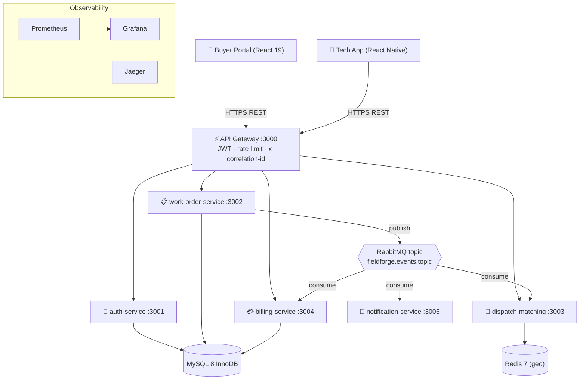
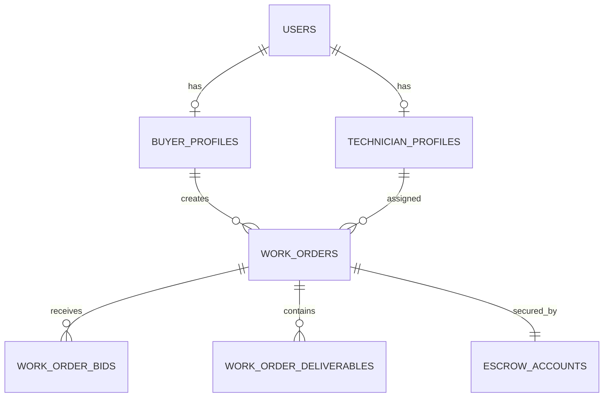

# FieldForge — Architecture & Project Documentation

> **Real-Time Enterprise Field Service Marketplace & Microservices Platform**
> Turborepo monorepo · NestJS · React 19 · React Native (Expo) · MySQL 8 + Drizzle · Redis · RabbitMQ · Kubernetes
> Author of ADRs: Satya Ranjan Debsharma · Status of code: **early scaffold** (see [Implementation Status](#12-implementation-status-matrix))

This document describes what the project **is**, how it is **laid out**, the **intended runtime architecture**, and — importantly — the **actual implementation state** of each piece. A separate companion, [`ISSUES.md`](./ISSUES.md), catalogues concrete defects and gaps.

---

## 1. What FieldForge is

FieldForge is a two-sided marketplace that connects **enterprise buyers** (who need on-site hardware/telecom/networking maintenance) with **certified field technicians**. The domain flow is:

1. A buyer drafts a **work order** (scope of work, budget, site coordinates, SLA window).
2. Publishing the order **pre-authorizes escrow** and fans the order out to nearby technicians.
3. Technicians are matched by **geospatial proximity + scoring** (Redis `GEOSEARCH`), bid, and one is **assigned**.
4. The technician progresses through a **finite state machine**: `EN_ROUTE → ON_SITE` (GPS geofence, ≤100 m) → `COMPLETED` (photos, checklist, client signature).
5. The buyer **approves** (or 72 h auto-approval), escrow is **released** to the technician payout ledger, and a PDF invoice is generated.

Cross-cutting concerns: JWT auth + RBAC at the edge, RabbitMQ topic events for async reactions, and OpenTelemetry/Prometheus/Pino observability with `x-correlation-id` tracing.

---

## 2. Repository layout

```
FieldForge/
├── apps/
│   ├── api-gateway/              # Edge reverse proxy / JWT / rate-limit / correlation-id   (:3000)
│   ├── auth-service/             # Identity, RBAC, technician vetting                        (:3001)
│   ├── work-order-service/       # Work-order lifecycle FSM, deliverables, SLA              (:3002)
│   ├── dispatch-matching-service/# Redis GEOSEARCH matching, bidding, auto-route            (:3003)
│   ├── billing-service/          # Escrow pre-auth / capture / payout / invoicing           (:3004)
│   ├── notification-service/     # FCM/APNS push, Twilio SMS, SES email (RabbitMQ consumer) (:3005)
│   ├── web-buyer-portal/         # React 19 + Redux Toolkit + Vite buyer dashboard          (:5173 intended)
│   └── mobile-tech-app/          # React Native + Expo technician app (offline-first)
├── packages/
│   ├── contracts/                # Shared DTOs, Zod validators, enums, RabbitMQ event interfaces
│   ├── database/                 # Drizzle schema, migrations, seeds, db client factory
│   ├── common/                   # Pino logger, APM interceptor, guards/decorators, health probes, error filter
│   ├── ui/                       # Tailwind React primitives (Button, StatusBadge)
│   ├── tsconfig/                 # Shared TS configs (base, nestjs, react, react-native)
│   └── eslint-config/            # Shared ESLint/Prettier config
├── infra/
│   ├── docker/                   # docker-compose (mysql/redis/rabbitmq/jaeger) + observability + mysql-init
│   ├── k8s/                      # base/ (configmap, secrets, ingress), services/ (Deployments), helm/ (empty)
│   └── terraform/                # AWS VPC module + S3 deliverables bucket
├── scripts/                      # seed-database.sh, setup-dev.sh, simulate-dispatch-load.js
├── .agent/                       # Agentic guardrails: rules/, context/ (living specs), memory/ADRs, workflows/
├── .github/workflows/            # CI (lint/test), docker build, k8s deploy
├── .cursorrules                  # Top-level agent directives
├── turbo.json · pnpm-workspace.yaml · package.json
```

**Tooling**
- **Package manager:** pnpm 9.15.9 workspaces (`apps/*`, `packages/*`); `engines.node >= 22`.
- **Task runner:** Turborepo (`build`, `dev --parallel`, `lint`, `test`; `test` depends on `build`).
- **Language:** TypeScript 5.7 across all workspaces; shared compiler configs in `packages/tsconfig`.
- **Backend framework:** NestJS (⚠️ mixed majors — see Issues; work-order on 11, billing on 10).

---

## 3. Intended runtime architecture



**Communication rules** (from `.agent/rules/01_architecture_rules.md`):
- Services **must not** query another service's database. Sync reads go through the gateway with JWT propagation; async mutations go through RabbitMQ topic events.
- All DTOs/validators/event interfaces come from `@fieldforge/contracts` (single source of truth).
- Propagate `x-correlation-id` across HTTP **and** AMQP; log structured JSON via Pino.

---

## 4. Microservices

| Service | Port | Domain responsibility | Data store | Publishes | Consumes |
| :--- | :---: | :--- | :--- | :--- | :--- |
| `api-gateway` | 3000 | Edge proxy, JWT validation, rate limiting, correlation-id injection | — (Redis intended) | — | — |
| `auth-service` | 3001 | Registration, login, refresh, RBAC, technician vetting/badges | MySQL `users`, `*_profiles` | — | — |
| `work-order-service` | 3002 | Work-order FSM, SOW, deliverables (S3 presign + signature), SLA watcher | MySQL `work_orders`, `work_order_deliverables` | `work_order.lifecycle.{published,assigned,approved}` | — |
| `dispatch-matching-service` | 3003 | Redis `GEOSEARCH` proximity + contractor scoring, bidding, auto-route | Redis, RabbitMQ | `dispatch.*` / `tech.bidding.*` (intended) | `work_order.lifecycle.published` |
| `billing-service` | 3004 | Escrow pre-auth/lock/capture, payouts, PDF invoicing | MySQL `escrow_accounts` | `billing.escrow.funded`, `billing.payout.disbursed` (intended) | `work_order.lifecycle.approved` (intended) |
| `notification-service` | 3005 | Push (FCM/APNS), SMS (Twilio), Email (SES) | RabbitMQ consumer | — | dispatch/notification events (intended) |

> **Reality check:** All six backend services currently bootstrap as plain HTTP apps whose only live endpoints are `/healthz` and `/readyz`. No service opens a DB connection, and no service attaches a RabbitMQ transport — publishers/consumers are `console.log` stubs. See [§12](#12-implementation-status-matrix) and `ISSUES.md`.

### Clients
- **web-buyer-portal** — React 19 + Redux Toolkit + Vite. Single static dashboard (`LiveDispatchBoard`, `SowBuilder`, `EscrowManager`) reading hardcoded Redux `initialState`. No router, no API layer, no RTK Query yet. Boots as an already-authenticated buyer with a mock token.
- **mobile-tech-app** — React Native + Expo. Static landing screen; an unmounted `ActiveJobScreen` demonstrates the geofence check-in UI. Ships a **correct Haversine** implementation (`services/geofencing.service.ts`, radius 6371 km → meters, `≤100 m`) and an in-memory offline queue (`services/offlineSync.service.ts`).

---

## 5. Shared packages

- **`@fieldforge/contracts`** — Enums (`UserRole`, `WorkOrderStatus`, `BidStatus`, `EscrowStatus`, `PriorityLevel`, …), request/response DTO interfaces, Zod validators (`createWorkOrderSchema`, `registerUserSchema`, `loginSchema`, `submitBidSchema`, `preAuthEscrowSchema`), and event envelopes (`WorkOrderPublished/Assigned/ApprovedEvent`, `EscrowFundedEvent`, `PayoutDisbursedEvent`). ⚠️ `transitionStatusSchema` referenced by the API catalogue does not exist here; event envelopes carry no `correlationId`.
- **`@fieldforge/database`** — Drizzle MySQL schemas (`users`, `buyer_profiles`, `technician_profiles`, `work_orders`, `work_order_bids`, `work_order_deliverables`, `escrow_accounts`), a single generated migration, a seed script, and `createDbClient(uri)` (mysql2 pool + Drizzle).
- **`@fieldforge/common`** — `createLogger()` (Pino JSON), `MetricsInterceptor` (currently `console.log` timing, not OTEL/Prometheus), `CorrelationId` param decorator (HTTP header only), `Roles` decorator (⚠️ **no `RolesGuard` enforces it**), `GlobalHttpExceptionFilter`, and `HealthController` (`/healthz`, `/readyz`).
- **`@fieldforge/ui`** — `Button`, `StatusBadge` (⚠️ handles `BIDDING`/`SETTLED`/`OPEN`/`IN_PROGRESS` which are **not** in the backend enum), and a `cn()` classname joiner.
- **`@fieldforge/tsconfig`**, **`@fieldforge/eslint-config`** — shared configs.

---

## 6. Data model



- **PKs:** `VARCHAR(36)` UUID strings. **Money:** `DECIMAL(10,2)` / `(12,2)` in the DB (but `number`/float in the TS/event layer — see Issues).
- **Enums (as coded):** `WorkOrderStatus` = `DRAFT, PUBLISHED, ASSIGNED, EN_ROUTE, ON_SITE, COMPLETED, APPROVED, CANCELLED, DISPUTED` — **no `BIDDING`, no `SETTLED`**. `EscrowStatus` = `HELD, RELEASED, REFUNDED, DISPUTED`.
- **Indexes:** two single-column indexes on `work_orders` (`idx_wo_status`, `idx_wo_schedule`). ⚠️ `RULE-DB-02` requires a **composite** `(status, scheduled_start_time)` index.
- **Constraints:** `escrow_accounts.work_order_id` is a plain FK — ⚠️ **not `UNIQUE`** despite the modelled 1:1 with a work order.
- Two schema definitions exist for the DB: the Drizzle TS schema + generated migration under `packages/database`, and a hand-written `infra/docker/mysql-init/01_init_schema.sql` used by the Docker MySQL container.

---

## 7. Work Order finite state machine

There are **three divergent definitions** of the FSM in this repo. This is a documentation hazard worth resolving.

**A. As implemented** (`work-order-service/src/modules/fsm/work-order-fsm.service.ts`):

```
DRAFT     → PUBLISHED, CANCELLED
PUBLISHED → ASSIGNED, CANCELLED
ASSIGNED  → EN_ROUTE, DISPUTED, CANCELLED
EN_ROUTE  → ON_SITE, DISPUTED
ON_SITE   → COMPLETED, DISPUTED
COMPLETED → APPROVED, DISPUTED
APPROVED  → (terminal)
DISPUTED  → APPROVED, CANCELLED
CANCELLED → (terminal)
```

**B. README diagram** adds `APPROVED → SETTLED → [*]` (a `SETTLED` terminal state that the enum/DB cannot store).

**C. `domain_entities.md` diagram** adds both `PUBLISHED → BIDDING → ASSIGNED` and `APPROVED → SETTLED` (neither `BIDDING` nor `SETTLED` exists in the enum/DB).

The guard is pure graph validation — it does **not** read the persisted status, check ownership, enforce the ≤100 m geofence on `ON_SITE`, or run inside a transaction.

---

## 8. Eventing

- **Exchange:** `fieldforge.events.topic` (RabbitMQ topic). **Routing key schema:** `<domain>.<entity>.<action>`.
- **Declared events** (`@fieldforge/contracts`): `WorkOrderPublishedEvent`, `WorkOrderAssignedEvent`, `WorkOrderApprovedEvent`, `EscrowFundedEvent`, `PayoutDisbursedEvent` — each carries an `eventId` (usable for idempotency) but **no `correlationId`**.
- **Publishers (stubbed):** `work-order-service` logs `work_order.lifecycle.{published,assigned,approved}`; only `published` is ever invoked, and with a **hardcoded** payload (fixed SF coordinates, `$450`).
- **Consumers (unbound):** dispatch and notification define handler methods but with **no `@EventPattern`/queue binding**; billing registers **no consumer at all**. Nothing is bound to any routing key, so no event is ever delivered.
- **Rules not yet met:** idempotency (7-day dedupe), dead-letter exchange + bounded ret/backoff (max 3), correlation-id propagation.

---

## 9. Infrastructure

**Docker Compose** (`infra/docker/docker-compose.yml`) — core backing services, all ports published to host, `restart: always`, **no healthchecks / resource limits / non-root user**:

| Service | Image | Ports | Credentials |
| :--- | :--- | :--- | :--- |
| MySQL | `mysql:8.4` | 3306 | root / `fieldforge_secret` (hardcoded) |
| Redis | `redis:7.4-alpine` | 6379 | **none (no auth)** |
| RabbitMQ | `rabbitmq:4.0-management-alpine` | 5672, 15672 | `guest` / `guest` |
| Jaeger | `jaegertracing/all-in-one:latest` | 16686, 4317, 4318 | — |

**Observability** (`docker-compose.observability.yml`) — Prometheus (`:9090`, mounts a `prometheus.yml` that **does not exist** in the repo) and Grafana (`3001:3000`, admin password `admin`). ⚠️ Grafana host port `3001` collides with `auth-service`.

**Kubernetes** (`infra/k8s/`) — `base/` has `configmap`, `secrets` (⚠️ committed `JWT_SECRET`), and an `ingress` (host `api.fieldforge.io` → `api-gateway-service:3000`). `services/` has **5 Deployments** (no notification-service), all `:latest`, **no Service objects, probes, resource limits, securityContext, or `envFrom`**, so config/secrets never reach the pods. `helm/` is empty. No `kustomization.yaml`, no MySQL/Redis/RabbitMQ workloads.

**Terraform** (`infra/terraform/`) — AWS provider `~>5.0`; VPC via `terraform-aws-modules/vpc/aws`; S3 `fieldforge-deliverables-storage-<env>` with SSE (AES256) + versioning. ⚠️ **No remote backend/state locking**, no `aws_s3_bucket_public_access_block`, no EKS/security groups; `outputs.tf` exposes only `vpc_id`.

---

## 10. Local development / quickstart

> ⚠️ **Caveats before you run this:** `db:seed` currently fails (a seed PK exceeds `VARCHAR(36)`), the buyer portal is pinned to port `3000` (collides with the gateway; README says `5173`), and the services expose only health endpoints. See `ISSUES.md`.

```bash
pnpm install
pnpm docker:up          # MySQL, Redis, RabbitMQ, Jaeger  (observability is a separate compose file)
pnpm db:migrate
pnpm db:seed            # ⚠️ currently errors — see ISSUES.md #S1
pnpm dev                # turbo run dev --parallel
```

Intended endpoints: Buyer Portal `:5173`, API Gateway `:3000/api/v1`, RabbitMQ UI `:15672` (guest/guest), Jaeger `:16686`, Grafana `:3001` (admin/admin).

---

## 11. CI/CD

- **`ci-pipeline.yml`** — on push/PR to `main`/`develop`: pnpm install → `lint` → `test`. ⚠️ Every service's test script is `jest --passWithNoTests` with **zero test files**, so the gate always passes while the PR template asserts "≥90% coverage".
- **`docker-build-push.yml`** — on `v*.*.*` tags: matrix `docker build` over the 6 services. ⚠️ Despite its name ("Build & Security Scan") it neither **pushes** nor **scans**; k8s pulls `:latest` images this pipeline never publishes.
- **`k8s-deploy.yml`** — `workflow_dispatch`: `kubectl apply -k infra/k8s/base`. ⚠️ Broken — no `kustomization.yaml` exists, only `base/` (not `services/`) is targeted, and no cluster credentials are wired.

---

## 12. Implementation status matrix

Legend: ✅ implemented · 🟡 partial/stub · ❌ absent

| Capability | Status | Notes |
| :--- | :---: | :--- |
| Health probes (`/healthz`, `/readyz`) | ✅ | Via `@fieldforge/common` (all services except notification/auth) |
| Shared contracts / DB schema / migration | ✅ | Types, Zod, Drizzle schema + one migration all present |
| Geofence Haversine math (client) | ✅ | Correct; but mock inputs & client-only enforcement |
| API Gateway JWT auth | ❌ | Guard always returns `true`, not registered; no JWT lib |
| API Gateway proxy/routing | ❌ | No proxy wired; real paths 404 |
| Rate limiting | ❌ | No throttler dependency |
| auth-service endpoints (register/login/…) | ❌ | Module is empty; no DB/bcrypt/JWT usage |
| Work-order persistence & transactions | ❌ | In-memory objects; no DB writes; no `db.transaction()` |
| FSM enforcement against real state | 🟡 | Graph validation only; hardcoded DRAFT→PUBLISHED in `publish()` |
| Server-side geofence enforcement | ❌ | Not present in work-order-service |
| SLA watcher / 72 h auto-approval | ❌ | Service unregistered; no scheduler; breach logic bug |
| Escrow lock/release correctness | ❌ | No state/amount/approval checks, no persistence, no idempotency |
| RabbitMQ transport / bindings | ❌ | No transport attached; publishers/consumers are `console.log` |
| Consumer idempotency / DLQ / retry | ❌ | None |
| correlation-id over AMQP | ❌ | Events carry no `correlationId` |
| Dispatch GEOSEARCH + scoring | 🟡→❌ | Returns 2 hardcoded techs; no Redis call, no scoring |
| Notification channels (SMS/push/email) | 🟡 | SMS/push are `console.log`; module empty so unregistered; no email |
| Buyer portal data / auth flow | 🟡 | Hardcoded Redux state, mock JWT, no API/RTK Query/router |
| Mobile offline sync | 🟡→❌ | In-memory queue; `flushQueue()` **discards** items |
| k8s deploy path | ❌ | No Services, missing kustomization, config not injected |
| CI tests | ❌ | `--passWithNoTests`, zero tests |
| Observability (Prometheus/OTEL) | 🟡 | Interceptor `console.log`s; `prometheus.yml` missing |

---

## 13. Conventions & guardrails

Codified under `.agent/` and `.cursorrules`:
- `RULE-ARCH-01` — bounded contexts, no cross-service DB access, contracts as single source of truth.
- `RULE-DB-02` — InnoDB/utf8mb4, UUID v4 `VARCHAR(36)` PKs, `db.transaction()` + `SELECT … FOR UPDATE` for multi-table state changes, composite `(status, scheduled_start_time)` index.
- `RULE-EVENT-03` — topic exchange `fieldforge.events.topic`, `<domain>.<entity>.<action>` keys, idempotent consumers (7-day TTL), DLQ + exponential backoff (max 3 retries).
- `RULE-FE-04` — Redux Toolkit + RTK Query, atomic components, Tailwind + `@fieldforge/ui`.
- `RULE-MOB-05` — offline-first SQLite cache + auto-flush on reconnect, Haversine ≤100 m geofence.
- ADRs (`.agent/memory/ADRs/`): MySQL 8.0 + Drizzle (001), RabbitMQ 3.13 topic exchanges (002), Redis 7 GEOSEARCH with 15 s heartbeat TTL (003).

Several of these rules are currently unmet — see [`ISSUES.md`](./ISSUES.md).

---

## 14. Where to look next

- Concrete defects, ranked by severity, with file:line and fixes → [`ISSUES.md`](./ISSUES.md).
- Living API catalogue → `.agent/context/api_contracts.md`.
- Domain entities & FSM spec → `.agent/context/domain_entities.md`.
- SLI/SLO definitions → `.agent/context/sli_slo_definitions.md`.
