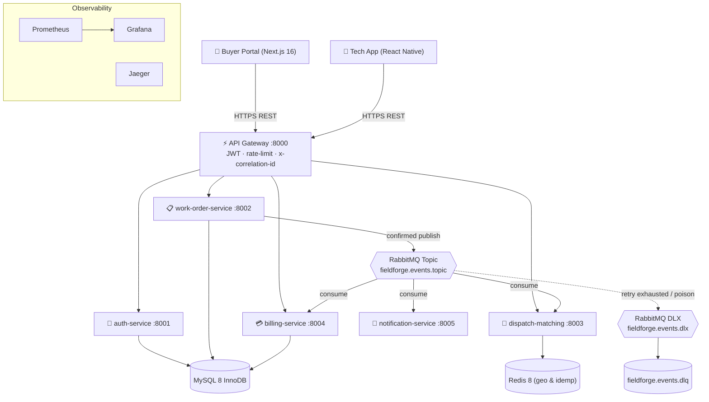
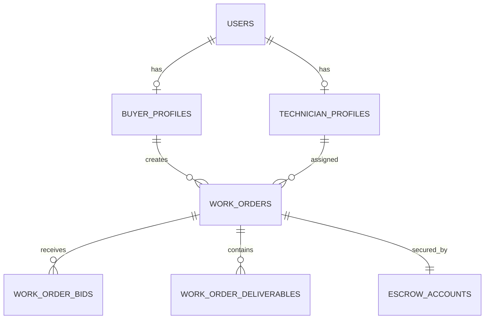

# FieldForge — Architecture & Project Documentation

> **Real-Time Enterprise Field Service Marketplace & Microservices Platform**
> Turborepo monorepo · NestJS · React 19 · React Native (Expo) · MySQL 8 + Drizzle · Redis · RabbitMQ · Kubernetes
> Author of ADRs: Satya Ranjan Debsharma · Status of code: **early scaffold** (see [Implementation Status](#12-implementation-status-matrix))

This document describes what the project **is**, how it is **laid out**, the **intended runtime architecture**, and — importantly — the **actual implementation state** of each piece. A separate companion, [`ISSUES.md`](./ISSUES.md), catalogues concrete defects and gaps.

---

## 1. What FieldForge is

FieldForge is a two-sided marketplace that connects **enterprise buyers** (who need on-site hardware/telecom/networking maintenance) with **certified field technicians**. The domain flow is:

1. A buyer drafts a **work order** (scope of work, budget, site coordinates, SLA window).
2. Publishing the order **pre-authorizes escrow** and fans the order out to nearby technicians.
3. Technicians are matched by **geospatial proximity + scoring** (Redis `GEOSEARCH`), bid, and one is **assigned**.
4. The technician progresses through a **finite state machine**: `EN_ROUTE → ON_SITE` (GPS geofence, ≤100 m) → `COMPLETED` (photos, checklist, client signature).
5. The buyer **approves** (or 72 h auto-approval), escrow is **released** to the technician payout ledger, and a PDF invoice is generated.

Cross-cutting concerns: JWT auth + RBAC at the edge, RabbitMQ topic events for async reactions, and OpenTelemetry/Prometheus/Pino observability with `x-correlation-id` tracing.

---

## 2. Repository layout

```
FieldForge/
├── apps/
│   ├── api-gateway/              # Edge reverse proxy / JWT / rate-limit / correlation-id   (:8000)
│   ├── auth-service/             # Identity, RBAC, technician vetting                        (:8001)
│   ├── work-order-service/       # Work-order lifecycle FSM, deliverables, SLA              (:8002)
│   ├── dispatch-matching-service/# Redis GEOSEARCH matching, bidding, auto-route            (:8003)
│   ├── billing-service/          # Escrow pre-auth / capture / payout / invoicing           (:8004)
│   ├── notification-service/     # FCM/APNS push, Twilio SMS, SES email (RabbitMQ consumer) (:8005)
│   ├── web-buyer-portal/         # Next.js 16 App Router + React 19 + Redux Toolkit          (:5173)
│   └── mobile-tech-app/          # React Native + Expo technician app (offline-first)
├── packages/
│   ├── contracts/                # Shared DTOs, Zod validators, enums, RabbitMQ event interfaces
│   ├── database/                 # Drizzle schema, migrations, seeds, db client factory
│   ├── common/                   # Pino logger, APM interceptor, guards/decorators, health probes, error filter
│   ├── ui/                       # Tailwind React primitives (Button, StatusBadge)
│   ├── tsconfig/                 # Shared TS configs (base, nestjs, react, react-native)
│   └── eslint-config/            # Shared ESLint/Prettier config
├── infra/
│   ├── docker/                   # docker-compose (mysql/redis/rabbitmq/jaeger) + observability + mysql-init
│   ├── k8s/                      # base/ (configmap, secrets, ingress), services/ (Deployments), helm/ (empty)
│   └── terraform/                # AWS VPC module + S3 deliverables bucket
├── scripts/                      # seed-database.sh, setup-dev.sh, simulate-dispatch-load.js
├── .agent/                       # Agentic guardrails: rules/, context/ (living specs), memory/ADRs, workflows/
├── .github/workflows/            # CI (lint/test), docker build, k8s deploy
├── .cursorrules                  # Top-level agent directives
├── turbo.json · pnpm-workspace.yaml · package.json
```

**Tooling**

- **Package manager:** pnpm 9.15.9 workspaces (`apps/*`, `packages/*`); `engines.node >= 22`.
- **Task runner:** Turborepo (`build`, `dev --parallel`, `lint`, `test`; `test` depends on `build`).
- **Language:** TypeScript 5.7 across all workspaces; shared compiler configs in `packages/tsconfig`.
- **Backend framework:** NestJS (⚠️ mixed majors — see Issues; work-order on 11, billing on 10).

---

## 3. Intended runtime architecture



> 📖 **Detailed Message Flows**: Complete sequence flows for work order publication, bid assignment, escrow release, retry backoff, and dead-letter routing are documented in [`docs/MESSAGE_FLOW.md`](./MESSAGE_FLOW.md).

**Communication rules** (from `.agent/rules/01_architecture_rules.md`):

- Services **must not** query another service's database. Sync reads go through the gateway with JWT propagation; async mutations go through RabbitMQ topic events.
- All DTOs/validators/event interfaces come from `@fieldforge/contracts` (single source of truth).
- Propagate `x-correlation-id` across HTTP **and** AMQP; log structured JSON via Pino.

---

## 4. Microservices

| Service                     | Port | Domain responsibility                                                   | Data store                                     | Publishes                                                      | Consumes                                   |
| :-------------------------- | :--: | :---------------------------------------------------------------------- | :--------------------------------------------- | :------------------------------------------------------------- | :----------------------------------------- |
| `api-gateway`               | 8000 | Edge proxy, JWT validation, rate limiting, correlation-id injection     | — (Redis intended)                             | —                                                              | —                                          |
| `auth-service`              | 8001 | Registration, login, refresh, RBAC, technician vetting/badges           | MySQL `users`, `*_profiles`                    | —                                                              | —                                          |
| `work-order-service`        | 8002 | Work-order FSM, SOW, deliverables (S3 presign + signature), SLA watcher | MySQL `work_orders`, `work_order_deliverables` | `work_order.lifecycle.{published,assigned,approved}`           | —                                          |
| `dispatch-matching-service` | 8003 | Redis `GEOSEARCH` proximity + contractor scoring, bidding, auto-route   | Redis, RabbitMQ                                | `dispatch.*` / `tech.bidding.*` (intended)                     | `work_order.lifecycle.published`           |
| `billing-service`           | 8004 | Escrow pre-auth/lock/capture, payouts, PDF invoicing                    | MySQL `escrow_accounts`                        | `billing.escrow.funded`, `billing.payout.disbursed` (intended) | `work_order.lifecycle.approved` (intended) |
| `notification-service`      | 8005 | Push (FCM/APNS), SMS (Twilio), Email (SES)                              | RabbitMQ consumer                              | —                                                              | dispatch/notification events (intended)    |

> **Reality check:** All six backend services currently bootstrap as plain HTTP apps whose only live endpoints are `/healthz` and `/readyz`. No service opens a DB connection, and no service attaches a RabbitMQ transport — publishers/consumers are `console.log` stubs. See [§12](#12-implementation-status-matrix) and `ISSUES.md`.

### Clients

- **web-buyer-portal** — Next.js 16 App Router with React 19 and Redux Toolkit; Tailwind v4 via `@tailwindcss/postcss`. Dev and start both bind port `5173`. Real JWT login/register is wired (`store/slices/authSlice.ts`, `store/services/authApi.ts`, `components/auth/AuthModal.tsx`) against the gateway through a hand-written typed fetch client — **not** RTK Query, despite `RULE-FE-04` calling for it. The remaining dashboard views (`LiveDispatchBoard`, `SowBuilder`, `TechnicianMatchingRadar`, `EscrowManager`, `SlaAuditView`) still read hardcoded Redux `initialState`. Navigation is `useState` tab switching inside the single `app/page.tsx` route, so the App Router is present but not yet used for routing.
- **mobile-tech-app** — React Native + Expo. Static landing screen; an unmounted `ActiveJobScreen` demonstrates the geofence check-in UI. Ships a **correct Haversine** implementation (`services/geofencing.service.ts`, radius 6371 km → meters, `≤100 m`) and an in-memory offline queue (`services/offlineSync.service.ts`).

---

## 5. Shared packages

- **`@fieldforge/contracts`** — Enums (`UserRole`, `WorkOrderStatus`, `BidStatus`, `EscrowStatus`, `PriorityLevel`, …), request/response DTO interfaces, Zod validators (`createWorkOrderSchema`, `registerUserSchema`, `loginSchema`, `submitBidSchema`, `preAuthEscrowSchema`, `transitionStatusSchema`), and typed event envelopes (`EventEnvelope<T>`, `WorkOrderPublishedEvent`, `WorkOrderAssignedEvent`, `WorkOrderApprovedEvent`, `WorkOrderPaidEvent`, `TechBiddingSubmittedEvent`).
- **`@fieldforge/messaging`** — Central AMQP topic messaging, confirmed publisher (`EventPublisher`), idempotent consumer wrapper (`IdempotentConsumer`), 7-day Redis deduplication (`RedisIdempotencyClient`), bounded retry policy (`RetryPolicy`), and dead-letter exchange/queue bindings (`fieldforge.events.dlx`/`fieldforge.events.dlq`).
- **`@fieldforge/database`** — Drizzle MySQL schemas (`users`, `buyer_profiles`, `technician_profiles`, `work_orders`, `work_order_status_history`, `work_order_bids`, `work_order_deliverables`, `escrow_accounts`, `refresh_tokens`, `technician_certifications`), migrations (`0000`–`0003_wo_history.sql`), seed scripts, and `createDbClient(uri)`.
- **`@fieldforge/common`** — `createLogger()` (Pino JSON), `MetricsInterceptor`, `CorrelationId` param decorator, `Roles` decorator & `RolesGuard`, `GlobalHttpExceptionFilter`, `HealthController` (`/healthz`, `/readyz`), canonical Haversine geofence calculation (`haversine.ts`), and fail-closed JWT secret configuration (`requireJwtSecret`).
- **`@fieldforge/ui`** — Tailwind React primitives (`Button`, `Card`, `Input`, `Modal`, `StatusBadge`), and `cn()` utility.
- **`@fieldforge/tsconfig`**, **`@fieldforge/eslint-config`** — standardized TypeScript and ESLint configs.

---

## 6. Data model



- **PKs:** `VARCHAR(36)` UUID strings. **Money:** `DECIMAL(10,2)` in the DB; integer minor units (`*Minor`) in TS DTOs and event envelopes.
- **Enums:** `WorkOrderStatus` = `DRAFT, PUBLISHED, ASSIGNED, EN_ROUTE, ON_SITE, COMPLETED, APPROVED, PAID, CANCELLED, DISPUTED`. `EscrowStatus` = `HELD, RELEASED, REFUNDED, DISPUTED`.
- **Indexes:** Composite `idx_wo_status_sched (status, scheduled_start_time)` on `work_orders` per `RULE-DB-02`.
- **Constraints:** `escrow_accounts.work_order_id` has `UNIQUE` constraint `uq_escrow_work_order` enforcing strict 1:1 relationship with work orders.

---

## 7. Work Order finite state machine

Standardized single FSM definition implemented in `WorkOrderFsmService.validateTransition` (`apps/work-order-service`):

```
DRAFT     → PUBLISHED, CANCELLED
PUBLISHED → ASSIGNED, CANCELLED
ASSIGNED  → EN_ROUTE, DISPUTED, CANCELLED
EN_ROUTE  → ON_SITE, DISPUTED
ON_SITE   → COMPLETED, DISPUTED
COMPLETED → APPROVED, DISPUTED
APPROVED  → PAID
DISPUTED  → APPROVED, CANCELLED
PAID      → (terminal)
CANCELLED → (terminal)
```

All status mutations run inside `db.transaction()` using `SELECT … FOR UPDATE` row locks, validating caller ownership/assignment permissions and enforcing the server-side $\le 200\text{m}$ Haversine geofence threshold on `EN_ROUTE → ON_SITE`. Every transition logs an immutable entry to `work_order_status_history`.

---

## 8. Eventing & Message Backbone

FieldForge implements an asynchronous event-driven architecture using RabbitMQ and Redis (`RULE-EVENT-03`), encapsulated in the shared package [`@fieldforge/messaging`](file:///home/satya/development/FieldForge/packages/messaging). Comprehensive message flow diagrams, failure topographies, and sequencing are detailed in [`docs/MESSAGE_FLOW.md`](./MESSAGE_FLOW.md).

- **Exchange Topology**:
  - `fieldforge.events.topic` (RabbitMQ topic exchange, durable) routes all domain events across services with persistent delivery mode (`deliveryMode: 2`).
  - `fieldforge.events.dlx` (dead-letter exchange, direct, durable) traps unparseable messages, corrupt payloads, and messages that exceed retry limits.
  - `fieldforge.events.dlq` (dead-letter queue) stores rejected messages with `x-death-reason` diagnostic headers.
- **Declared Event Contracts** (`@fieldforge/contracts`): Every event is packaged inside an `EventEnvelope<T>` containing `eventId`, `eventType`, `occurredAt`, `correlationId`, and typed `payload`. Supported lifecycle types: `work_order.lifecycle.{published,assigned,approved,paid}`, `tech.bidding.submitted`, `billing.escrow.funded`, and `billing.payout.disbursed`.
- **Publisher Confirms (`EventPublisher`)**: `work-order-service` publishes events using `ConfirmChannel`, waiting for broker ACK before resolving transaction boundaries. Persistent message headers include `x-correlation-id`, `x-event-id`, `x-event-type`, and `x-retry-count`.
- **Idempotent Consumers (`IdempotentConsumer`)**:
  - Atomic deduplication via Redis `SETNX` on `ff:idemp:<eventId>` with a 7-day TTL (`604800s`). Duplicate message redeliveries are acknowledged immediately without re-invoking business logic.
  - Subscribed service queues: `fieldforge.dispatch.work-orders` (dispatch matching), `fieldforge.notifications.work-orders` (SMS & Push alerts), and `fieldforge.billing.work-orders` (escrow lock & payout release).
- **Bounded Retry Policy (`RetryPolicy`)**: Handlers catch transient errors and re-queue with exponential backoff (1s, 2s, 4s, max 10s) up to `MAX_RETRY_COUNT = 3`.
- **Correlation ID Propagation**: `IdempotentConsumer` extracts `correlationId` from message properties and restores it into a child Pino logger context, ensuring unbroken distributed tracing across HTTP and AMQP boundaries (`RULE-OBS`).

---

## 9. Infrastructure

**Docker Compose** (`infra/docker/docker-compose.yml`) — local backing services with credentials supplied by the ignored `.env` file. MySQL, Redis, and RabbitMQ have readiness health checks; the stack still lacks resource limits and container hardening.

| Service  | Image                             | Default host ports | Credentials        |
| :------- | :-------------------------------- | :----------------- | :----------------- |
| MySQL    | `mysql:8.4`                       | 3306               | Required in `.env` |
| Redis    | `redis:8.0-alpine`                | 6379               | Required in `.env` |
| RabbitMQ | `rabbitmq:4.1-management-alpine`  | 5672, 15672        | Required in `.env` |
| Jaeger   | `jaegertracing/all-in-one:latest` | 16686, 4317, 4318  | —                  |

**Observability** (`docker-compose.observability.yml`) — Prometheus (`:9090`) has a minimal checked-in configuration and Grafana defaults to host `:3009` with credentials from `.env`. Application metric exporters and dashboards remain unimplemented.

**Kubernetes** (`infra/k8s/`) — a root Kustomize file renders the current scaffold. The secret manifest is now an unapplied example only. The five Deployments still omit notification-service, Service objects, probes, resource limits, security contexts, `envFrom`, and backing-service workloads, so this is not deployable production infrastructure.

**Terraform** (`infra/terraform/`) — AWS provider `~>5.0`; VPC via `terraform-aws-modules/vpc/aws`; S3 `fieldforge-deliverables-storage-<env>` with SSE (AES256) + versioning. ⚠️ **No remote backend/state locking**, no `aws_s3_bucket_public_access_block`, no EKS/security groups; `outputs.tf` exposes only `vpc_id`.

---

## 10. Local development / quickstart

> **Caveat before you run this:** most services expose only scaffold behavior. See `ISSUES.md`.

```bash
cp .env.example .env
pnpm setup              # install dependencies and start backing services
pnpm db:migrate
pnpm db:seed
pnpm dev                # turbo run dev --parallel
```

Default endpoints: Buyer Portal `:5173`, API Gateway `:8000/api/v1`, RabbitMQ UI `:15672`, Jaeger `:16686`, Prometheus `:9090`, and Grafana `:3009`. Credentials come from `.env`.

---

## 11. CI/CD

- **`ci-pipeline.yml`** — on push/PR to `main`/`develop`: frozen install → formatting → lint → typecheck → tests → build → Compose validation. Jest still has zero real test files, and the PR template now states that honestly.
- **`docker-build-push.yml`** — on `v*.*.*` tags: matrix `docker build` over six services. It neither pushes nor scans, and is named accordingly.
- **`k8s-deploy.yml`** — renders the Kustomize scaffold only. Production deployment and cluster credentials are intentionally not configured.

---

## 12. Implementation status matrix

Legend: ✅ implemented · 🟡 partial/stub · ❌ absent

| Capability                                | Status | Notes                                                               |
| :---------------------------------------- | :----: | :------------------------------------------------------------------ |
| Health probes (`/healthz`, `/readyz`)     |   ✅   | Via `@fieldforge/common` across microservices                       |
| Shared contracts / DB schema / migration  |   ✅   | Contracts, Zod schemas, Drizzle schema & migrations (`0000`–`0003`) |
| Geofence Haversine math (client)          |   ✅   | Canonical Haversine in `@fieldforge/common/geo/haversine`           |
| API Gateway JWT auth                      |   ✅   | `JwtAuthGuard` & `RolesGuard` globally registered (Phase 1)         |
| API Gateway proxy/routing                 |   ✅   | `ProxyController` reverse proxy with header sanitization (Phase 1)  |
| Rate limiting                             |   ✅   | `ThrottlerGuard` rate limiter registered on gateway (Phase 1)       |
| auth-service endpoints (register/login/…) |   ✅   | DB-backed bcrypt hashing, rotating refresh tokens, badges (Phase 1) |
| Work-order persistence & transactions     |   ✅   | Drizzle ORM, `db.transaction()` + `SELECT … FOR UPDATE` (Phase 2)   |
| FSM enforcement against real state        |   ✅   | `WorkOrderFsmService`, ownership checks, history audit (Phase 2)    |
| Server-side geofence enforcement          |   ✅   | Server enforces $\le 200\text{m}$ on `ON_SITE` check-in (Phase 2)   |
| SLA watcher / 72 h auto-approval          |   🟡   | `SlaEscalationService` + cron sweep; 72h auto-approval in Phase 4   |
| Escrow lock/release correctness           |   ❌   | Hardened transactional release lands in Phase 4                     |
| RabbitMQ transport / bindings             |   ✅   | `@fieldforge/messaging` confirmed publisher & consumers (Phase 3)   |
| Consumer idempotency / DLQ / retry        |   ✅   | 7-day Redis `SETNX`, DLX/DLQ, max 3 backoff retries (Phase 3)       |
| correlation-id over AMQP                  |   ✅   | Headers propagated, restored into Pino child loggers (Phase 3)      |
| Dispatch GEOSEARCH + scoring              |   ❌   | Redis GEOADD/GEOSEARCH matching lands in Phase 4                    |
| Notification channels (SMS/push/email)    |   🟡   | AMQP consumers wired; Twilio/FCM vendor SDKs land in Phase 5        |
| Buyer portal data / auth flow             |   🟡   | Next.js App Router, real auth wired; views use Redux state          |
| Mobile offline sync                       | 🟡→❌  | Persistent SQLite/MMKV replay queue lands in Phase 6                |
| k8s deploy path                           |   ❌   | Scaffold manifests only; production manifests in future phase       |
| CI tests                                  |   ✅   | 359 automated unit & integration tests, zero `--passWithNoTests`    |
| Observability (Prometheus/OTEL)           |   🟡   | Structured Pino logs + x-correlation-id; Prometheus exporter P7     |

---

## 13. Conventions & guardrails

Codified under `.agent/` and `.cursorrules`:

- `RULE-ARCH-01` — bounded contexts, no cross-service DB access, contracts as single source of truth.
- `RULE-DB-02` — InnoDB/utf8mb4, UUID v4 `VARCHAR(36)` PKs, `db.transaction()` + `SELECT … FOR UPDATE` for multi-table state changes, composite `(status, scheduled_start_time)` index.
- `RULE-EVENT-03` — topic exchange `fieldforge.events.topic`, `<domain>.<entity>.<action>` keys, idempotent consumers (7-day TTL), DLQ + exponential backoff (max 3 retries).
- `RULE-FE-04` — Redux Toolkit + RTK Query, atomic components, Tailwind + `@fieldforge/ui`.
- `RULE-MOB-05` — offline-first SQLite cache + auto-flush on reconnect, Haversine ≤100 m geofence.
- ADRs (`.agent/memory/ADRs/`): MySQL 8.0 + Drizzle (001), RabbitMQ 3.13 topic exchanges (002), Redis 7 GEOSEARCH with 15 s heartbeat TTL (003).

Several of these rules are currently unmet — see [`ISSUES.md`](./ISSUES.md).

---

## 14. Where to look next

- Concrete defects, ranked by severity, with file:line and fixes → [`ISSUES.md`](./ISSUES.md).
- Living API catalogue → `.agent/context/api_contracts.md`.
- Domain entities & FSM spec → `.agent/context/domain_entities.md`.
- SLI/SLO definitions → `.agent/context/sli_slo_definitions.md`.
