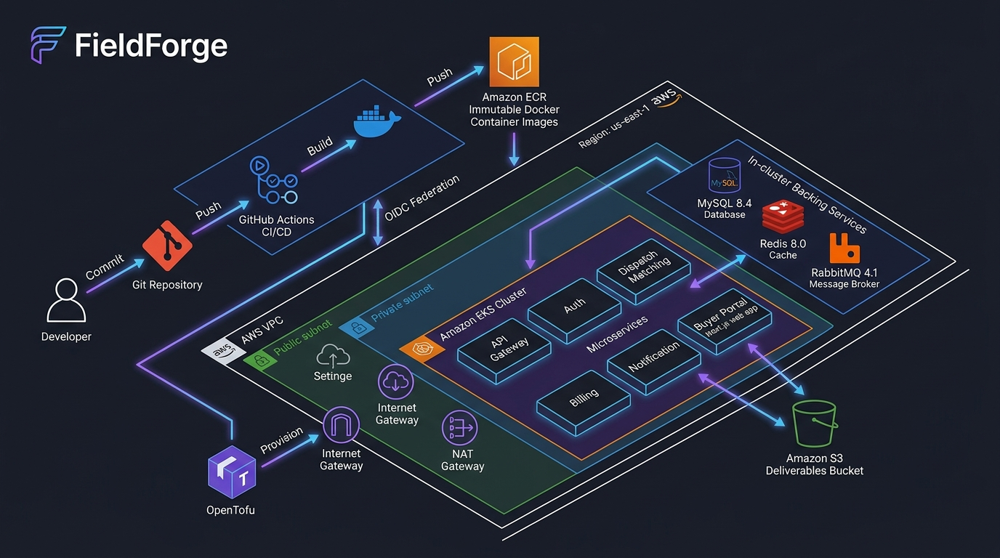
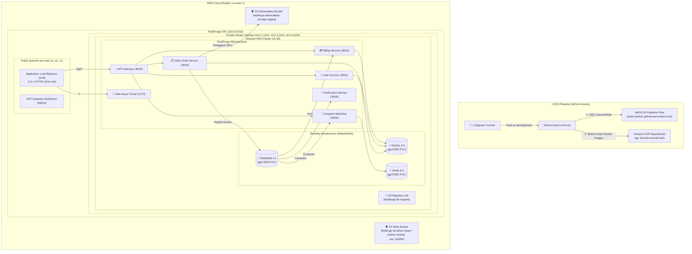

# FieldForge — AWS Production & Staging Deployment Guide

> **Enterprise Field Service Marketplace & Microservices Platform**  
> Complete step-by-step deployment guide for Amazon Web Services (AWS) using OpenTofu / Terraform, Amazon EKS (Kubernetes 1.36), Amazon ECR, Amazon S3, and GitHub Actions OIDC.

---

## 1. Architecture Overview

FieldForge on AWS utilizes a cloud-native, microservices-oriented topology deployed within a dedicated, multi-AZ Amazon VPC. Workloads run on Amazon Elastic Kubernetes Service (EKS) in private worker subnets with strict egress control via NAT Gateways.

### Visual Deployment & Cloud Architecture Flow





---

## 2. Infrastructure Inventory & Ports

| Component / Microservice      | Container Port  | Protocol / Exposure       | AWS Resource / Mechanism                       |
| :---------------------------- | :-------------: | :------------------------ | :--------------------------------------------- |
| **API Gateway**               |     `8000`      | HTTP / Internal & Ingress | EKS Deployment, Edge Proxy, Rate Limiter       |
| **Auth Service**              |     `8001`      | HTTP / Cluster-internal   | EKS Deployment, Identity, RBAC                 |
| **Work Order Service**        |     `8002`      | HTTP / Cluster-internal   | EKS Deployment, FSM, Deliverables              |
| **Dispatch Matching Service** |     `8003`      | HTTP / Cluster-internal   | EKS Deployment, Redis Geospatial               |
| **Billing Service**           |     `8004`      | HTTP / Cluster-internal   | EKS Deployment, Escrow Ledger                  |
| **Notification Service**      |     `8005`      | HTTP / Cluster-internal   | EKS Deployment, RabbitMQ Event Consumer        |
| **Web Buyer Portal**          |     `5173`      | HTTP / Ingress            | EKS Deployment, Next.js 16 App Router          |
| **MySQL Database**            |     `3306`      | TCP / Cluster-internal    | StatefulSet, Amazon EBS `gp3` (10Gi)           |
| **Redis Cache & Geo**         |     `6379`      | TCP / Cluster-internal    | StatefulSet, Amazon EBS `gp3` (5Gi), AOF       |
| **RabbitMQ Broker**           | `5672`, `15672` | AMQP & HTTP / Internal    | StatefulSet, Amazon EBS `gp3` (10Gi)           |
| **Deliverables Storage**      |      `443`      | HTTPS S3 API              | Amazon S3 Bucket (AES256, CORS enabled)        |
| **Remote IaC State**          |      `443`      | HTTPS S3 API              | Amazon S3 Bucket (Versioning + `use_lockfile`) |

---

## 3. Prerequisites & Local Tooling

Ensure the following versions are installed on your administrative host:

```bash
# 1. AWS CLI v2 (>= 2.32)
aws --version

# 2. OpenTofu (>= 1.12.0)
tofu version

# 3. Kubernetes CLI & Kustomize
kubectl version --client
kustomize version

# 4. Helm (v3+)
helm version

# 5. Node.js & pnpm
node --version # >= v22.0.0
pnpm --version # = 11.24.0
```

Verify your active AWS identity:

```bash
aws sts get-caller-identity --profile fieldforge-staging
```

---

## 4. Step-by-Step Deployment Flow

### Step 1: OpenTofu Remote State S3 Bootstrap

To avoid circular dependencies, the S3 state bucket is created by a lightweight, standalone bootstrap root module using local state. State locking uses OpenTofu's native S3 conditional write locking (`use_lockfile = true`), completely eliminating the need for a separate DynamoDB table.

1. Navigate to the bootstrap directory:

   ```bash
   cd infra/terraform/bootstrap-state
   ```

2. Initialize and apply:

   ```bash
   tofu init
   tofu plan -out=bootstrap.tfplan
   tofu apply bootstrap.tfplan
   ```

3. Export the created bucket name:

   ```bash
   STATE_BUCKET=$(tofu output -raw state_bucket_name)
   echo "Remote state bucket provisioned: ${STATE_BUCKET}"
   ```

4. Populate the main infrastructure backend configuration in `infra/terraform/backend.staging.tfbackend`:
   ```hcl
   bucket       = "fieldforge-terraform-state-<YOUR_ACCOUNT_ID>-us-east-1"
   key          = "fieldforge/staging/terraform.tfstate"
   region       = "us-east-1"
   use_lockfile = true
   encrypt      = true
   ```

---

### Step 2: Core Infrastructure Provisioning (VPC, ECR, IAM, S3)

The main Terraform root module provisions the networking foundation, container registries, GitHub Actions OIDC federation, and application storage.

1. Navigate to the main Terraform directory:

   ```bash
   cd ../
   ```

2. Initialize with remote S3 backend:

   ```bash
   tofu init -backend-config=backend.staging.tfbackend
   ```

3. Validate configuration:

   ```bash
   tofu validate
   ```

4. Plan and apply:

   ```bash
   tofu plan -var="environment=staging" -out=main.tfplan
   tofu apply main.tfplan
   ```

5. Confirm provisioned outputs:
   - **VPC ID**: `10.0.0.0/16` with 3 private and 3 public subnets.
   - **ECR Repositories**: 7 repositories under `fieldforge/*` with tag immutability.
   - **GitHub Actions OIDC Role**: `arn:aws:iam::<ACCOUNT_ID>:role/fieldforge-github-ecr-publisher`.
   - **Deliverables S3 Bucket**: `fieldforge-deliverables-storage-staging`.

---

### Step 3: Container Image Build & ECR Publishing

Every production or staging image must be tagged with the exact 40-character Git commit SHA (`sha-<full-git-sha>`). The `:latest` tag is strictly forbidden.

#### Automated GitHub Actions CI/CD

On push to `develop` or release tags, `.github/workflows/docker-build-push.yml` authenticates via GitHub OIDC, builds 7 images with Buildx, and pushes them to Amazon ECR:

```yaml
# Matrix services published:
# 1. fieldforge/api-gateway
# 2. fieldforge/auth-service
# 3. fieldforge/billing-service
# 4. fieldforge/dispatch-matching-service
# 5. fieldforge/notification-service
# 6. fieldforge/work-order-service
# 7. fieldforge/web-buyer-portal
```

#### Manual / CLI Publishing (if emergency deployment is needed)

```bash
ACCOUNT_ID=$(aws sts get-caller-identity --query "Account" --output text)
REGION="us-east-1"
ECR_REGISTRY="${ACCOUNT_ID}.dkr.ecr.${REGION}.amazonaws.com"
IMAGE_TAG="sha-$(git rev-parse HEAD)"

# 1. Log in to ECR
aws ecr get-login-password --region ${REGION} | \
  docker login --username AWS --password-stdin ${ECR_REGISTRY}

# 2. Build and push a service (e.g., auth-service)
docker build -t ${ECR_REGISTRY}/fieldforge/auth-service:${IMAGE_TAG} \
  -f apps/auth-service/Dockerfile .
docker push ${ECR_REGISTRY}/fieldforge/auth-service:${IMAGE_TAG}
```

---

### Step 4: EKS Cluster Foundation & Storage Provisioning

FieldForge targets Kubernetes **1.36** with API Authentication Mode and EKS Pod Identity for the AWS EBS CSI driver.

1. **Cluster Configuration Summary**:
   - **Version**: Kubernetes `1.36`
   - **Access Mode**: `authentication_mode = "API"` (using EKS Access Entries, no legacy `aws-auth`).
   - **Node Group**: Private worker subnets, managed node group with minimum 2 `t3.large` or `m6i.large` instances (architecture: `amd64`).
   - **Add-ons**: `vpc-cni`, `kube-proxy`, `coredns`, `eks-pod-identity-agent`, `aws-ebs-csi-driver`.

2. **Connect to EKS**:

   ```bash
   aws eks update-kubeconfig --region us-east-1 --name fieldforge-staging-cluster
   kubectl get nodes
   ```

3. **StorageClass Verification**:
   Ensure `gp3` is configured as the default StorageClass:
   ```yaml
   apiVersion: storage.k8s.io/v1
   kind: StorageClass
   metadata:
     name: gp3
     annotations:
       storageclass.kubernetes.io/is-default-class: 'true'
   provisioner: ebs.csi.aws.com
   volumeBindingMode: WaitForFirstConsumer
   allowVolumeExpansion: true
   parameters:
     type: gp3
     fsType: ext4
   ```

---

### Step 5: Kubernetes Base Configuration & Secrets

1. Create target namespace:

   ```bash
   kubectl create namespace fieldforge-staging || true
   kubectl config set-context --current --namespace=fieldforge-staging
   ```

2. Apply ConfigMap:

   ```bash
   kubectl apply -f infra/k8s/base/configmap.yaml
   ```

3. Deploy Kubernetes Secrets:
   Generate strong credentials and author `infra/k8s/base/secrets.yaml` (never commit real secrets):
   ```bash
   kubectl create secret generic fieldforge-secrets \
     --from-literal=JWT_SECRET="<generate-256-bit-random-secret>" \
     --from-literal=INTERNAL_SERVICE_SECRET="<generate-random-internal-token>" \
     --from-literal=MYSQL_ROOT_PASSWORD="<strong-mysql-root-password>" \
     --from-literal=MYSQL_PASSWORD="<strong-mysql-app-password>" \
     --from-literal=RABBITMQ_DEFAULT_PASS="<strong-rabbitmq-password>" \
     --from-literal=DATABASE_URL="mysql://fieldforge:<PASSWORD>@mysql-service:3306/fieldforge" \
     --from-literal=REDIS_URL="redis://redis-service:6379" \
     --from-literal=RABBITMQ_URL="amqp://fieldforge:<PASSWORD>@rabbitmq-service:5672" \
     --dry-run=client -o yaml | kubectl apply -f -
   ```

---

### Step 6: Deploy Backing Services & Await Readiness

Deploy in-cluster StatefulSets for MySQL, Redis, and RabbitMQ:

```bash
# 1. Apply backing services
kubectl apply -f infra/k8s/backing/mysql.yaml
kubectl apply -f infra/k8s/backing/redis.yaml
kubectl apply -f infra/k8s/backing/rabbitmq.yaml

# 2. Wait for full readiness before progressing
kubectl rollout status statefulset/mysql --timeout=180s
kubectl rollout status statefulset/redis --timeout=180s
kubectl rollout status statefulset/rabbitmq --timeout=180s
```

Verify endpoints:

```bash
kubectl get pods -l tier=backing
kubectl get pvc
```

---

### Step 7: Database Migration Job Execution

FieldForge enforces that schema migrations must run to completion **before** any application deployments are initiated.

1. Execute the migration runner script with target ECR release parameters:

   ```bash
   export ECR_REGISTRY="${ACCOUNT_ID}.dkr.ecr.us-east-1.amazonaws.com"
   export IMAGE_TAG="sha-$(git rev-parse HEAD)"

   ./scripts/k8s-run-db-migration.sh
   ```

2. Verify job completion:
   ```bash
   kubectl wait --for=condition=complete job/fieldforge-db-migrate --timeout=120s
   kubectl logs job/fieldforge-db-migrate
   ```

---

### Step 8: Deploy Microservices & Ingress

Use the staging deployment orchestrator script to validate inputs, render release manifests, inject immutable images, and trigger rolling updates:

```bash
export ECR_REGISTRY="${ACCOUNT_ID}.dkr.ecr.us-east-1.amazonaws.com"
export IMAGE_TAG="sha-$(git rev-parse HEAD)"

./scripts/k8s-deploy-staging.sh
```

The script will:

- Verify backing infrastructure health.
- Run database migrations to success.
- Render manifests in an isolated temporary directory via Kustomize.
- Deploy and verify rollout across all 7 services:
  - `api-gateway`
  - `auth-service`
  - `billing-service`
  - `dispatch-matching-service`
  - `notification-service`
  - `work-order-service`
  - `web-buyer-portal`

Verify pod status:

```bash
kubectl get deployments
kubectl get pods -l tier=app
```

---

### Step 9: Ingress, DNS, & TLS Configuration

1. **Install AWS Load Balancer Controller**:

   ```bash
   helm repo add eks https://aws.github.io/eks-charts
   helm repo update
   helm install aws-load-balancer-controller eks/aws-load-balancer-controller \
     -n kube-system \
     --set clusterName=fieldforge-staging-cluster \
     --set serviceAccount.create=false \
     --set serviceAccount.name=aws-load-balancer-controller
   ```

2. **Deploy Ingress**:

   ```bash
   kubectl apply -f infra/k8s/base/ingress.yaml
   ```

3. **Check Ingress Status & Address**:

   ```bash
   kubectl get ingress fieldforge-ingress
   ```

4. **Point Route 53 to Ingress ALB**:
   Create an `A` (Alias) record in Route 53 pointing `staging.fieldforge.com` to the dualstack ALB DNS hostname.

---

### Step 10: Post-Deployment Smoke Test & Verification

Run health checks against the public or port-forwarded API Gateway:

```bash
# Port-forward API gateway for testing
kubectl port-forward svc/api-gateway-service 8000:8000 &

# Check health and readiness probes
curl -f http://localhost:8000/healthz
curl -f http://localhost:8000/readyz

# Verify buyer registration & login
curl -X POST http://localhost:8000/api/auth/register \
  -H "Content-Type: application/json" \
  -d '{"email":"buyer@example.com","password":"Password123!","role":"BUYER","fullName":"AWS Enterprise Buyer"}'

# Verify buyer portal in browser
curl -I http://localhost:5173
```

---

## 5. Rollback & Emergency Runbook

### Reverting Application Deployment

If an issue is detected in a new release, rollback to the previous known-good immutable commit SHA:

```bash
PREVIOUS_GOOD_SHA="sha-<previous-commit-hash>"

./scripts/k8s-deploy-staging.sh \
  "${ACCOUNT_ID}.dkr.ecr.us-east-1.amazonaws.com" \
  "${PREVIOUS_GOOD_SHA}"
```

### Pod CrashLoopBackOff Troubleshooting

```bash
# Check pod events and logs
kubectl describe pod -l app=work-order-service
kubectl logs -l app=work-order-service --tail=100

# Inspect correlation IDs
kubectl logs -l app=api-gateway | grep "x-correlation-id"
```
