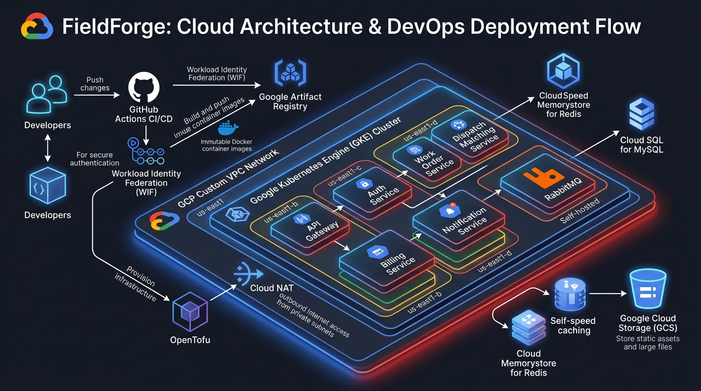
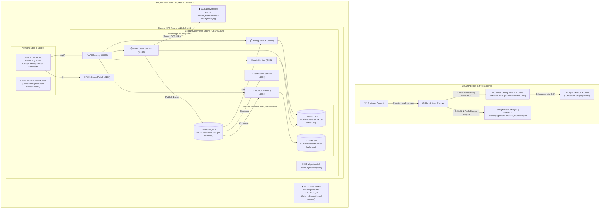

# FieldForge — GCP Production & Staging Deployment Guide

> **Enterprise Field Service Marketplace & Microservices Platform**  
> Complete step-by-step deployment guide for Google Cloud Platform (GCP) using OpenTofu / Terraform, Google Kubernetes Engine (GKE v1.36+), Google Artifact Registry, Google Cloud Storage (GCS), and GitHub Actions Workload Identity Federation (WIF).

---

## 1. Architecture Overview

FieldForge on Google Cloud Platform (GCP) deploys within a custom Virtual Private Cloud (VPC) network in the `us-east1` region. Microservices run on Google Kubernetes Engine (GKE) with private nodes, egressing through Google Cloud NAT. Container images are securely stored in Google Artifact Registry and deployed with zero long-lived service account keys via Workload Identity Federation.

### Visual Deployment & Cloud Architecture Flow





---

## 2. AWS vs. GCP Component Mapping

| Architectural Domain     | AWS Implementation         | GCP Implementation                    | Notes                                                |
| :----------------------- | :------------------------- | :------------------------------------ | :--------------------------------------------------- |
| **Container Registry**   | Amazon ECR                 | Google Artifact Registry              | `us-east1-docker.pkg.dev/${PROJECT_ID}/fieldforge/*` |
| **Kubernetes Engine**    | Amazon EKS (v1.36)         | Google Kubernetes Engine (GKE v1.36+) | Private cluster with Workload Identity               |
| **CI/CD Authentication** | AWS IAM OIDC AssumeRole    | Workload Identity Federation (WIF)    | Zero long-lived service account keys                 |
| **Object Storage**       | Amazon S3                  | Google Cloud Storage (GCS)            | Uniform Bucket-Level Access + CORS                   |
| **Persistent Storage**   | Amazon EBS (`gp3`)         | GCE Persistent Disk (`pd-balanced`)   | Managed CSI driver with dynamic expansion            |
| **Ingress & TLS**        | AWS ALB Controller + ACM   | GKE Ingress + Google-Managed SSL      | Auto-renewing TLS certificates                       |
| **Network Egress**       | AWS NAT Gateway            | Google Cloud Router + Cloud NAT       | High-availability regional gateway                   |
| **IaC State Backend**    | S3 + Native `use_lockfile` | GCS State Bucket (`backend "gcs"`)    | Native object-lock consistency                       |

---

## 3. Prerequisites & Local Tooling

Ensure the following tools are installed:

```bash
# 1. Google Cloud SDK (gcloud)
gcloud version

# 2. OpenTofu (>= 1.12.0)
tofu version

# 3. Kubernetes CLI & Kustomize
kubectl version --client
kustomize version

# 4. Helm (v3+)
helm version

# 5. Node.js & pnpm
node --version # >= v22.0.0
pnpm --version # = 11.24.0
```

Authenticate your administrative session:

```bash
gcloud auth login
gcloud auth application-default login
```

---

## 4. Step-by-Step Deployment Flow

### Step 1: Project Setup, APIs, and GCS Remote State Bootstrap

1. **Set Environment Variables**:

   ```bash
   export PROJECT_ID="fieldforge-staging-2026"
   export REGION="us-east1"
   export ZONE="us-east1-b"

   gcloud config set project ${PROJECT_ID}
   ```

2. **Enable Required Google Cloud APIs**:

   ```bash
   gcloud services enable \
     compute.googleapis.com \
     container.googleapis.com \
     artifactregistry.googleapis.com \
     iamcredentials.googleapis.com \
     cloudresourcemanager.googleapis.com \
     storage.googleapis.com \
     dns.googleapis.com
   ```

3. **Provision GCS Remote State Bucket**:
   Create a dedicated bucket for OpenTofu state storage with Object Versioning and Uniform Bucket-Level Access enabled:

   ```bash
   STATE_BUCKET="fieldforge-tfstate-${PROJECT_ID}"

   gcloud storage buckets create gs://${STATE_BUCKET} \
     --location=${REGION} \
     --uniform-bucket-level-access

   gcloud storage buckets update gs://${STATE_BUCKET} --versioning
   ```

4. **Define OpenTofu GCS Backend**:
   In your root OpenTofu configuration, configure the backend:
   ```hcl
   terraform {
     required_version = ">= 1.12.0"
     backend "gcs" {
       bucket  = "fieldforge-tfstate-<YOUR_PROJECT_ID>"
       prefix  = "fieldforge/staging"
     }
   }
   ```

---

### Step 2: Custom VPC Network & Cloud NAT Provisioning

Create a private VPC network with dedicated secondary ranges for GKE Pods and Services, and a Cloud NAT gateway for private outbound traffic:

1. **Create Custom VPC & Subnets**:

   ```bash
   # Create custom VPC network
   gcloud compute networks create fieldforge-vpc --subnet-mode=custom

   # Create primary subnet with secondary IP ranges for GKE
   gcloud compute networks subnets create gke-subnet \
     --network=fieldforge-vpc \
     --region=${REGION} \
     --range=10.0.0.0/20 \
     --secondary-range=gke-pods=10.4.0.0/14,gke-services=10.8.0.0/20 \
     --enable-private-ip-google-access
   ```

2. **Create Cloud Router & Cloud NAT**:
   ```bash
   # Create Cloud Router
   gcloud compute routers create fieldforge-router \
     --network=fieldforge-vpc \
     --region=${REGION}

   # Create Cloud NAT
   gcloud compute routers nats create fieldforge-nat \
     --router=fieldforge-router \
     --region=${REGION} \
     --auto-allocate-nat-external-ips \
     --nat-all-subnet-ip-ranges
   ```

---

### Step 3: Artifact Registry & GCS Deliverables Storage

1. **Create Artifact Registry Repository**:

   ```bash
   gcloud artifacts repositories create fieldforge \
     --repository-format=docker \
     --location=${REGION} \
     --description="FieldForge Immutable Microservice Container Images" \
     --immutable-tags
   ```

2. **Create Deliverables GCS Bucket**:
   Used for technician checklists, before/after photos, and client signatures:
   ```bash
   DELIVERABLES_BUCKET="fieldforge-deliverables-${PROJECT_ID}-staging"

   gcloud storage buckets create gs://${DELIVERABLES_BUCKET} \
     --location=${REGION} \
     --uniform-bucket-level-access

   # Configure CORS for Buyer Portal and Technician Mobile uploads
   cat <<EOF > /tmp/gcs-cors.json
   [
     {
       "origin": ["*"],
       "method": ["GET", "PUT", "POST", "HEAD"],
       "responseHeader": ["Content-Type", "x-goog-resumable"],
       "maxAgeSeconds": 3600
     }
   ]
   EOF
   gcloud storage buckets update gs://${DELIVERABLES_BUCKET} --cors-file=/tmp/gcs-cors.json
   rm /tmp/gcs-cors.json
   ```

---

### Step 4: GitHub Actions Workload Identity Federation (WIF)

Replace static service account JSON keys with secure, short-lived OIDC tokens:

1. **Create Workload Identity Pool & Provider**:

   ```bash
   # Create Pool
   gcloud iam workload-identity-pools create "github-pool" \
     --project="${PROJECT_ID}" \
     --location="global" \
     --display-name="GitHub Actions Pool"

   # Create Provider
   gcloud iam workload-identity-pools providers create-oidc "github-provider" \
     --project="${PROJECT_ID}" \
     --location="global" \
     --workload-identity-pool="github-pool" \
     --display-name="GitHub Actions Provider" \
     --issuer-uri="https://token.actions.githubusercontent.com" \
     --attribute-mapping="google.subject=assertion.sub,attribute.actor=assertion.actor,attribute.repository=assertion.repository" \
     --attribute-condition="assertion.repository == 'satya-ranjon/FieldForge'"
   ```

2. **Create Deployer Service Account**:
   ```bash
   gcloud iam service-accounts create fieldforge-deployer \
     --display-name="FieldForge CI/CD Deployer"

   # Grant Artifact Registry Writer role
   gcloud projects add-iam-policy-binding ${PROJECT_ID} \
     --member="serviceAccount:fieldforge-deployer@${PROJECT_ID}.iam.gserviceaccount.com" \
     --role="roles/artifactregistry.writer"

   # Allow GitHub Actions repository to impersonate this Service Account
   POOL_ID=$(gcloud iam workload-identity-pools describe "github-pool" --location="global" --format="value(name)")

   gcloud iam service-accounts add-iam-policy-binding \
     "fieldforge-deployer@${PROJECT_ID}.iam.gserviceaccount.com" \
     --role="roles/iam.workloadIdentityUser" \
     --member="principalSet://iam.googleapis.com/${POOL_ID}/attribute.repository/satya-ranjon/FieldForge"
   ```

---

### Step 5: Container Image Build & Publishing to Artifact Registry

Images are tagged with the immutable Git commit SHA:
`us-east1-docker.pkg.dev/${PROJECT_ID}/fieldforge/<service>:sha-<git-commit-hash>`

#### GitHub Actions Workflow Integration

In `.github/workflows/deploy-gcp.yml`:

```yaml
- name: Authenticate to Google Cloud
  uses: google-github-actions/auth@v2
  with:
    workload_identity_provider: 'projects/<PROJECT_NUMBER>/locations/global/workloadIdentityPools/github-pool/providers/github-provider'
    service_account: 'fieldforge-deployer@${{ env.PROJECT_ID }}.iam.gserviceaccount.com'

- name: Configure Docker for Artifact Registry
  run: gcloud auth configure-docker us-east1-docker.pkg.dev --quiet

- name: Build and Push Microservices
  run: |
    IMAGE_TAG="sha-${{ github.sha }}"
    REGISTRY="us-east1-docker.pkg.dev/${{ env.PROJECT_ID }}/fieldforge"

    for SVC in api-gateway auth-service billing-service dispatch-matching-service notification-service work-order-service web-buyer-portal; do
      docker build -t ${REGISTRY}/${SVC}:${IMAGE_TAG} -f apps/${SVC}/Dockerfile .
      docker push ${REGISTRY}/${SVC}:${IMAGE_TAG}
    done
```

---

### Step 6: GKE Cluster Foundation & Storage Provisioning

Create a private GKE cluster targeting Kubernetes **1.36+** with Workload Identity and GCE Persistent Disk CSI:

1. **Create GKE Cluster**:

   ```bash
   gcloud container clusters create-auto fieldforge-gke-staging \
     --region=${REGION} \
     --network=fieldforge-vpc \
     --subnetwork=gke-subnet \
     --release-channel=regular \
     --enable-private-nodes \
     --enable-master-authorized-networks \
     --master-authorized-networks=$(curl -s ifconfig.me)/32
   ```

   _(For standard GKE clusters, configure node pools with `e2-standard-4` machines in private subnets with Workload Identity enabled)._

2. **Connect to GKE Cluster**:

   ```bash
   gcloud container clusters get-credentials fieldforge-gke-staging --region=${REGION}
   kubectl get nodes
   ```

3. **Verify GCE Persistent Disk CSI Driver**:
   GKE natively provides `pd-balanced` and `pd-ssd` StorageClasses:
   ```bash
   kubectl get storageclass
   # Expected default: premium-rwo or standard-rwo / pd-balanced
   ```

---

### Step 7: Kubernetes Base Configuration, Secrets, & Workload Identity

1. **Create Target Namespace**:

   ```bash
   kubectl create namespace fieldforge-staging || true
   kubectl config set-context --current --namespace=fieldforge-staging
   ```

2. **Deploy ConfigMap**:

   ```bash
   kubectl apply -f infra/k8s/base/configmap.yaml
   ```

3. **Deploy Secrets**:

   ```bash
   kubectl create secret generic fieldforge-secrets \
     --from-literal=JWT_SECRET="<generate-256-bit-random-secret>" \
     --from-literal=INTERNAL_SERVICE_SECRET="<generate-random-internal-token>" \
     --from-literal=MYSQL_ROOT_PASSWORD="<strong-mysql-root-password>" \
     --from-literal=MYSQL_PASSWORD="<strong-mysql-app-password>" \
     --from-literal=RABBITMQ_DEFAULT_PASS="<strong-rabbitmq-password>" \
     --from-literal=DATABASE_URL="mysql://fieldforge:<PASSWORD>@mysql-service:3306/fieldforge" \
     --from-literal=REDIS_URL="redis://redis-service:6379" \
     --from-literal=RABBITMQ_URL="amqp://fieldforge:<PASSWORD>@rabbitmq-service:5672" \
     --dry-run=client -o yaml | kubectl apply -f -
   ```

4. **Bind Kubernetes Service Account (KSA) to Google Service Account (GSA)**:
   For Work Order Service deliverables uploads to GCS:
   ```bash
   gcloud iam service-accounts create fieldforge-work-order-sa \
     --display-name="Work Order GCS Storage Service Account"

   gcloud storage buckets add-iam-policy-binding gs://${DELIVERABLES_BUCKET} \
     --member="serviceAccount:fieldforge-work-order-sa@${PROJECT_ID}.iam.gserviceaccount.com" \
     --role="roles/storage.objectAdmin"

   # Annotate KSA for Workload Identity
   kubectl annotate serviceaccount work-order-service-sa \
     iam.gke.io/gcp-service-account=fieldforge-work-order-sa@${PROJECT_ID}.iam.gserviceaccount.com
   ```

---

### Step 8: Deploy Backing Services & Await Readiness

Deploy in-cluster StatefulSets for MySQL, Redis, and RabbitMQ:

```bash
# 1. Apply backing manifests
kubectl apply -f infra/k8s/backing/mysql.yaml
kubectl apply -f infra/k8s/backing/redis.yaml
kubectl apply -f infra/k8s/backing/rabbitmq.yaml

# 2. Wait for rollout readiness
kubectl rollout status statefulset/mysql --timeout=180s
kubectl rollout status statefulset/redis --timeout=180s
kubectl rollout status statefulset/rabbitmq --timeout=180s
```

---

### Step 9: Database Migration Job Execution

Run the Drizzle schema migrations to initialize tables and initial seeds before launching app pods:

1. Update `infra/k8s/migrations/db-migrate-job.yaml` with the Artifact Registry image:

   ```yaml
   image: us-east1-docker.pkg.dev/<PROJECT_ID>/fieldforge/auth-service:sha-<GIT_SHA>
   ```

2. Execute and monitor migration:
   ```bash
   kubectl delete job fieldforge-db-migrate --ignore-not-found=true
   kubectl apply -k infra/k8s/migrations/
   kubectl wait --for=condition=complete job/fieldforge-db-migrate --timeout=120s
   kubectl logs job/fieldforge-db-migrate
   ```

---

### Step 10: Microservices Deployment & Ingress

1. **Deploy Microservices using Kustomize**:
   Substitute Artifact Registry image references and apply:

   ```bash
   REGISTRY="us-east1-docker.pkg.dev/${PROJECT_ID}/fieldforge"
   IMAGE_TAG="sha-$(git rev-parse HEAD)"

   kubectl kustomize infra/k8s | \
     sed "s|fieldforge/\(.*\):latest|${REGISTRY}/\1:${IMAGE_TAG}|g" | \
     kubectl apply -f -
   ```

2. **Verify Pod Status**:
   ```bash
   kubectl get deployments
   kubectl get pods -l tier=app
   ```

---

### Step 11: Ingress, Cloud Load Balancing, Cloud DNS & Managed SSL

1. **Configure Google-Managed SSL Certificate**:

   ```yaml
   apiVersion: networking.gke.io/v1
   kind: ManagedCertificate
   metadata:
     name: fieldforge-staging-certificate
   spec:
     domains:
       - staging.fieldforge.com
   ```

2. **Deploy GKE Ingress**:

   ```yaml
   apiVersion: networking.k8s.io/v1
   kind: Ingress
   metadata:
     name: fieldforge-gke-ingress
     annotations:
       kubernetes.io/ingress.class: 'gce'
       networking.gke.io/managed-certificates: 'fieldforge-staging-certificate'
   spec:
     rules:
       - host: staging.fieldforge.com
         http:
           paths:
             - path: /api/*
               pathType: ImplementationSpecific
               backend:
                 service:
                   name: api-gateway-service
                   port:
                     number: 8000
             - path: /*
               pathType: ImplementationSpecific
               backend:
                 service:
                   name: web-buyer-portal-service
                   port:
                     number: 5173
   ```

3. **Check Ingress IP**:

   ```bash
   kubectl get ingress fieldforge-gke-ingress
   ```

4. **Configure Cloud DNS**:
   Create an `A` record mapping `staging.fieldforge.com` to the assigned external IP address.

---

### Step 12: Post-Deployment Smoke Test & Observability

```bash
# Port-forward API Gateway
kubectl port-forward svc/api-gateway-service 8000:8000 &

# Health and readiness probes
curl -f http://localhost:8000/healthz
curl -f http://localhost:8000/readyz

# Cloud Logging query
gcloud logging read "resource.type=k8s_container AND resource.labels.namespace_name=fieldforge-staging" --limit=20
```

---

## 5. Rollback & Emergency Runbook

### Reverting Application Deployment

If a defect is discovered, immediately revert to the previous known-good immutable commit SHA:

```bash
PREVIOUS_SHA="sha-<previous-commit-hash>"
REGISTRY="us-east1-docker.pkg.dev/${PROJECT_ID}/fieldforge"

for SVC in api-gateway auth-service billing-service dispatch-matching-service notification-service work-order-service web-buyer-portal; do
  kubectl set image deployment/${SVC} ${SVC}=${REGISTRY}/${SVC}:${PREVIOUS_SHA}
done
```

### Inspecting Microservice Failures

```bash
# Check crash logs
kubectl logs -l app=dispatch-matching-service --tail=50

# Trace correlation IDs across microservice network
kubectl logs -l tier=app | grep "x-correlation-id"
```
