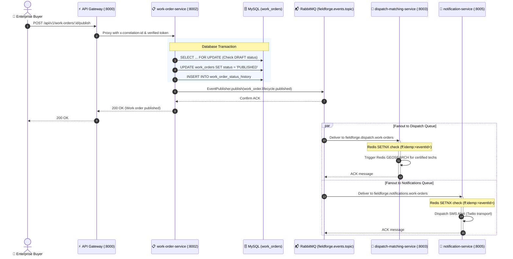
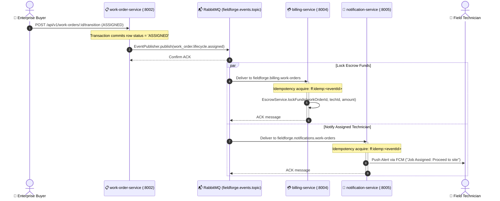
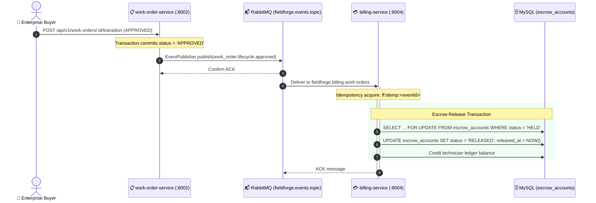
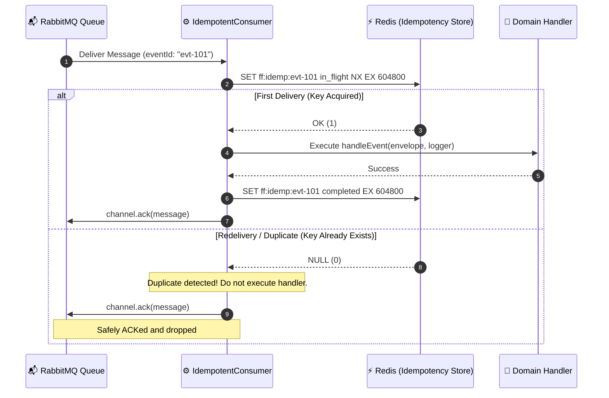
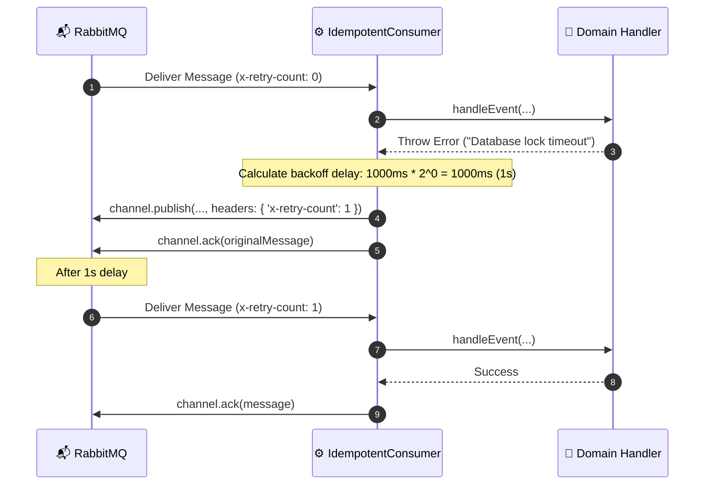
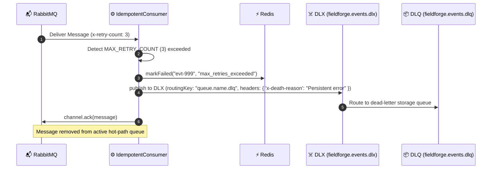

# FieldForge — Event Backbone & Message Flow Architecture

> **Comprehensive Event-Driven Architecture, AMQP Topology, and Lifecycle Message Flows**  
> Companion to [`ARCHITECTURE.md`](./ARCHITECTURE.md) and [`DEVELOPMENT_PLAN.md`](./DEVELOPMENT_PLAN.md)  
> Standard: [`RULE-EVENT-03`](file:///home/satya/development/FieldForge/.agent/rules/03_event_rules.md) · Implementation: [`@fieldforge/messaging`](file:///home/satya/development/FieldForge/packages/messaging)

---

## 1. Executive Summary

FieldForge employs an asynchronous, event-driven choreography for all cross-service state mutations and notifications. While client requests enter via the synchronous API Gateway (`:8000`), downstream microservice effects—such as dispatching matching queries, locking escrow funds, broadcasting SMS/Push notifications, and disbursing contractor payouts—are decoupled across a RabbitMQ topic exchange infrastructure backed by an atomic Redis idempotency deduplication layer.

```
                  ┌─────────────────────────────────┐
                  │      HTTP Ingress (Gateway)     │
                  └────────────────┬────────────────┘
                                   │
                                   ▼
                  ┌─────────────────────────────────┐
                  │    Producer Microservice        │
                  │ (e.g. apps/work-order-service)  │
                  └────────────────┬────────────────┘
                                   │ Confirmed Publish
                                   ▼
    ┌──────────────────────────────────────────────────────────────┐
    │          RabbitMQ Topic Exchange: fieldforge.events.topic    │
    └──────────────┬───────────────────────────────┬───────────────┘
                   │                               │
       Routing Key │                   Routing Key │
                   ▼                               ▼
    ┌──────────────────────────────┐ ┌─────────────────────────────┐
    │ fieldforge.dispatch.work-ord │ │ fieldforge.notifications... │
    └──────────────┬───────────────┘ └─────────────┬───────────────┘
                   │                               │
                   ▼                               ▼
    ┌──────────────────────────────┐ ┌─────────────────────────────┐
    │   IdempotentConsumer         │ │    IdempotentConsumer       │
    │   (Redis 7d SETNX Dedupe)    │ │    (Redis 7d SETNX Dedupe)  │
    └──────────────┬───────────────┘ └─────────────┬───────────────┘
                   │                               │
                   ▼                               ▼
    ┌──────────────────────────────┐ ┌─────────────────────────────┐
    │  apps/dispatch-matching-svc  │ │  apps/notification-service  │
    └──────────────────────────────┘ └─────────────────────────────┘
```

---

## 2. AMQP Topology & Infrastructure (`@fieldforge/messaging`)

The core messaging infrastructure is encapsulated within [`packages/messaging`](file:///home/satya/development/FieldForge/packages/messaging), providing consistent publisher-confirms, persistent delivery mode, standardized headers, and consumer wrappers across all NestJS microservices.

### Exchanges & Queues

| Component                      | Identifier                             | Type             | Durability | Purpose                                                               |
| :----------------------------- | :------------------------------------- | :--------------- | :--------- | :-------------------------------------------------------------------- |
| **Central Topic Exchange**     | `fieldforge.events.topic`              | `topic`          | Durable    | Central fanout exchange routing all domain events.                    |
| **Dead-Letter Exchange (DLX)** | `fieldforge.events.dlx`                | `direct`         | Durable    | Traps poison pills, malformed messages, and exhausted retries.        |
| **Dead-Letter Queue (DLQ)**    | `fieldforge.events.dlq`                | `direct`         | Durable    | Storage queue bound to DLX for forensic inspection and manual replay. |
| **Dispatch Queue**             | `fieldforge.dispatch.work-orders`      | `direct` / bound | Durable    | Receives publication events for geospatial matching.                  |
| **Notifications Queue**        | `fieldforge.notifications.work-orders` | `direct` / bound | Durable    | Receives lifecycle events for SMS and Push alerts.                    |
| **Billing Queue**              | `fieldforge.billing.work-orders`       | `direct` / bound | Durable    | Receives lifecycle events for escrow pre-auth, lock, and release.     |

### Routing Keys & Consumer Subscriptions

| Routing Key                      | Event Type                       | Publisher Service           | Subscribed Queue(s)                                                          | Receiving Microservice(s)                              |
| :------------------------------- | :------------------------------- | :-------------------------- | :--------------------------------------------------------------------------- | :----------------------------------------------------- |
| `work_order.lifecycle.published` | `work_order.lifecycle.published` | `work-order-service`        | `fieldforge.dispatch.work-orders`<br/>`fieldforge.notifications.work-orders` | `dispatch-matching-service`<br/>`notification-service` |
| `work_order.lifecycle.assigned`  | `work_order.lifecycle.assigned`  | `work-order-service`        | `fieldforge.notifications.work-orders`<br/>`fieldforge.billing.work-orders`  | `notification-service`<br/>`billing-service`           |
| `work_order.lifecycle.approved`  | `work_order.lifecycle.approved`  | `work-order-service`        | `fieldforge.billing.work-orders`                                             | `billing-service`                                      |
| `work_order.lifecycle.paid`      | `work_order.lifecycle.paid`      | `work-order-service`        | `fieldforge.notifications.work-orders`                                       | `notification-service`                                 |
| `tech.bidding.submitted`         | `tech.bidding.submitted`         | `dispatch-matching-service` | `fieldforge.notifications.work-orders`                                       | `notification-service`                                 |
| `billing.escrow.funded`          | `billing.escrow.funded`          | `billing-service`           | `fieldforge.work-orders.billing`                                             | `work-order-service`                                   |
| `billing.payout.disbursed`       | `billing.payout.disbursed`       | `billing-service`           | `fieldforge.work-orders.billing`                                             | `work-order-service`                                   |

---

## 3. Standard Event Envelope & AMQP Headers

Every message published to `fieldforge.events.topic` adheres to the strict contract defined in [`@fieldforge/contracts`](file:///home/satya/development/FieldForge/packages/contracts/src/events/envelope.ts).

### JSON Envelope Payload Structure

```json
{
  "eventId": "e9b271d4-839e-4c7b-9721-cb9ad0419280",
  "eventType": "work_order.lifecycle.published",
  "occurredAt": "2026-09-05T01:00:00.000Z",
  "correlationId": "corr-f81d4fae-7dec-11d0-a765-00a0c91e6bf6",
  "payload": {
    "workOrderId": "wo-12345",
    "buyerId": "buyer-987",
    "title": "Emergency POS Terminal Replacement",
    "maxBudgetMinor": 45000,
    "latitude": 37.7749,
    "longitude": -122.4194
  }
}
```

### AMQP Message Properties & Headers

| Header / Property  | Value / Format            | Purpose                                                      |
| :----------------- | :------------------------ | :----------------------------------------------------------- |
| `deliveryMode`     | `2` (Persistent)          | Writes message to disk on broker to survive broker restarts. |
| `contentType`      | `application/json`        | Guarantees UTF-8 JSON serialization.                         |
| `messageId`        | `eventId` (UUID v4)       | AMQP native identifier.                                      |
| `correlationId`    | `correlationId` (UUID v4) | AMQP native correlation ID for distributed tracing.          |
| `x-correlation-id` | `correlationId` string    | Explicit transport header matching HTTP ingress.             |
| `x-event-id`       | `eventId` string          | Key used for Redis atomic idempotency check.                 |
| `x-event-type`     | `eventType` string        | Strict event enumeration value.                              |
| `x-retry-count`    | Integer (`0` to `3`)      | Counter incremented on delayed retry redeliveries.           |
| `x-death-reason`   | Error string              | Injected only when routing to DLX/DLQ.                       |

---

## 4. End-to-End Domain Message Flows

### Flow 1: Work Order Publication & Dispatch Fanout

Triggered when a buyer transitions a work order from `DRAFT` to `PUBLISHED` via `POST /api/v1/work-orders/:id/publish`.



---

### Flow 2: Bid Acceptance & Work Order Assignment

Triggered when a contractor's bid is accepted, assigning the technician and triggering fund lock and push alerts.



---

### Flow 3: Buyer Sign-Off, Approval & Escrow Release

Triggered when a buyer reviews deliverables and approves the work order (`COMPLETED` → `APPROVED`).



---

## 5. Resiliency & Failure Topologies

### A. Idempotency & Duplicate Delivery Suppression

Network blips, broker failovers, or unacknowledged socket disconnects can cause AMQP brokers to redeliver messages (`redelivered: true`). `IdempotentConsumer` ensures domain logic is executed **exactly once**.



---

### B. Bounded Retries with Exponential Backoff

When transient network or database errors occur in consumer handlers, the consumer captures the failure, applies an exponential delay, and re-queues the message with an incremented `x-retry-count`.



---

### C. Poison Pill & Retry Exhaustion → Dead-Letter Exchange (DLX)

If an unparseable JSON payload arrives, or if a message fails consistently through all 3 retries, `IdempotentConsumer` permanently marks the event as failed in Redis and routes the raw message directly to `fieldforge.events.dlx`.



---

## 6. Distributed Tracing & Correlation ID Propagation

In accordance with [`RULE-OBS`](file:///home/satya/development/FieldForge/.agent/rules/01_architecture_rules.md), request context is preserved across HTTP and AMQP boundaries:

1. **HTTP Ingress**: The API Gateway (`apps/api-gateway`) reads or generates `x-correlation-id` and passes it downstream.
2. **Event Publishing**: `EventPublisher` copies `correlationId` into the JSON envelope and into the AMQP transport header `x-correlation-id`.
3. **Event Consumption**: `IdempotentConsumer` extracts `correlationId` from the headers/envelope and initializes a scoped child logger:
   ```typescript
   const childLogger = this.logger.child({
     correlationId,
     eventId: envelope.eventId,
     eventType: envelope.eventType,
     queue
   });
   ```
4. **Log Continuity**: All log lines produced inside the domain handler include the same `correlationId`, allowing Jaeger and Loki to trace the entire transaction from the initial user click in the Buyer Portal to the final SMS alert sent to the contractor.
