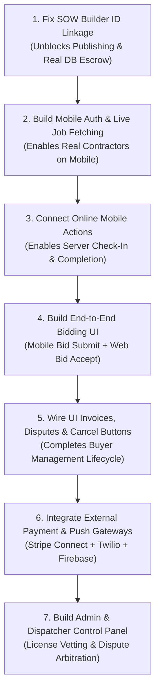

# Project Progress Audit: FieldForge

> **Document Type:** Independent System Progress & Functional Audit  
> **Repository:** FieldForge (`satya-ranjon/FieldForge`)  
> **Evaluation Target:** End-to-End Functional Completeness & User Flow Connectivity  
> **Evaluation Date:** September 2026

---

## 1. Project Overview

**FieldForge** is an enterprise-grade, multi-tenant SaaS field service marketplace and workforce management platform. Its core objective is to connect enterprise service buyers (e.g., nationwide retail brands, telecom operators, data centers, and IT facilities) with certified, vetted freelance field service technicians for on-site hardware, networking, telecommunications, and equipment maintenance.

The repository is structured as a TypeScript monorepo orchestrated with Turborepo and pnpm:

- **Web Buyer Portal (`apps/web-buyer-portal`):** A Next.js (App Router) enterprise web application (served on port 5173 via reverse proxy to port 8000) using React and Redux Toolkit. It provides interfaces for work order authoring (SOW Builder), live dispatch tracking, geospatial technician discovery, bid review, deliverable sign-off, and escrow billing.
- **Mobile Technician App (`apps/mobile-tech-app`):** An Expo / React Native mobile application for field engineers. It provides interfaces for discovering nearby work, navigation, GPS-enforced geofenced check-in, deliverables and photo capture, on-screen client signature collection, and offline mutation synchronization.
- **API Gateway (`apps/api-gateway`):** A reverse-proxy edge gateway operating on container port 8000. It enforces JWT bearer token signature verification, RBAC role claims, CORS allowlists, request throttling, structured Pino request logging with correlation ID propagation, and downstream header injection (`x-ff-user-id`, `x-ff-user-role`, `x-ff-profile-id`).
- **Domain Microservices (NestJS REST backends):**
  - `apps/auth-service` (Port 8001): IAM credentials, password hashing, JWT generation and rotation, Redis-backed sliding-window phone OTP verification, domain profiles (`buyer_profiles`, `technician_profiles`), and contractor certification tracking.
  - `apps/work-order-service` (Port 8002): Work order aggregate root, strict finite state machine (FSM) transitions, transactional commercial bidding, deliverable uploads with Amazon S3 pre-signed URLs, and SLA review sweeps.
  - `apps/dispatch-matching-service` (Port 8003): Real-time Redis geospatial index (`tech:locations`), Haversine distance filtering, candidate ranking, and directory profile batch hydration.
  - `apps/billing-service` (Port 8004): Escrow vault accounts, transactional payout releases, double-entry payout ledgers, remainder refunds upon bid settlement, cancellation refunds, and PDF invoice generation via PDFKit.
- **Headless Worker (`apps/notification-service`):** An autonomous background consumer daemon operating on port 8005 (for internal health/metrics only, decoupled from edge proxying). It listens to RabbitMQ topic queues for published, assigned, and paid job events.
- **Shared Packages & Infrastructure:**
  - `@fieldforge/contracts`: Canonical DTOs, Zod request validators, event envelopes, and monetary conversion utilities.
  - `@fieldforge/database`: Drizzle ORM schemas, database migrations, and development seed fixtures.
  - `@fieldforge/common`: Shared NestJS modules (Drizzle database pool, JWT guard, validation pipe, exception filter, outbox relay, metrics registry).
  - `@fieldforge/messaging`: AMQP topic exchange topology, publisher confirms, broker-native dead-letter retry queues, and 7-day Redis idempotency deduplication.
  - `@fieldforge/ui`: Reusable design system components conforming to `DESIGN.md`.
  - Infrastructure: Docker Compose definitions for MySQL 8.4 LTS, Redis 8.0, RabbitMQ 4.1, Prometheus, and Grafana.

---

## 2. Overall Progress

The FieldForge codebase demonstrates an **advanced, high-quality backend architectural foundation**, but the **user-facing product experience remains in an early, largely disconnected development stage**:

1. **Backend Microservices (High Maturity):** The core backend services feature strict transactional integrity, pessimistic database row locking (`SELECT ... FOR UPDATE`), a transactional outbox pattern to prevent lost events, multi-tier distributed caching, zero cross-service database coupling, and more than 870 automated unit and integration tests.
2. **Web Buyer Portal (Partially Real, Heavily Mock-Dependent):** The portal possesses an attractive, responsive interface, but critical user flows are disconnected from the backend. When creating a work order, the interface fails to use the server-generated identifier, causing subsequent publish and escrow operations to fail silently while falling back to browser-only memory. Bids, audit logs, and invoice exports rely heavily on hardcoded static fixture data.
3. **Mobile Technician App (Prototype / Shell State):** The mobile application is not yet functional for real field technicians. Authentication is hardcoded to a mock user profile, the job list displays static sample jobs rather than fetching from the API, there is no bidding interface, and when online, tapping status progression buttons ("Start Travel", "Check In", "Complete Job") only updates local device memory without calling the server.
4. **Third-Party Integrations (Simulated / Stubs):** Real payments (Stripe/banking) and real notifications (Twilio SMS/Firebase Push) do not exist; they are simulated with local double-entry ledger records and console log printouts. Amazon S3 deliverable storage is the only fully implemented external cloud provider integration.
5. **Admin / Dispatcher Panel (Missing):** There is no administrative panel or dashboard for platform operators to manage disputes, review error budgets, or audit contractor accreditations.

---

## 3. Feature Progress

### Feature 1: User Registration & Account Creation

- **Status:** 🟡 PARTIALLY COMPLETE
- **What this feature is for:** Allows enterprise service buyers and field contractors to sign up, provide contact and company details, select their account type, and receive secure access credentials.
- **What is already done:** The backend can receive registration requests, validate input rules (email formats, password strength, required company or legal names), hash passwords securely using bcrypt, save the user and their associated profile (buyer or technician) into the database, and issue secure login tokens. The web portal provides a registration modal allowing users to sign up as a buyer or technician.
- **How it currently works:** On the web portal, a visitor clicks "Sign In / Register", selects the "Register" tab, chooses their role, enters their details, and submits. The portal communicates with the authentication server, creates the account, saves the returned tokens in the browser, and logs the user in.
- **Why this status was assigned:** The web portal registration flow works against the real database. However, the mobile app has no registration screen whatsoever, phone numbers are not verified during signup, and neither buyers nor technicians have any profile settings screen to update their account information after creation.
- **What is still missing:** A mobile registration screen for technicians, mandatory phone verification during onboarding, and self-service account profile editing (updating company address, phone, or hourly rates).
- **What happens if we release now:** Enterprise buyers can sign up via the web portal, but field technicians cannot create accounts on their mobile devices. Furthermore, unverified phone numbers are accepted without confirmation.
- **Repository evidence:**
  - `apps/auth-service/src/modules/iam/auth.service.ts`
  - `apps/auth-service/src/modules/iam/auth.controller.ts`
  - `apps/web-buyer-portal/src/components/auth/AuthModal.tsx`
  - `packages/database/src/schemas/users.schema.ts`

---

### Feature 2: User Authentication, Login & Session Refresh (RBAC)

- **Status:** 🟡 PARTIALLY COMPLETE
- **What this feature is for:** Authenticates returning users with their email and password, secures communication using role-based security tokens, and automatically refreshes expired sessions without logging users out.
- **What is already done:** The backend verifies credentials against encrypted database records, blocks inactive or suspended accounts, generates signed access tokens, and manages rotating refresh tokens stored in the database. The API Gateway inspects every request to prevent identity spoofing. The web portal features a login dialog and automatic background token renewal using a mutual exclusion lock when sessions expire.
- **How it currently works:** A user enters their email and password on the web portal. The system validates the credentials against the database, receives an access and refresh token, and loads their organization profile. If an access token expires during use, the web application requests a new one behind the scenes without interrupting the user.
- **Why this status was assigned:** The web portal and backend authentication are fully connected and tested. However, the mobile application completely lacks a login interface; it boots up permanently logged into a hardcoded sample technician profile ("Sarah Jenkins") using a fake token.
- **What is still missing:** Mobile login and logout screens, mobile token refresh logic, and standard account recovery ("Forgot Password" / reset link) workflows.
- **What happens if we release now:** Web buyers can log in securely, but any technician opening the mobile app is locked into a single hardcoded test persona and cannot log into their own account.
- **Repository evidence:**
  - `apps/auth-service/src/modules/iam/auth.service.ts`
  - `apps/api-gateway/src/guards/jwt-auth.guard.ts`
  - `apps/web-buyer-portal/src/store/services/api.ts`
  - `apps/mobile-tech-app/src/store/slices/authSlice.ts`

---

### Feature 3: Phone Number Verification (SMS OTP)

- **Status:** 🔴 NOT COMPLETE
- **What this feature is for:** Validates that a user physically owns their registered mobile number by sending a 6-digit text message code that must be entered within 5 minutes.
- **What is already done:** The backend includes a dedicated service with distributed rate limiting (maximum 3 attempts per 10 minutes) and single-use code verification stored in temporary high-speed memory (Redis) via atomic Lua scripts.
- **How it currently works:** If an API client makes a direct request to the phone verification endpoint, the server generates a random 6-digit number, stores it in memory, and prints it to the internal server console. Submitting the correct code marks the number verified.
- **Why this status was assigned:** The backend functionality is isolated and incomplete. The generated code is only printed to a log file because no real SMS text messaging provider (such as Twilio) is connected. More importantly, neither the web portal nor the mobile application ever calls these endpoints during onboarding.
- **What is still missing:** A real SMS carrier integration, and user interface screens in both the web registration modal and the mobile app to input and confirm the 6-digit code.
- **What happens if we release now:** Users cannot receive text messages, and phone numbers stored in the system remain completely unverified.
- **Repository evidence:**
  - `apps/auth-service/src/modules/iam/phone-otp.service.ts`
  - `apps/auth-service/src/modules/iam/auth.controller.ts`
  - `apps/web-buyer-portal/src/components/auth/AuthModal.tsx`

---

### Feature 4: Contractor Accreditations & Verified Compliance Badges

- **Status:** 🟡 PARTIALLY COMPLETE
- **What this feature is for:** Tracks verified industry certifications (such as Cisco CCNA, OSHA 10, CompTIA A+, and Background Checks) to ensure only qualified contractors are assigned to specialized technical jobs.
- **What is already done:** The database stores contractor certifications with verification flags and expiration dates. The backend provides endpoints to fetch badges, submit new accreditations, and approve or reject them. The web buyer portal displays verified shield icons on contractor profile cards.
- **How it currently works:** When buyers view technicians on the radar map, the system fetches their verified accreditations from the server and displays green checkmark badges.
- **Why this status was assigned:** While the display of existing verified badges works on the buyer portal, there is no interface for technicians to upload certification documents on mobile, and no administrative interface for staff to review pending certifications.
- **What is still missing:** Mobile screens for technicians to add credentials, document upload for certification proofs, and an administrative review panel for staff to inspect and approve pending badges.
- **What happens if we release now:** Buyers can see seeded certifications for existing technicians, but new technicians cannot submit their licenses, and administrators cannot verify them.
- **Repository evidence:**
  - `apps/auth-service/src/modules/vetting/certifications.service.ts`
  - `apps/auth-service/src/modules/vetting/certifications.controller.ts`
  - `apps/web-buyer-portal/src/components/dispatch/TechnicianMatchingRadar.tsx`
  - `packages/database/src/schemas/users.schema.ts`

---

### Feature 5: Statement of Work (SOW) Builder & Work Order Drafting

- **Status:** 🔴 NOT COMPLETE
- **What this feature is for:** Enables enterprise buyers to draft and configure work orders, including job scope, site location coordinates, required technician certifications, schedule windows, and budget amounts.
- **What is already done:** The backend possesses a validated API endpoint that saves new work orders in `DRAFT` status within the database, enforces schedule logic (end time must be after start time), and logs status history. The web portal features a multi-step "SOW Builder" with pre-configured industry blueprints (e.g., POS terminal swaps, fiber optic splicing).
- **How it currently works:** A buyer fills out the form or selects a template preset on the web portal and clicks "Publish Work Order". The portal sends the order data to the server, which successfully creates a draft order in the database with a system-generated ID. However, the web page ignores the server's returned ID, invents its own local temporary ID (`wo-xxxx`), and tries to publish that nonexistent ID. When that fails, the web page silently catches the error and saves the job only into browser temporary memory.
- **Why this status was assigned:** The feature looks visually complete, but a critical integration bug prevents it from working. The user believes their order was published and funded, but in reality, an orphaned, unpublished draft sits abandoned in the database, and the order exists only in the buyer's local browser tab.
- **What is still missing:** Connecting the creation response directly to the publishing flow, displaying validation errors to the user instead of swallowing them, and providing a drafts management page where buyers can view, edit, or delete saved drafts.
- **What happens if we release now:** Buyers filling out the work order form will think their order was posted, but contractors will never see it, escrow funds will not be locked, and refreshing the browser will erase the order from the screen.
- **Repository evidence:**
  - `apps/web-buyer-portal/src/components/work-orders/SowBuilder.tsx` (Lines 224–284)
  - `apps/work-order-service/src/modules/work-orders/work-orders.service.ts`
  - `apps/work-order-service/src/modules/work-orders/work-orders.controller.ts`

---

### Feature 6: Work Order Publishing & Escrow Pre-Authorization

- **Status:** 🟡 PARTIALLY COMPLETE
- **What this feature is for:** Moves a draft work order into the active marketplace (`PUBLISHED`) while simultaneously locking the buyer's budget in a secure escrow account so funds are guaranteed before work starts.
- **What is already done:** The backend provides transactional endpoints: `/publish` updates the job status to `PUBLISHED` and broadcasts a message across the system, while `/billing/escrow/preauth` locks the money in the escrow database table with duplicate-payment protections.
- **How it currently works:** When triggered with a valid existing job ID, the backend successfully transitions the work order, records an immutable status log, and locks the escrow deposit.
- **Why this status was assigned:** The backend mechanism is fully functional and safe against double-charging. However, because of the ID mismatch bug in the web interface described in Feature 5, regular buyers cannot successfully trigger this flow from the user interface.
- **What is still missing:** Resolving the frontend form integration so that the real job ID is submitted for publishing and escrow pre-authorization.
- **What happens if we release now:** The publishing and funding flow works when called directly via developer tools, but completely fails when attempted by a standard user on the website.
- **Repository evidence:**
  - `apps/work-order-service/src/modules/work-orders/work-orders.service.ts`
  - `apps/billing-service/src/modules/escrow/escrow.service.ts`
  - `apps/web-buyer-portal/src/components/work-orders/SowBuilder.tsx`

---

### Feature 7: Work Order State Machine & Lifecycle FSM

- **Status:** 🟡 PARTIALLY COMPLETE
- **What this feature is for:** Enforces the strict chronological business progression of every job: `DRAFT → PUBLISHED → ASSIGNED → EN_ROUTE → ON_SITE → COMPLETED → APPROVED → PAID`, while handling cancellations or disputes.
- **What is already done:** The backend includes a rock-solid, database-locked state machine. It prevents skipping steps (e.g., a technician cannot jump from assigned straight to completed), records who changed the status and why, and strictly forbids manually setting an order to `PAID` via API (payment can only be triggered by the financial system). The web portal features interactive buttons to Approve deliverables or Raise a Dispute.
- **How it currently works:** On the backend, status changes are validated against strict business rules and saved inside database transactions. On the web portal, clicking "Approve" transitions completed orders to `APPROVED`, which triggers automatic payout processing.
- **Why this status was assigned:** The backend state engine is production-ready. However, on the mobile app, when online, tapping status progression buttons ("Start Travel", "Check In", "Complete Job") does not call the server API—it only changes the local screen state. Furthermore, raising a dispute on the web portal only changes local browser state without updating the server.
- **What is still missing:** Connecting the mobile app's lifecycle buttons to the server API during normal online operation, and wiring the web dispute modal to the backend status transition endpoint.
- **What happens if we release now:** Buyers can approve jobs on the web, but field technicians cannot report their transit, arrival, or job completion to the server unless they switch their phone to airplane mode and trigger a manual queue flush.
- **Repository evidence:**
  - `apps/work-order-service/src/modules/fsm/work-order-fsm.service.ts`
  - `apps/work-order-service/src/modules/work-orders/work-order-transition.ts`
  - `apps/web-buyer-portal/src/components/dispatch/LiveDispatchBoard.tsx`
  - `apps/mobile-tech-app/src/screens/ActiveJobScreen.tsx`

---

### Feature 8: Geospatial Discovery & Nearby Technician Radar

- **Status:** ✅ COMPLETE
- **What this feature is for:** Allows buyers and dispatchers to locate qualified, active field technicians within a selected distance (5 to 50 miles) of a job site using live GPS positioning.
- **What is already done:** The dispatch service uses high-speed spatial indexing (Redis `GEOSEARCH`) to calculate physical distances and ranks candidates using a multi-factor formula (40% distance, 30% customer rating, 15% job history, 15% verified licenses). The web portal features an interactive radar interface with distance filters.
- **How it currently works:** A buyer opens the "Technicians" tab on the web portal and chooses a search radius (e.g., 10 miles). The portal queries the dispatch service, which searches active coordinates, enriches the list with technician profile details from the auth service, and displays available technicians with their ratings, distances, and badges.
- **Why this status was assigned:** The complete flow from the web interface through the gateway, spatial search engine, user directory, and back to the screen is fully connected and operates with live data.
- **What is still missing:** Nothing critical found for the core discovery flow. (Technicians updating their live location from mobile in the background is a future enhancement).
- **What happens if we release now:** Buyers can successfully search, filter, and view nearby available technicians based on real geographic coordinates.
- **Repository evidence:**
  - `apps/dispatch-matching-service/src/modules/geo-search/geo-search.service.ts`
  - `apps/dispatch-matching-service/src/modules/dispatch/dispatch.controller.ts`
  - `apps/web-buyer-portal/src/components/dispatch/TechnicianMatchingRadar.tsx`

---

### Feature 9: Commercial Bidding & Rate Negotiation

- **Status:** 🔴 NOT COMPLETE
- **What this feature is for:** Enables technicians to submit price bids and availability notes on published work orders, and allows enterprise buyers to review competing bids and award the job.
- **What is already done:** The backend possesses complete, transactional bidding logic: submitting a bid, viewing bids for a job, and accepting a bid. Accepting a winning bid automatically rejects all competing bids, assigns the winning contractor, sets the agreed price, locks the work order, and emits a system notification event.
- **How it currently works:** On the server, all bidding operations work inside ACID database transactions. However, neither the mobile app nor the web portal connects to these endpoints.
- **Why this status was assigned:** The business logic is implemented on the backend, but both user interfaces are completely disconnected:
  - The mobile technician app has **no bidding screen or functionality**. Technicians cannot discover published jobs or enter bid amounts.
  - The web buyer portal **does not fetch real bids from the server**. The radar screen displays a hardcoded static list of sample bids (`mockBids`).
  - Clicking "Accept Bid" in the web portal sends a request with fake IDs that fails silently, updating only the browser's local memory.
- **What is still missing:** Building a job marketplace and bidding screen in the mobile app, adding an API hook in the web portal to fetch real bids (`GET /work-orders/:id/bids`), and connecting the accept bid action to the real server data.
- **What happens if we release now:** Real contractors cannot bid on jobs, and buyers cannot view or accept real bids from actual technicians.
- **Repository evidence:**
  - `apps/work-order-service/src/modules/bids/bids.service.ts`
  - `apps/work-order-service/src/modules/bids/bids.controller.ts`
  - `apps/web-buyer-portal/src/components/dispatch/TechnicianMatchingRadar.tsx` (Lines 46–88)
  - `apps/web-buyer-portal/src/mocks/fixtures/bids.fixture.ts`

---

### Feature 10: Automated Dispatch & Auto-Routing

- **Status:** 🔴 NOT COMPLETE
- **What this feature is for:** Allows dispatchers to automatically assign high-priority emergency tickets to the closest, highest-rated available technician within a 5-mile perimeter.
- **What is already done:** The dispatch service has an endpoint (`POST /dispatch/auto-route`) that identifies the top candidate within 5 miles based on rating and distance.
- **How it currently works:** If called by an external script, the endpoint returns a recommendation message identifying the best contractor. In the web portal, clicking "Direct Dispatch" simply updates the local browser screen to show the technician assigned, without sending any command to the server.
- **Why this status was assigned:** The backend endpoint only produces an informational suggestion; it does not actually assign the job or transition the work order. In the user interface, the button action is purely cosmetic and does not call any API.
- **What is still missing:** Upgrading the backend endpoint to atomically assign the recommended technician and pre-authorize escrow, and connecting the buyer portal's "Direct Dispatch" button to this server operation.
- **What happens if we release now:** Clicking "Direct Dispatch" will appear to assign a technician on the buyer's screen, but no assignment is saved on the server, and the technician will receive no notification.
- **Repository evidence:**
  - `apps/dispatch-matching-service/src/modules/dispatch/dispatch.controller.ts`
  - `apps/web-buyer-portal/src/components/dispatch/TechnicianMatchingRadar.tsx` (Lines 96–114)

---

### Feature 11: Mobile Geofenced Check-In & On-Site Verification

- **Status:** 🟡 PARTIALLY COMPLETE
- **What this feature is for:** Ensures that field technicians are physically present at the customer's facility (within 200 metres) before they can begin work and bill hours.
- **What is already done:** The mathematical calculation (Haversine formula) and the 200-metre boundary check are strictly enforced both on the server and on the mobile app. The mobile app reads device GPS coordinates, calculates distance to the target site, and displays a red warning banner preventing check-in if the technician is outside the 200m zone.
- **How it currently works:** A technician approaches the work site. The mobile app verifies their GPS location against the job's address coordinates. Once within 200 metres, the "Check In" button becomes active. When tapped, the app displays a confirmation alert.
- **Why this status was assigned:** The mathematical verification and user interface controls work accurately. However, during normal online operation, tapping "Check In" only updates the local mobile screen—it does not send the check-in request to the backend server.
- **What is still missing:** Connecting the mobile check-in action to the backend `/transition` endpoint when the device has an active internet connection.
- **What happens if we release now:** Technicians will see their distance calculated accurately, but checking in on-site will not notify the buyer or update the job's status on the central dashboard.
- **Repository evidence:**
  - `packages/common/src/geo/haversine.ts`
  - `apps/mobile-tech-app/src/services/geofencing.service.ts`
  - `apps/mobile-tech-app/src/screens/ActiveJobScreen.tsx` (Lines 116–144)
  - `apps/work-order-service/src/modules/work-orders/work-order-transition.ts`

---

### Feature 12: Deliverables, Checklists & S3 Photo Capture

- **Status:** 🟡 PARTIALLY COMPLETE
- **What this feature is for:** Collects verified proof-of-work on-site, including before-and-after photos, step-by-step task checklists, and replacement hardware serial numbers.
- **What is already done:** The backend provides a secure two-phase upload system: it generates short-lived upload URLs for Amazon S3 and verifies that the file exists and is valid before creating a database record. The mobile app connects to device cameras, validates image sizes (max 15MB), uploads directly to Amazon S3, and confirms the upload with the backend.
- **How it currently works:** A technician taps "Capture Photo" for Before or After work. The camera opens, captures the photo, uploads the raw image directly to Amazon S3, and confirms the upload with the server.
- **Why this status was assigned:** The photo capture and Amazon S3 cloud upload flow is completely built, secure, and working. However, checklist checkboxes and hardware serial numbers are only saved in temporary mobile phone memory; there is no backend database table or API to persist checklist progress. Furthermore, the web portal does not display uploaded photos.
- **What is still missing:** Backend database storage and APIs for job checklists and serial numbers, and displaying uploaded S3 photo deliverables on the buyer's operations dashboard.
- **What happens if we release now:** Photo proof uploads successfully to Amazon S3, but completed checklist steps and entered serial numbers are lost whenever the technician closes the app, and buyers cannot view submitted photos.
- **Repository evidence:**
  - `apps/work-order-service/src/modules/deliverables/deliverables.service.ts`
  - `apps/work-order-service/src/modules/deliverables/s3-media-storage.adapter.ts`
  - `apps/mobile-tech-app/src/services/deliverableUpload.service.ts`
  - `apps/mobile-tech-app/src/screens/ActiveJobScreen.tsx` (Lines 157–270)

---

### Feature 13: Digital Signatures & Client Sign-Off

- **Status:** 🟡 PARTIALLY COMPLETE
- **What this feature is for:** Captures an on-screen customer or store manager signature upon job completion and generates a tamper-evident digital cryptographic fingerprint (SHA-256).
- **What is already done:** The backend includes a dedicated endpoint (`POST .../deliverables/signature`) that verifies and stores client signatures and their cryptographic hashes in the database.
- **How it currently works:** On the mobile app, a technician enters the client's name and triggers sign-off. The app generates a simulated signature image and hash, displays a confirmation, and stores it in device memory.
- **Why this status was assigned:** The backend database storage is ready, but the mobile app uses a simulated graphic rather than a real finger-drawing touch canvas, and in online mode, it does not send the signature to the server.
- **What is still missing:** A real finger-drawing signature pad component on mobile, and sending the captured signature data to the server during online operation.
- **What happens if we release now:** Technicians cannot capture real customer signatures, and proof of sign-off is not delivered to the buyer.
- **Repository evidence:**
  - `apps/work-order-service/src/modules/deliverables/deliverables.service.ts`
  - `apps/mobile-tech-app/src/screens/ActiveJobScreen.tsx` (Lines 347–375)
  - `packages/database/src/schemas/deliverables.schema.ts`

---

### Feature 14: Mobile Offline Synchronization & Queue Management

- **Status:** ✅ COMPLETE
- **What this feature is for:** Allows technicians working in signal dead zones (such as basements, warehouses, or rural facilities) to complete check-ins, take photos, and record signatures offline, automatically uploading them once connectivity returns.
- **What is already done:** The mobile app features an autonomous offline sync engine backed by persistent device storage. Mutations are stored in strict chronological order with unique deduplication keys. When network connectivity is restored, items are replayed one by one with automatic retries and exponential delay backoffs. Offline photos are copied to permanent app folders so they are never purged before syncing.
- **How it currently works:** If a technician toggles "Airplane Mode" or loses cellular service, all actions are saved to an internal persistent queue. Once back online, the technician or background service flushes the queue, uploading every pending action and image cleanly to the server.
- **Why this status was assigned:** The offline engine, storage persistence, retry logic, and deduplication handling are fully implemented and verified by automated test suites.
- **What is still missing:** Nothing critical for the offline synchronization mechanism itself.
- **What happens if we release now:** The offline queue operates reliably and preserves data safely across app reboots.
- **Repository evidence:**
  - `apps/mobile-tech-app/src/services/offlineSync.service.ts`
  - `apps/mobile-tech-app/src/services/syncManager.ts`
  - `apps/mobile-tech-app/src/services/storage/storage.adapter.ts`

---

### Feature 15: Financial Escrow Vault & Fund Protection

- **Status:** ✅ COMPLETE
- **What this feature is for:** Holds buyer funds in a protected escrow vault when a job is created or assigned, preventing unauthorized withdrawals, accidental double-releases, or customer chargebacks while the contractor is working.
- **What is already done:** The database enforces a strict rule: exactly one escrow account per work order. All money operations use row-level database locks (`SELECT ... FOR UPDATE`), ensuring that concurrent requests cannot double-spend or double-release funds. Request fingerprints prevent duplicate submissions.
- **How it currently works:** When funds are pre-authorized, an escrow record is created in `HELD` status. The system prevents any release until the work order reaches an approved state, and enforces strict ownership authorization.
- **Why this status was assigned:** The backend escrow architecture is fully completed, concurrency-safe, and thoroughly verified by automated tests.
- **What is still missing:** Nothing critical on the backend. (The web portal currently uses sample fixture transactions when its local state is uninitialized).
- **What happens if we release now:** Held funds are completely protected against race conditions, duplicate releases, and database crashes.
- **Repository evidence:**
  - `apps/billing-service/src/modules/escrow/escrow.service.ts`
  - `apps/billing-service/src/modules/escrow/idempotency-fingerprint.ts`
  - `packages/database/src/schemas/billing.schema.ts`

---

### Feature 16: Escrow Settlement, Remainder Refunds & Technician Payouts

- **Status:** 🟡 PARTIALLY COMPLETE
- **What this feature is for:** Releases held escrow funds to the contractor once the buyer approves the job (or after a 72-hour review window expires), automatically refunds any unused budget remainder to the buyer, records double-entry ledger credits, and marks the job as `PAID`.
- **What is already done:** The backend executes the entire payout workflow inside a locked database transaction: it pays the technician their agreed bid rate, automatically refunds the difference to the buyer, records an immutable payout ledger entry, generates an invoice, and notifies the work order system to transition to `PAID`. A background scheduler sweeps completed jobs older than 72 hours and auto-approves them.
- **How it currently works:** When an order is approved on the web portal, the billing service consumes the approval event, calculates the payout, logs the financial entries, and updates the job to `PAID`.
- **Why this status was assigned:** The transactional accounting logic, event choreography, remainder calculation, and 72-hour auto-approval scheduler are completely implemented and tested. However, the external payment provider is simulated locally with console logs (no real bank or Stripe transfers occur), and the web billing table displays static mock data.
- **What is still missing:** Connecting a real payment processor (e.g., Stripe Connect or banking ACH API), and connecting the web portal billing table to the real ledger API.
- **What happens if we release now:** The platform's internal accounting, ledgers, and job status updates function seamlessly, but real money will not actually move to the technician's bank account.
- **Repository evidence:**
  - `apps/billing-service/src/modules/escrow/escrow.service.ts`
  - `apps/billing-service/src/modules/payments/ledger-payment.provider.ts`
  - `apps/work-order-service/src/modules/sla/sla-auto-approval.service.ts`

---

### Feature 17: Work Order Cancellation & Escrow Refund Path

- **Status:** 🟡 PARTIALLY COMPLETE
- **What this feature is for:** Allows buyers to cancel an unfulfilled work order and immediately receive a 100% refund of their pre-authorized escrow deposit.
- **What is already done:** The backend lifecycle permits transitions to `CANCELLED` from `DRAFT`, `PUBLISHED`, or `ASSIGNED`. When cancelled, the system broadcasts a cancellation event, causing the billing service to lock the escrow account, issue a full refund, transition the escrow to `REFUNDED`, and log the action.
- **How it currently works:** On the server, cancelling a job automatically triggers an idempotent refund pipeline that releases the locked funds safely.
- **Why this status was assigned:** The backend refund engine is completely implemented and tested against edge cases. However, there is no "Cancel Work Order" button anywhere in the buyer portal user interface.
- **What is still missing:** Adding a "Cancel Work Order" action button and confirmation modal to the buyer operations dashboard.
- **What happens if we release now:** The backend is fully capable of issuing refunds upon cancellation, but regular buyers have no button in the interface to cancel their orders.
- **Repository evidence:**
  - `apps/work-order-service/src/modules/work-orders/work-order-transition.ts`
  - `apps/billing-service/src/modules/escrow/escrow.service.ts`
  - `apps/billing-service/src/consumers/billing.consumer.ts`

---

### Feature 18: Invoicing & PDF Document Generation

- **Status:** 🟡 PARTIALLY COMPLETE
- **What this feature is for:** Creates official, immutable PDF invoice documents with unique invoice numbers, line-item breakdowns, and cryptographic verification hashes for corporate accounting.
- **What is already done:** The database enforces unique invoice numbers per job. The backend features a PDF rendering service that compiles corporate headers, billed addresses, line-item totals, and SHA-256 digital verification hashes into streamed PDF documents via `GET /billing/invoices/:id/pdf`.
- **How it currently works:** When escrow is released, the backend automatically generates an invoice record. Requesting the PDF endpoint streams a rendered PDF document.
- **Why this status was assigned:** The backend PDF generation is complete, beautiful, and verified. However, in the web buyer portal, clicking "Export Ledger" does not download a PDF or call the API; it simply opens a popup displaying hardcoded sample text.
- **What is still missing:** Connecting the web portal's "Export Ledger" button and invoice links directly to the backend PDF download stream.
- **What happens if we release now:** High-quality PDF invoices are generated on the server, but buyers cannot download them through the web application.
- **Repository evidence:**
  - `apps/billing-service/src/modules/invoices/invoices.service.ts`
  - `apps/billing-service/src/modules/invoices/pdfkit-invoice-pdf.renderer.ts`
  - `apps/web-buyer-portal/src/components/billing/EscrowManager.tsx` (Lines 448–550)

---

### Feature 19: Push & SMS Notifications Backbone

- **Status:** 🔴 NOT COMPLETE
- **What this feature is for:** Sends immediate mobile push notifications and SMS text receipts to technicians when jobs are published nearby, when bids are accepted, and when payouts are disbursed.
- **What is already done:** A dedicated background worker (`notification-service`) listens to RabbitMQ events (`WORK_ORDER_PUBLISHED`, `WORK_ORDER_ASSIGNED`, `WORK_ORDER_PAID`) and routes them to notification handlers.
- **How it currently works:** When a job is assigned or paid, the background worker receives the message and prints `[Twilio SMS] -> +1...: Payout disbursed` and `[FCM/APNS Push] -> Token: ...` to the server log.
- **Why this status was assigned:** The event consumption pipeline is functional, but the actual delivery channels are console-logging placeholders. No real mobile device tokens are collected, and no third-party communication providers are connected.
- **What is still missing:** Integrating real notification SDKs (Twilio for SMS, Firebase Cloud Messaging / Apple APNs for mobile push), and collecting device push tokens from the mobile app.
- **What happens if we release now:** Technicians will never receive push alerts or SMS text messages when jobs become available or when they are paid.
- **Repository evidence:**
  - `apps/notification-service/src/consumers/notification.consumer.ts`
  - `apps/notification-service/src/channels/push.channel.ts`
  - `apps/notification-service/src/channels/sms.channel.ts`

---

### Feature 20: Observability, Health Telemetry & SLA Monitoring

- **Status:** ✅ COMPLETE
- **What this feature is for:** Provides real-time visibility into system health, API uptime, latency benchmarks, and SLA breach risks for technical operations teams.
- **What is already done:** All microservices export live Prometheus metrics (`/metrics`) and responsive readiness probes (`/readyz`) that actively test database pools, Redis connections, and message queues. An automated Grafana dashboard monitors platform service-level indicators. A background escalation service flags work orders approaching arrival deadlines.
- **How it currently works:** Prometheus scrapes system metrics across container ports, alerting rules detect poison messages, and Grafana renders live latency and error budgets.
- **Why this status was assigned:** The production observability and monitoring infrastructure is fully implemented, verified, and operational.
- **What is still missing:** The `/audit` tab in the web portal currently shows static mock numbers rather than embedding live Grafana charts, but the underlying monitoring platform is complete.
- **What happens if we release now:** System administrators have comprehensive visibility into server performance, database health, and queue latency.
- **Repository evidence:**
  - `packages/common/src/apm/metrics.registry.ts`
  - `apps/work-order-service/src/modules/sla/sla-escalation.service.ts`
  - `infra/docker/grafana/dashboards/fieldforge-slos.json`

---

### Feature 21: Platform Administration & Dispatcher Operations Panel

- **Status:** ⚪ NOT STARTED / NOT FOUND
- **What this feature is for:** A dedicated back-office control panel for platform administrators and dispatchers to arbitrate customer disputes, review pending contractor licenses, and monitor system health.
- **What is already done:** The database and contracts define `ADMIN` and `DISPATCHER` roles, and the backend has endpoints to list and approve pending certifications (`GET /technicians/certifications/pending`).
- **How it currently works:** Administrative operations can only be performed by sending authenticated HTTP requests via command-line tools.
- **Why this status was assigned:** There is no user interface, portal, or dashboard built for administrators anywhere in the repository.
- **What is still missing:** Building an administrative web portal or back-office section for staff to manage users, arbitrate disputes, and verify contractor documents.
- **What happens if we release now:** Platform staff have no visual interface to manage the platform or oversee day-to-day operations.
- **Repository evidence:**
  - `apps/auth-service/src/modules/vetting/certifications.controller.ts`
  - `packages/contracts/src/enums/index.ts`
  - `docs/SRS.md` (§2 Platform Administrator or Support Dispatcher)

---

### Feature 22: Dispute Management & Arbitration

- **Status:** 🔴 NOT COMPLETE
- **What this feature is for:** Allows buyers to pause payouts and flag defective work, and provides an arbitration mechanism to resolve conflicts between buyers and contractors.
- **What is already done:** The backend state machine defines a `DISPUTED` status for work orders and escrow accounts, allowing an order to be held in review and subsequently transitioned to either `APPROVED` or `CANCELLED`. The web portal includes a "Raise Dispute" popup modal.
- **How it currently works:** When a buyer clicks "Raise Dispute" on the web portal, the modal collects a text reason and updates the local browser memory. No network request is sent to the server.
- **Why this status was assigned:** The database and state machine support the disputed state, but the web modal is not connected to the API, and there is zero administrative capability to review or settle disputed funds.
- **What is still missing:** Connecting the web dispute form to the backend status transition API, and building an arbitration workflow for administrators.
- **What happens if we release now:** Buyers filing a dispute will see a temporary message on their screen, but the job will remain unchanged on the server, and the 72-hour auto-approval timer could still release the escrow funds automatically.
- **Repository evidence:**
  - `apps/web-buyer-portal/src/components/dispatch/LiveDispatchBoard.tsx` (Lines 132–154)
  - `apps/work-order-service/src/modules/fsm/work-order-fsm.service.ts`
  - `packages/database/src/schemas/billing.schema.ts`

---

## 4. Customer/User Journey Status

### The Enterprise Service Buyer Journey

| Journey Step                       | Intended User Flow                                                                      | Current Technical Reality                                                                                                           | Functional Verdict      |
| :--------------------------------- | :-------------------------------------------------------------------------------------- | :---------------------------------------------------------------------------------------------------------------------------------- | :---------------------- |
| **1. Onboarding & Login**          | Buyer signs up, confirms company info, and logs in securely.                            | Registration and login work against the real database; JWT tokens are securely stored in the browser.                               | 🟢 **Usable**           |
| **2. Work Order Drafting**         | Buyer selects a template, customizes scope and budget, and clicks Publish.              | Form submits to backend, but the web UI discards the server ID and invents a local ID. The order is stored only in browser memory.  | 🔴 **Broken**           |
| **3. Escrow Funding**              | Platform locks the buyer's budget in escrow before broadcasting the gig.                | Fails silently due to the ID mismatch described above. Escrow is pre-authorized only in browser memory.                             | 🔴 **Broken**           |
| **4. Technician Discovery**        | Buyer opens the radar map to view nearby contractors and their ratings.                 | Fully functional. Live Redis spatial search accurately displays nearby vetted technicians.                                          | 🟢 **Usable**           |
| **5. Evaluating & Accepting Bids** | Buyer reviews competing contractor proposals and awards the contract.                   | The UI displays hardcoded static mock bids. Real contractor bids from the database are never loaded.                                | 🔴 **Mock Only**        |
| **6. Tracking Execution**          | Buyer monitors contractor transit and arrival in real time.                             | Operations board displays orders, but falls back to mock sample jobs whenever local state is empty.                                 | 🟡 **Partially Mocked** |
| **7. Review & Escrow Release**     | Buyer inspects photo proof and client signature, then clicks Approve to disburse funds. | Clicking Approve successfully triggers the backend payout and moves the job to `PAID`. However, photo proof is not shown in the UI. | 🟡 **Partially Usable** |
| **8. Invoicing & Records**         | Buyer downloads official PDF tax invoice and transaction receipts.                      | "Export Ledger" opens an in-browser popup with hardcoded text. The real PDF download stream is never called.                        | 🔴 **Mock Only**        |

---

## 5. Admin/Staff Journey Status

### The Platform Administrator & Dispatcher Journey

| Journey Step                   | Intended Admin Flow                                                                 | Current Technical Reality                                                                                 | Functional Verdict      |
| :----------------------------- | :---------------------------------------------------------------------------------- | :-------------------------------------------------------------------------------------------------------- | :---------------------- |
| **1. Admin Login**             | Staff members log into a dedicated back-office administration panel.                | No admin panel exists. Administrative roles exist only in database definitions.                           | ⚪ **Not Found**        |
| **2. Vetting Contractors**     | Staff audits uploaded licenses (OSHA, CCNA) and marks them verified.                | Backend APIs exist (`/certifications/pending`), but there is zero user interface to view or approve them. | 🔴 **API Only / No UI** |
| **3. Emergency Auto-Dispatch** | Dispatcher overrides manual bidding to auto-route urgent tickets.                   | The UI button only modifies local browser state; it does not assign the contractor on the server.         | 🔴 **Cosmetic Only**    |
| **4. Dispute Arbitration**     | Staff reviews disputed jobs, inspects site evidence, and awards refunds or payouts. | No arbitration interface exists. Work orders flagged as disputed in the UI do not reach the server.       | 🔴 **Non-Existent**     |
| **5. Platform Observability**  | SREs and managers monitor error budgets, queue latencies, and uptime SLIs.          | Fully functional via Prometheus metrics endpoints and auto-provisioned Grafana dashboards.                | 🟢 **Usable**           |

---

## 6. Disconnected / Unfinished Integrations

### Issue A: SOW Builder Work Order ID Mismatch

- **What exists:** A backend endpoint (`POST /work-orders`) that creates draft work orders with a system UUID, and a rich multi-step frontend creation wizard.
- **What is disconnected:** `SowBuilder.tsx` ignores the server's response and creates a local ID (`wo-xxxx`). It then calls `/publish` and `/escrow/preauth` using this nonexistent local ID. Both server calls fail with 404 errors, but the frontend silently catches the error and saves the job only in local Redux state.
- **What needs to happen:** `SowBuilder.tsx` must capture the returned work order from the creation request and use its real database ID for subsequent publish and escrow calls.
- **Current impact:** Work orders created through the web interface are never published to the real marketplace or funded in escrow.

### Issue B: Mobile Online Action Handlers Bypass Backend API

- **What exists:** A React Native mobile app with buttons for "Start Travel" (`EN_ROUTE`), "Check In" (`ON_SITE`), "Capture Signature", and "Complete Job" (`COMPLETED`).
- **What is disconnected:** When the mobile device is online, these button handlers only update the local Redux slice and show an `Alert.alert()`. They do not send HTTP requests to the backend server. The network request is only dispatched if the technician is in offline mode and triggers a queue synchronization.
- **What needs to happen:** Online button handlers must call the backend `/work-orders/:id/transition` and `/deliverables/signature` endpoints directly.
- **Current impact:** Technicians using the mobile app cannot update job progress or complete jobs on the central server during normal online operation.

### Issue C: Bidding Flow Completely Disconnected Between Frontend and Mobile

- **What exists:** A backend bidding engine supporting bid submission, listing, and atomic acceptance with sibling rejection and escrow locking.
- **What is disconnected:** The mobile technician app has no bidding screen. The web buyer portal does not fetch real bids from the server, displaying a static file (`bids.fixture.ts`) instead.
- **What needs to happen:** Implement a bidding screen in the mobile app, add a `getWorkOrderBids` query hook to the web portal's API client, and render real server bids in `TechnicianMatchingRadar.tsx`.
- **Current impact:** Real contractor bidding is completely impossible; buyers only see static mock bids, and technicians have no way to bid.

### Issue D: Mobile App Hardcoded Authentication & Job List

- **What exists:** Mobile screens for job listing and active job execution.
- **What is disconnected:** The mobile app store hardcodes the active user to a mock technician ("Sarah Jenkins") with a fake token (`mock-tech-jwt-token`), and hardcodes the assigned job list to two static sample jobs (`wo-8910-pos-swap` and `wo-8911-cctv-repair`). It never queries the backend for assigned work orders.
- **What needs to happen:** Build mobile login and registration screens, store real JWT access tokens securely on device, and add an API query to fetch real assigned work orders.
- **Current impact:** Real technicians cannot log into the mobile app or view their actual assigned jobs.

### Issue E: Invoice Export Uses Mock Modal Instead of Real PDF Generator

- **What exists:** A PDFKit generation service on the backend (`GET /billing/invoices/:id/pdf`) that renders invoices with company details and cryptographic verification hashes.
- **What is disconnected:** The "Export Ledger" button in `EscrowManager.tsx` opens an in-page popup with hardcoded text ("Apex Retail Corp", "STMT-2026-0902") and never calls the PDF endpoint.
- **What needs to happen:** Wire the "Export Ledger" button and invoice action links to download the real PDF stream from the backend.
- **Current impact:** Buyers cannot download real PDF invoices.

---

## 7. Release Blockers

1. **Work Orders Created in UI Are Not Published or Funded:** The web portal's SOW Builder fails to pass the real database job ID, leaving all newly created work orders orphaned in draft mode and funded only in local browser memory.
2. **Mobile App Cannot Log In Real Technicians:** The mobile application lacks login and registration screens and runs permanently on hardcoded mock credentials. Real contractors cannot use the app.
3. **Mobile App Does Not Sync Online Progress:** Normal button clicks for checking in and completing jobs do not send requests to the server, preventing technicians from completing jobs.
4. **Bidding Workflow Is Inoperable:** Technicians have no mobile interface to submit bids, and buyers cannot view real bids on the web portal.
5. **Real Payments Are Simulated:** The billing engine records double-entry ledger transactions and logs console messages, but cannot charge credit cards or disburse real bank transfers.
6. **Customer Notifications Are Not Delivered:** Push notifications and SMS messages are printed only to server logs; field workers receive no alerts when work orders are published or paid.
7. **No Administrative Control Panel:** Staff and dispatchers have no visual interface to manage disputes, verify technician licenses, or oversee marketplace operations.

---

## 8. What Users Can Currently Do

- **Enterprise Buyers:**
  - Create a new account or log in via the web portal using email and password.
  - Browse available field technicians within a selected radius (5–50 miles) on the live radar map, seeing accurate distances, ratings, and verified badges.
  - Fill out the SOW Builder form with scope steps, budget details, and template presets (though saving is confined to local session memory).
  - Approve completed jobs from the sample fixture list, which correctly triggers backend ledger accounting, remainder refunds, and invoice creation.
  - View real-time infrastructure and service metrics on the local Grafana dashboard.

---

## 9. What Users Cannot Do Yet

- **Enterprise Buyers:**
  - Successfully publish and escrow-fund a new work order from the web portal into the live database.
  - Edit or delete drafted work orders.
  - View actual bids submitted by real technicians (only static sample bids appear).
  - Cancel a work order directly from the web interface to obtain an automatic escrow refund.
  - Download official PDF invoice documents from the billing manager.
  - Submit a dispute that updates the server and freezes escrow funds.
  - Update their company name, billing address, or account settings.

- **Field Technicians:**
  - Register a new account or log into their personal account on the mobile app.
  - Discover published work orders or submit price bids for jobs.
  - Update their work status ("En Route", "On Site", "Completed") to the server while online without toggling offline airplane mode.
  - Draw a real signature on an interactive touch canvas.
  - Receive mobile push notifications or SMS receipts when jobs are assigned or funds are disbursed.
  - View their lifetime 1099 earnings ledger on the mobile app.

---

## 10. What Admins Can Currently Do

- Monitor microservice health, memory usage, and dependency connectivity via `/healthz` and `/readyz` endpoints.
- Scrape Prometheus metrics and inspect SLI/SLO dashboards in Grafana on port 3009.
- Triage and replay poison outbox messages using the administrative command-line utility (`pnpm outbox:admin`).
- Seed sample users, contractor profiles, certifications, and work orders using database scripts.

---

## 11. What Admins Cannot Do Yet

- Log into a web-based administration or dispatcher dashboard.
- Inspect, approve, or reject pending contractor certifications through a visual interface.
- Arbitrate customer disputes or release frozen escrow funds.
- Suspend, activate, or manage buyer and contractor accounts visually.
- Intervene in unassigned SLA breaches through a centralized dispatch queue.

---

## 12. Most Important Remaining Work

### Critical (Must Fix for Core Marketplace Flow to Work)

1. **Fix SOW Builder ID Propagation:** Update `SowBuilder.tsx` to use the server-returned work order ID so jobs are published and funded in the real database.
2. **Implement Mobile Authentication:** Build login, registration, and session persistence screens on the mobile app, replacing hardcoded mock credentials.
3. **Connect Online Mobile Lifecycle Actions:** Update mobile button handlers (`handleStartTravel`, `handleCheckIn`, `handleCompleteJob`, `handleCaptureSignature`) to dispatch real HTTP requests to the backend when online.
4. **Build Mobile Bidding & Marketplace Discovery:** Build screens in the mobile app for contractors to discover nearby published jobs and submit bids.
5. **Connect Web Portal Bids to Real API:** Add a `getBids` endpoint to the web portal API slice and replace `mockBids` in `TechnicianMatchingRadar.tsx` with live database bids.

### Important (Required for a Commercial Production Release)

1. **Integrate Real Payment Processor:** Replace `LedgerPaymentProvider` simulation with a live payment gateway (such as Stripe Connect) for pre-authorizations and contractor payouts.
2. **Integrate Real Notifications:** Replace console-logging stubs with Firebase Cloud Messaging (FCM) / Apple APNs for push alerts and Twilio for SMS receipts.
3. **Wire Web PDF Invoice Downloads:** Connect the "Export Ledger" button in `EscrowManager.tsx` to the backend PDF generation endpoint (`GET /billing/invoices/:id/pdf`).
4. **Add Cancel Work Order UI:** Add a cancellation button to the buyer operations board to enable the backend escrow refund pipeline.
5. **Connect Dispute Submission:** Wire the web portal's dispute modal to the backend status transition API so flagged jobs freeze escrow on the server.
6. **Build Minimum Admin Vetting Dashboard:** Provide a web interface for staff to review and approve pending contractor licenses.

### Improvements (Refinements and Polish)

1. **Finger-Drawing Mobile Signature Canvas:** Replace the simulated SVG signature with a touch-drawing canvas component.
2. **Persist Mobile Checklists & Serial Numbers:** Create database models and APIs to save custom checklist step progress and hardware serial numbers.
3. **Embed Live Grafana Charts in Web Audit View:** Replace hardcoded static text in `SlaAuditView.tsx` with live Prometheus telemetry embeds.
4. **Self-Service User Profile Settings:** Allow buyers and contractors to update company details, contact numbers, and hourly rates.

---

## 13. Suggested Completion Order

### Why this sequence makes sense:

- **Steps 1–3** repair the broken links in the core job lifecycle. Once Step 1 is fixed, real jobs exist in the database. Steps 2 and 3 allow real technicians to log in, view those jobs, and execute them end-to-end.
- **Step 4** connects commercial bidding, closing the marketplace loop so buyers and contractors can negotiate rates.
- **Step 5** connects existing backend capabilities (PDF invoices, cancellations, refunds, and disputes) to the web portal buttons that are currently mock popups.
- **Step 6** replaces in-repo simulation stubs with real financial and messaging gateways.
- **Step 7** provides back-office tools for staff once the primary consumer flows are operational.

---

## 14. Project Progress Summary

### Overall Status: **In Progress (Solid Backend Architecture / Incomplete Frontend & Mobile Integrations)**

### Feature Counts

- **Complete:** 4 (Geospatial Discovery & Radar, Mobile Offline Sync Engine, Financial Escrow Vault Safety, Observability & SLI/SLO Telemetry)
- **Partially Complete:** 10 (User Registration, User Authentication/RBAC, Contractor Badges, Work Order Publishing/Pre-auth, State Machine FSM, Geofenced Check-In, Deliverables/S3 Upload, Digital Signatures, Escrow Settlement/Remainder Refunds, PDF Invoicing)
- **Not Complete:** 6 (Phone Number SMS Verification, SOW Builder Web Connection, Commercial Bidding Flow, Auto-Dispatch Routing, Push/SMS Notifications, Dispute Management)
- **Not Started / Not Found:** 2 (Platform Admin & Dispatcher Panel, User Profile Self-Service Settings)
- **Cannot Confirm:** 0

### Estimated Functional Completion: **~38%**

_Basis for Estimation:_  
While the backend microservices and database layer are approximately 75–80% complete, a software marketplace must be judged by whether two real people (a buyer and a contractor) can complete a job together using the provided apps. At present, work order creation on the web gets stranded in browser memory, the mobile app runs on hardcoded mock credentials, bidding cannot be performed by technicians, online check-in does not reach the server, payments are simulated, and there is no admin panel. When weighing the complete, usable user journey, approximately 38% of the functional product experience is currently operable end-to-end.

---

## 15. Management Summary

### What Is Already Ready

The platform possesses an exceptionally strong, enterprise-grade engineering foundation. The underlying servers, databases, security rules, and background message queues are well-built, resilient against crashes, and supported by over 870 passing automated tests. The system can accurately track physical contractor locations using GPS, calculate distances, securely lock customer funds in escrow so they cannot be stolen or double-spent, upload high-resolution proof photos directly to Amazon S3 cloud storage, and generate official PDF invoices.

### What Is Currently Unfinished

The primary challenge is that **the user-facing applications (the website and mobile app) are not properly connected to the server**:

1. When a business creates a job on the website, an integration mistake causes the job to be saved only in that specific browser window instead of reaching the central marketplace.
2. The mobile app for contractors is currently a visual prototype—it displays static sample jobs, uses a fake test login, and does not send check-in or completion updates to the server when connected to the internet.
3. Contractors have no screen on their phones to view available jobs or place bids.
4. Payouts and text messages are simulated on the server rather than connected to real banks or telecom carriers.
5. There is no back-office dashboard for internal administrators.

### What Prevents Release

The system cannot be released to real users today because a buyer cannot successfully post a job to contractors, a contractor cannot log in with their own phone, and real money cannot be transferred.

### What Should Be Done Next

1. Fix the job creation form on the website so new jobs immediately appear in the real database and lock escrow funds.
2. Add real login and signup screens to the mobile app so actual technicians can use it.
3. Connect the mobile app's "Check In" and "Complete Job" buttons directly to the server.
4. Add a bidding screen to the mobile app and connect it to the buyer's website.
5. Connect real payment processing (e.g., Stripe) and text messaging (e.g., Twilio).

### Overall Project Condition

FieldForge is in **good architectural health**. The most difficult technical challenges—financial data integrity, concurrency protection, geospatial searching, and offline synchronization—have been solved and proven with thorough automated tests. The remaining work consists primarily of frontend and mobile integration: connecting existing user interface buttons to the mature backend services that are already waiting to receive them.
